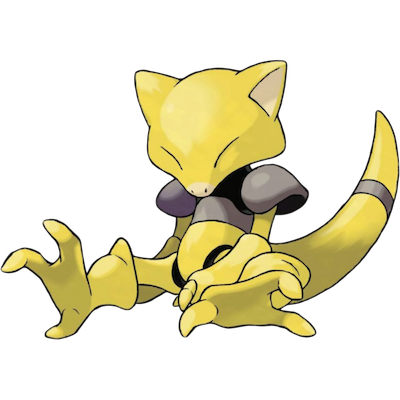

# Abra

**Abra** (K&#x0113;shii &#x30b1;&#x30fc;&#x30b7;&#x30a3;) sleeps all of the time. Even when it is sleeping, which it does most of its life, it can sense danger with its highly potent Psychic power. When it is in danger, it will teleport to safety. Abra's teleportation is usually faster than the player's Pok&#x00e9;mon, requiring a higher Speed stat in order to disable it before it teleports.

| **Name** | **Index** | **Type 1** | **Type 2** |
|----|----|----|----|
| Abra | 063 | Psychic  |  |

| **Id** | **Name** | **Species Id** | **Height dm** | **Weight hg** | **Base Experience** |
|--------|----------|----------------|------------|------------|---------------------|
| 63 | Abra | 63 | 9 | 195 | 62 |

## Stats

| **Hit Points** | **Attack** | **Defense** | **Special Attack** | **Special Defense** | **Speed** | **Total** |
|----------------|------------|-------------|--------------------|---------------------|-----------|-----------|
| 25 | 20 | 15 | 105 | 55 | 90 | 310 |

## See also

- [List of Pokémon](../pokemon.md)
- [National Pokédex](../national_pokedex.md)
- [Pokédex](../pokedex.md)
- [README](../README.md)
