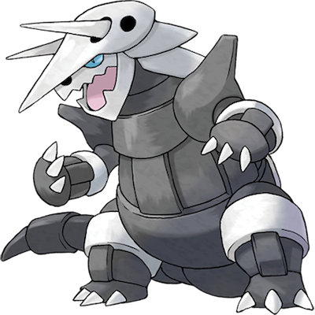

# Aggron

| **Name** | **Index** | **Type 1** | **Type 2** |
|----|----|----|----|
| Aggron | 306 | Steel | Rock  |

**Aggron** 

Height is measured in decimeters (1/10th of a meter)

Weight is measured in hectograms (1/10th of a kilogram)

| **Id** | **Name** | **Species Id** | **Height** | **Weight** | **Base Experience** |
|--------|----------|----------------|------------|------------|---------------------|
| 306 | Aggron | 306 | 21 | 3600 | 265 |

## See also

- [List of Pokémon](../pokemon.md)
- [National Pokédex](../national_pokedex.md)
- [Pokédex](../pokedex.md)
- [README](../README.md)
