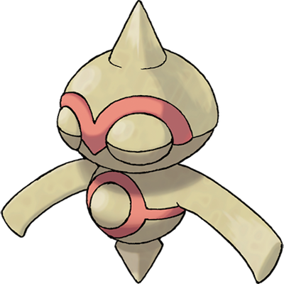

# Baltoy

| **Name** | **Index** | **Type 1** | **Type 2** |
|----|----|----|----|
| Baltoy | 343 | Ground | Psychic  |

**Baltoy** 

| **Id** | **Name** | **Species Id** | **Height dm** | **Weight hg** | **Base Experience** |
|--------|----------|----------------|------------|------------|---------------------|
| 343 | Baltoy | 343 | 5 | 215 | 60 |

## Stats

| **Hit Points** | **Attack** | **Defense** | **Special Attack** | **Special Defense** | **Speed** | **Total** |
|----------------|------------|-------------|--------------------|---------------------|-----------|-----------|
| 40 | 40 | 55 | 40 | 70 | 55 | 300 |

## See also

- [List of Pokémon](../pokemon.md)
- [National Pokédex](../national_pokedex.md)
- [Pokédex](../pokedex.md)
- [README](../README.md)
