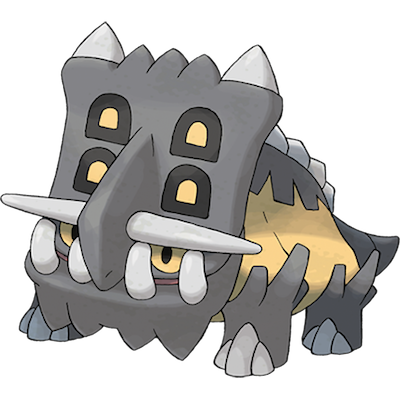

# Bastiodon

| **Name** | **Index** | **Type 1** | **Type 2** |
|----|----|----|----|
| Bastiodon | 411 | Rock | Steel  |

**Bastiodon** 

Height is measured in decimeters (1/10th of a meter)

Weight is measured in hectograms (1/10th of a kilogram)

| **Id** | **Name** | **Species Id** | **Height** | **Weight** | **Base Experience** |
|--------|----------|----------------|------------|------------|---------------------|
| 411 | Bastiodon | 411 | 13 | 1495 | 173 |

## See also

[List of Pokémon](../pokemon.md)
