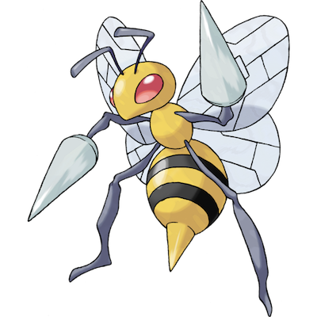

# Beedrill

| **Name** | **Index** | **Type 1** | **Type 2** |
|----|----|----|----|
| Beedrill | 015 | Bug | Poison  |

**Beedrill** 

| **Id** | **Name** | **Species Id** | **Height dm** | **Weight hg** | **Base Experience** |
|--------|----------|----------------|------------|------------|---------------------|
| 15 | Beedrill | 15 | 10 | 295 | 178 |

## Stats

| **Hit Points** | **Attack** | **Defense** | **Special Attack** | **Special Defense** | **Speed** | **Total** |
|----------------|------------|-------------|--------------------|---------------------|-----------|-----------|
| 65 | 90 | 40 | 45 | 80 | 75 | 395 |

## See also

- [List of Pokémon](../pokemon.md)
- [National Pokédex](../national_pokedex.md)
- [Pokédex](../pokedex.md)
- [README](../README.md)
