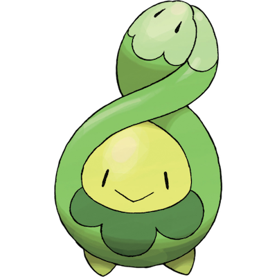

# Budew

| **Name** | **Index** | **Type 1** | **Type 2** |
|----|----|----|----|
| Budew | 406 | Grass | Poison  |

**Budew** 

Height is measured in decimeters (1/10th of a meter)

Weight is measured in hectograms (1/10th of a kilogram)

| **Id** | **Name** | **Species Id** | **Height** | **Weight** | **Base Experience** |
|--------|----------|----------------|------------|------------|---------------------|
| 406 | Budew | 406 | 2 | 12 | 56 |

## See also

- [List of Pokémon](../pokemon.md)
- [National Pokédex](../national_pokedex.md)
- [Pokédex](../pokedex.md)
- [README](../README.md)
