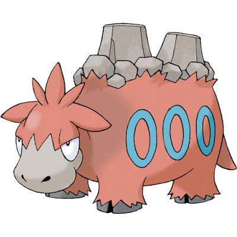

# Camerupt

| **Name** | **Index** | **Type 1** | **Type 2** |
|----|----|----|----|
| Camerupt | 323 | Fire | Ground  |

**Camerupt** 

| **Id** | **Name** | **Species Id** | **Height dm** | **Weight hg** | **Base Experience** |
|--------|----------|----------------|------------|------------|---------------------|
| 323 | Camerupt | 323 | 19 | 2200 | 161 |

## Stats

| **Hit Points** | **Attack** | **Defense** | **Special Attack** | **Special Defense** | **Speed** | **Total** |
|----------------|------------|-------------|--------------------|---------------------|-----------|-----------|
| 70 | 100 | 70 | 105 | 75 | 40 | 460 |

## See also

- [List of Pokémon](../pokemon.md)
- [National Pokédex](../national_pokedex.md)
- [Pokédex](../pokedex.md)
- [README](../README.md)
