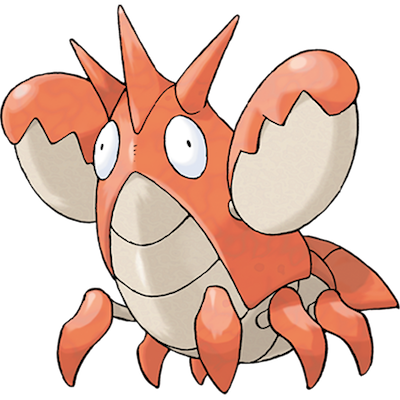

# Corphish

| **Name** | **Index** | **Type 1** | **Type 2** |
|----|----|----|----|
| Corphish | 341 | Water  |  |

**Corphish** 

| **Id** | **Name** | **Species Id** | **Height dm** | **Weight hg** | **Base Experience** |
|--------|----------|----------------|------------|------------|---------------------|
| 341 | Corphish | 341 | 6 | 115 | 62 |

## Stats

| **Hit Points** | **Attack** | **Defense** | **Special Attack** | **Special Defense** | **Speed** | **Total** |
|----------------|------------|-------------|--------------------|---------------------|-----------|-----------|
| 43 | 80 | 65 | 50 | 35 | 35 | 308 |

## See also

- [List of Pokémon](../pokemon.md)
- [National Pokédex](../national_pokedex.md)
- [Pokédex](../pokedex.md)
- [README](../README.md)
