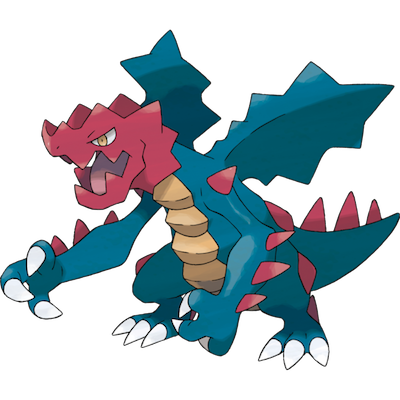

# Druddigon

| **Name** | **Index** | **Type 1** | **Type 2** |
|----|----|----|----|
| Druddigon | 621 | Dragon  |  |

**Druddigon** 

Height is measured in decimeters (1/10th of a meter)

Weight is measured in hectograms (1/10th of a kilogram)

| **Id** | **Name** | **Species Id** | **Height** | **Weight** | **Base Experience** |
|--------|----------|----------------|------------|------------|---------------------|
| 621 | Druddigon | 621 | 16 | 1390 | 170 |

## See also

- [List of Pokémon](../pokemon.md)
- [National Pokédex](../national_pokedex.md)
- [Pokédex](../pokedex.md)
- [README](../README.md)
