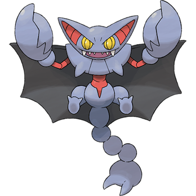

# Gliscor

| **Name** | **Index** | **Type 1** | **Type 2** |
|----|----|----|----|
| Gliscor | 472 | Ground | Flying  |

**Gliscor** 

| **Id** | **Name** | **Species Id** | **Height dm** | **Weight hg** | **Base Experience** |
|--------|----------|----------------|------------|------------|---------------------|
| 472 | Gliscor | 472 | 20 | 425 | 179 |

## Stats

| **Hit Points** | **Attack** | **Defense** | **Special Attack** | **Special Defense** | **Speed** | **Total** |
|----------------|------------|-------------|--------------------|---------------------|-----------|-----------|
| 75 | 95 | 125 | 45 | 75 | 95 | 510 |

## See also

- [List of Pokémon](../pokemon.md)
- [National Pokédex](../national_pokedex.md)
- [Pokédex](../pokedex.md)
- [README](../README.md)
