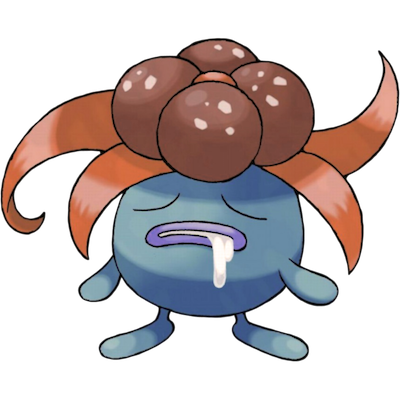

# Gloom

| **Name** | **Index** | **Type 1** | **Type 2** |
|----|----|----|----|
| Gloom | 044 | Grass | Poison  |

**Gloom** 

| **Id** | **Name** | **Species Id** | **Height dm** | **Weight hg** | **Base Experience** |
|--------|----------|----------------|------------|------------|---------------------|
| 44 | Gloom | 44 | 8 | 86 | 138 |

## Stats

| **Hit Points** | **Attack** | **Defense** | **Special Attack** | **Special Defense** | **Speed** | **Total** |
|----------------|------------|-------------|--------------------|---------------------|-----------|-----------|
| 60 | 65 | 70 | 85 | 75 | 40 | 395 |

## See also

- [List of Pokémon](../pokemon.md)
- [National Pokédex](../national_pokedex.md)
- [Pokédex](../pokedex.md)
- [README](../README.md)
