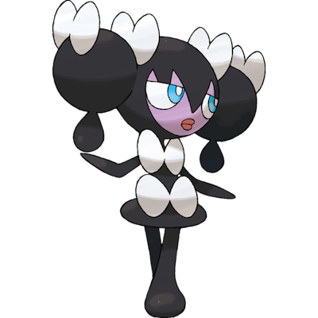

# Gothorita

| **Name** | **Index** | **Type 1** | **Type 2** |
|----|----|----|----|
| Gothorita | 575 | Psychic  |  |

**Gothorita** 

| **Id** | **Name** | **Species Id** | **Height dm** | **Weight hg** | **Base Experience** |
|--------|----------|----------------|------------|------------|---------------------|
| 575 | Gothorita | 575 | 7 | 180 | 137 |

## Stats

| **Hit Points** | **Attack** | **Defense** | **Special Attack** | **Special Defense** | **Speed** | **Total** |
|----------------|------------|-------------|--------------------|---------------------|-----------|-----------|
| 60 | 45 | 70 | 75 | 85 | 55 | 390 |

## See also

- [List of Pokémon](../pokemon.md)
- [National Pokédex](../national_pokedex.md)
- [Pokédex](../pokedex.md)
- [README](../README.md)
