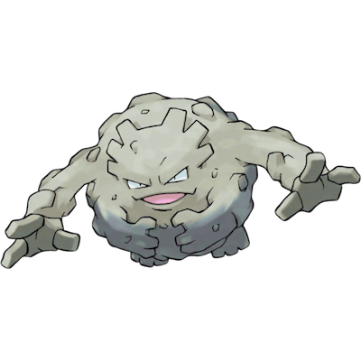

# Graveler

| **Name** | **Index** | **Type 1** | **Type 2** |
|----|----|----|----|
| Graveler | 075 | Rock | Electric form=Alola  |

**Graveler** 

| **Id** | **Name** | **Species Id** | **Height dm** | **Weight hg** | **Base Experience** |
|--------|----------|----------------|------------|------------|---------------------|
| 75 | Graveler | 75 | 10 | 1050 | 137 |

## Stats

| **Hit Points** | **Attack** | **Defense** | **Special Attack** | **Special Defense** | **Speed** | **Total** |
|----------------|------------|-------------|--------------------|---------------------|-----------|-----------|
| 55 | 95 | 115 | 45 | 45 | 35 | 390 |

## See also

- [List of Pokémon](../pokemon.md)
- [National Pokédex](../national_pokedex.md)
- [Pokédex](../pokedex.md)
- [README](../README.md)
