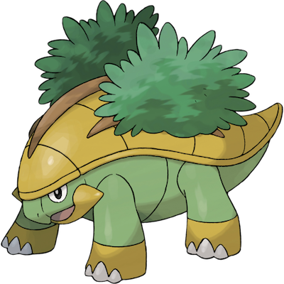

# Grotle

| **Name** | **Index** | **Type 1** | **Type 2** |
|----|----|----|----|
| Grotle | 388 | Grass  |  |

**Grotle** 

| **Id** | **Name** | **Species Id** | **Height dm** | **Weight hg** | **Base Experience** |
|--------|----------|----------------|------------|------------|---------------------|
| 388 | Grotle | 388 | 11 | 970 | 142 |

## Stats

| **Hit Points** | **Attack** | **Defense** | **Special Attack** | **Special Defense** | **Speed** | **Total** |
|----------------|------------|-------------|--------------------|---------------------|-----------|-----------|
| <% tp.frontmatter.hitpoints %> | <% tp.frontmatter.attack %> | <% tp.frontmatter.defense %> | <% tp.frontmatter.specialattack %> | <% tp.frontmatter.specialdefense %> | <% tp.frontmatter.speed %> | <% tp.frontmatter.total %> |

## See also

- [List of Pokémon](../pokemon.md)
- [National Pokédex](../national_pokedex.md)
- [Pokédex](../pokedex.md)
- [README](../README.md)
