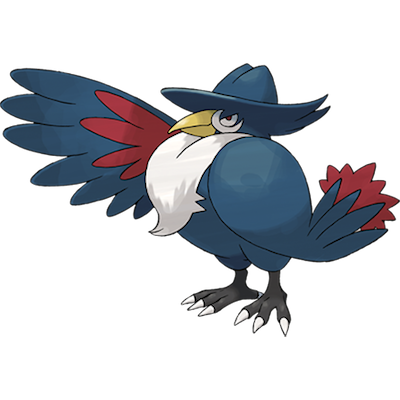

# Honchkrow

| **Name** | **Index** | **Type 1** | **Type 2** |
|----|----|----|----|
| Honchkrow | 430 | Dark | Flying  |

**Honchkrow** 

| **Id** | **Name** | **Species Id** | **Height dm** | **Weight hg** | **Base Experience** |
|--------|----------|----------------|------------|------------|---------------------|
| 430 | Honchkrow | 430 | 9 | 273 | 177 |

## Stats

| **Hit Points** | **Attack** | **Defense** | **Special Attack** | **Special Defense** | **Speed** | **Total** |
|----------------|------------|-------------|--------------------|---------------------|-----------|-----------|
| 100 | 125 | 52 | 105 | 52 | 71 | 505 |

## See also

- [List of Pokémon](../pokemon.md)
- [National Pokédex](../national_pokedex.md)
- [Pokédex](../pokedex.md)
- [README](../README.md)
