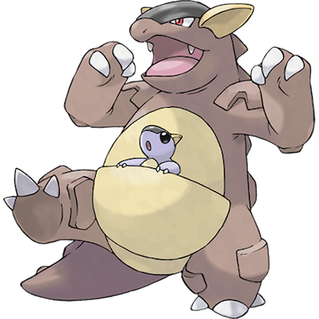

# Kangaskhan

| **Name** | **Index** | **Type 1** | **Type 2** |
|----|----|----|----|
| Kangaskhan | 115 | Normal  |  |

**Kangaskhan** 

Height is measured in decimeters (1/10th of a meter)

Weight is measured in hectograms (1/10th of a kilogram)

| **Id** | **Name** | **Species Id** | **Height** | **Weight** | **Base Experience** |
|--------|----------|----------------|------------|------------|---------------------|
| 115 | Kangaskhan | 115 | 22 | 800 | 172 |

## See also

[List of Pokémon](../pokemon.md)
