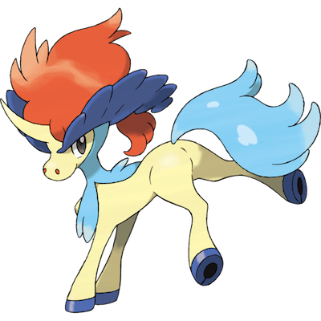

# Keldeo

| **Name** | **Index** | **Type 1** | **Type 2** |
|----|----|----|----|
| Keldeo | 647 | Water | Fighting  |

**Keldeo** 

## Stats

| **Hit Points** | **Attack** | **Defense** | **Special Attack** | **Special Defense** | **Speed** | **Total** |
|----------------|------------|-------------|--------------------|---------------------|-----------|-----------|
| 91 | 72 | 90 | 129 | 90 | 108 | 580 |

| **Species Id** | **Height dm** | **Weight hg** | **Base Experience** |
|----------------|------------|------------|---------------------|
| 647 | 14 | 485 | 290 |

## See also

- [List of Pokémon](../pokemon.md)
- [National Pokédex](../national_pokedex.md)
- [Pokédex](../pokedex.md)
- [README](../README.md)
