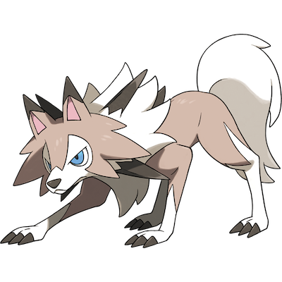

# Lycanroc

| **Name** | **Index** | **Type 1** | **Type 2** |
|----|----|----|----|
| Lycanroc | 745 | Rock  |  |

**Lycanroc** 

## Stats

| **Hit Points** | **Attack** | **Defense** | **Special Attack** | **Special Defense** | **Speed** | **Total** |
|----------------|------------|-------------|--------------------|---------------------|-----------|-----------|
| 75 | 117 | 65 | 55 | 65 | 110 | 487 |

| **Species Id** | **Height dm** | **Weight hg** | **Base Experience** |
|----------------|------------|------------|---------------------|
| 745 | 8 | 250 | 170 |

## See also

- [List of Pokémon](../pokemon.md)
- [National Pokédex](../national_pokedex.md)
- [Pokédex](../pokedex.md)
- [README](../README.md)
