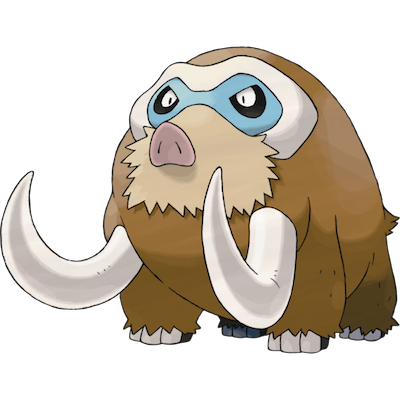

# Mamoswine

| **Name** | **Index** | **Type 1** | **Type 2** |
|----|----|----|----|
| Mamoswine | 473 | Ice | Ground  |

**Mamoswine** 

Height is measured in decimeters (1/10th of a meter)

Weight is measured in hectograms (1/10th of a kilogram)

| **Id** | **Name** | **Species Id** | **Height** | **Weight** | **Base Experience** |
|--------|----------|----------------|------------|------------|---------------------|
| 473 | Mamoswine | 473 | 25 | 2910 | 265 |

## See also

[List of Pokémon](../pokemon.md)
