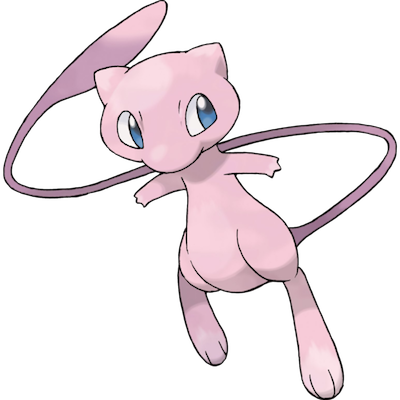

# Mew

| **Name** | **Index** | **Type 1** | **Type 2** |
|----|----|----|----|
| Mew | 151 | Psychic  |  |

**Mew** (Japanese: &#x30df;&#x30e5;&#x30a6;) is a small, pink, Psychic-type Mythical Pok&#x00e9;mon. It was added to Pok&#x00e9;mon Red and Blue by its creator, Game Freak programmer Shigeki Morimoto, as an intended obtainable Pokemon. However, due to a lack of cartridge space, and the inability to write/add additional storyline/plot points to lead up to an in-game encounter with the Pokemon, it was ultimately not published within the game. It was still viewable within the game's background data, which led to the assumption and ultimate confirmation that it was originally intended to be released/published within the game. As such, its presence within the game's background data has been surrounded by rumors and myths, which contributed to making the Pok&#x00e9;mon franchise a success. For years, Mew could not be legitimately obtained in the games except through Pok&#x00e9;mon distribution events or via glitches.

Mew's first film appearance was in Pok&#x00e9;mon: The First Movie as a main character alongside [Mewtwo](Mewtwo.md). The movie revealed that a fossilized Mew eyelash, found in the Guyana jungle by a team of scientists, was used to create Mewtwo, a genetically enhanced Mew clone. Mew later appeared in Pok&#x00e9;mon: Lucario and the Mystery of Mew as a main character alongside Lucario; the backstory of the film revolves around Mew's mysterious history and how it came to be so powerful. Pok&#x00e9;mon: The Mastermind of Mirage Pok&#x00e9;mon had a mirage version of Mew appear as a main character in the movie who helped Ash and friends try to defeat the Mirage Master. 

Unlike the older characters in the Pok&#x00e9;mon franchise, Mew's development was not overseen by Ken Sugimori, but by Game Freak programmer Shigeki Morimoto. Morimoto programmed Mew into the game secretly as a prank amongst the staff just prior to its release in Japan. It was intended to be a Pok&#x00e9;mon only Game Freak staff members would know about and be able to obtain. Mew was added at the very end of the development of Pok&#x00e9;mon Red and Blue after the removal of debug features, freeing up just enough space to add the character despite being told not to alter the game any further at this point. Though not intended by the developers to be obtainable, due to a glitch, players were able to encounter it.

Mew is a Psychic-type Pok&#x00e9;mon with high stats. Morimoto designed it as a pale pink feliform creature with somewhat large eyes and a long, thin tail that broadens at the end, though the shiny version is blue and rarely distributed. Its skin is covered with a layer of short, fine hair which may only be viewed under a microscope. Its DNA combines the genetic composition of all existing Pok&#x00e9;mon species; the game states that scientists within the game view it as being the single ancestor of all other Pok&#x00e9;mon. It is shy and rarely seen by humans. It is a Mythical Pok&#x00e9;mon, though it was previously classified in non-Japanese media as a Legendary Pok&#x00e9;mon alongside Pok&#x00e9;mon such as [Articuno](Articuno.md), [Zapdos](Zapdos.md), [Moltres](Moltres.md), and [Mewtwo](Mewtwo.md). Mew's number in the National Pok&#x00e9;dex is 151, the last of the first-generation Pok&#x00e9;mon, with 150 being Mewtwo and 152 being [Chikorita](Chikorita.md). In the first-generation games and their remakes, the player can find journal entries in the Pok&#x00e9;mon Mansion on Cinnabar Island stating that Mew was discovered deep in the jungles of Guyana, South America, on July 5 of an unspecified year, and named on July 10, and that it "gave birth" to Mewtwo on February 6. Both the Japanese name &#x30df;&#x30e5;&#x30a6;, My&#x016b;, and its romanized form Mew are based on the English words mutant or mutation, as well as the onomatopoeia &#x201c;mew&#x201d;, the sound a kitten makes, referring to its size and cat-like appearance.

In the video games, it is possible for Mew to learn any move that can be taught (except for signature moves that only certain Pokemon know, unless if Mew uses the move Copycat). In addition to [Ditto](Ditto.md) and [Smeargle](Smeargle.md) (through the Sketch technique), it can "transform" into other Pok&#x00e9;mon. In the anime, it is capable of flight, teleportation, shapeshifting (via the move Transform), rendering itself invisible, and summoning bubbles of psychic energy for protection, amusement, or other purposes.

| **Id** | **Name** | **Species Id** | **Height dm** | **Weight hg** | **Base Experience** |
|--------|----------|----------------|------------|------------|---------------------|
| 151 | Mew | 151 | 4 | 40 | 300 |

## Stats

| **Hit Points** | **Attack** | **Defense** | **Special Attack** | **Special Defense** | **Speed** | **Total** |
|----------------|------------|-------------|--------------------|---------------------|-----------|-----------|
| <% tp.frontmatter.hitpoints %> | <% tp.frontmatter.attack %> | <% tp.frontmatter.defense %> | <% tp.frontmatter.specialattack %> | <% tp.frontmatter.specialdefense %> | <% tp.frontmatter.speed %> | <% tp.frontmatter.total %> |

## See also

- [List of Pokémon](../pokemon.md)
- [National Pokédex](../national_pokedex.md)
- [Pokédex](../pokedex.md)
- [README](../README.md)
