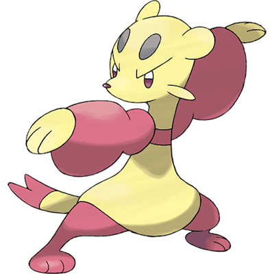

# Mienfoo

| **Name** | **Index** | **Type 1** | **Type 2** |
|----|----|----|----|
| Mienfoo | 619 | Fighting  |  |

**Mienfoo** 

Height is measured in decimeters (1/10th of a meter)

Weight is measured in hectograms (1/10th of a kilogram)

| **Id** | **Name** | **Species Id** | **Height** | **Weight** | **Base Experience** |
|--------|----------|----------------|------------|------------|---------------------|
| 619 | Mienfoo | 619 | 9 | 200 | 70 |

## See also

[List of Pokémon](../pokemon.md)
