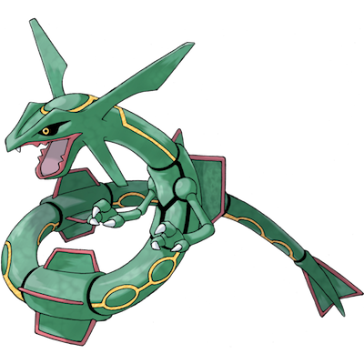

# Rayquaza

| **Name** | **Index** | **Type 1** | **Type 2** |
|----|----|----|----|
| Rayquaza | 384 | Dragon | Flying  |

**Rayquaza** 

| **Id** | **Name** | **Species Id** | **Height dm** | **Weight hg** | **Base Experience** |
|--------|----------|----------------|------------|------------|---------------------|
| 384 | Rayquaza | 384 | 70 | 2065 | 340 |

## Stats

| **Hit Points** | **Attack** | **Defense** | **Special Attack** | **Special Defense** | **Speed** | **Total** |
|----------------|------------|-------------|--------------------|---------------------|-----------|-----------|
| 105 | 150 | 90 | 150 | 90 | 95 | 680 |

## See also

- [List of Pokémon](../pokemon.md)
- [National Pokédex](../national_pokedex.md)
- [Pokédex](../pokedex.md)
- [README](../README.md)
