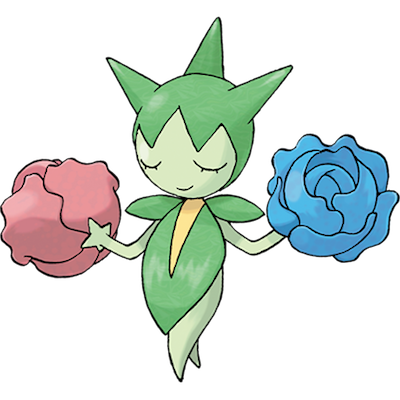

# Roselia

| **Name** | **Index** | **Type 1** | **Type 2** |
|----|----|----|----|
| Roselia | 315 | Grass | Poison  |

**Roselia** 

| **Id** | **Name** | **Species Id** | **Height dm** | **Weight hg** | **Base Experience** |
|--------|----------|----------------|------------|------------|---------------------|
| 315 | Roselia | 315 | 3 | 20 | 140 |

## Stats

| **Hit Points** | **Attack** | **Defense** | **Special Attack** | **Special Defense** | **Speed** | **Total** |
|----------------|------------|-------------|--------------------|---------------------|-----------|-----------|
| 50 | 60 | 45 | 100 | 80 | 65 | 400 |

## See also

- [List of Pokémon](../pokemon.md)
- [National Pokédex](../national_pokedex.md)
- [Pokédex](../pokedex.md)
- [README](../README.md)
