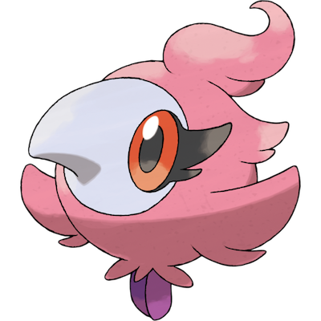

# Spritzee

| **Name** | **Index** | **Type 1** | **Type 2** |
|----|----|----|----|
| Spritzee | 682 | Fairy  |  |

**Spritzee** 

Height is measured in decimeters (1/10th of a meter)

Weight is measured in hectograms (1/10th of a kilogram)

| **Id** | **Name** | **Species Id** | **Height** | **Weight** | **Base Experience** |
|--------|----------|----------------|------------|------------|---------------------|
| 682 | Spritzee | 682 | 2 | 5 | 68 |

## See also

[List of Pokémon](../pokemon.md)
