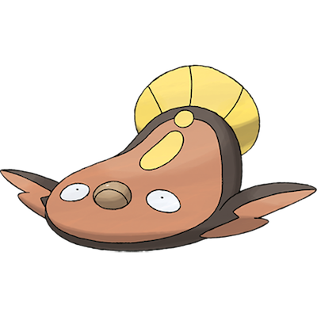

# Stunfisk

| **Name** | **Index** | **Type 1** | **Type 2** |
|----|----|----|----|
| Stunfisk | 618 | Ground | Steel form=Galar  |

**Stunfisk** 

Height is measured in decimeters (1/10th of a meter)

Weight is measured in hectograms (1/10th of a kilogram)

| **Id** | **Name** | **Species Id** | **Height** | **Weight** | **Base Experience** |
|--------|----------|----------------|------------|------------|---------------------|
| 618 | Stunfisk | 618 | 7 | 110 | 165 |

## See also

- [List of Pokémon](../pokemon.md)
- [National Pokédex](../national_pokedex.md)
- [Pokédex](../pokedex.md)
- [README](../README.md)
