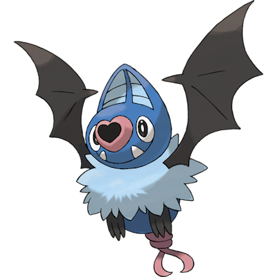

# Swoobat

| **Name** | **Index** | **Type 1** | **Type 2** |
|----|----|----|----|
| Swoobat | 528 | Psychic | Flying  |

**Swoobat** 

Height is measured in decimeters (1/10th of a meter)

Weight is measured in hectograms (1/10th of a kilogram)

| **Id** | **Name** | **Species Id** | **Height** | **Weight** | **Base Experience** |
|--------|----------|----------------|------------|------------|---------------------|
| 528 | Swoobat | 528 | 9 | 105 | 149 |

## See also

[List of Pokémon](../pokemon.md)
