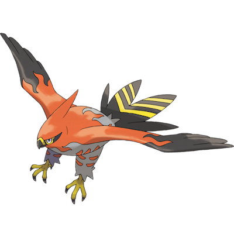

# Talonflame

| **Name** | **Index** | **Type 1** | **Type 2** |
|----|----|----|----|
| Talonflame | 663 | Fire | Flying  |

**Talonflame** 

| **Id** | **Name** | **Species Id** | **Height dm** | **Weight hg** | **Base Experience** |
|--------|----------|----------------|------------|------------|---------------------|
| 663 | Talonflame | 663 | 12 | 245 | 175 |

## Stats

| **Hit Points** | **Attack** | **Defense** | **Special Attack** | **Special Defense** | **Speed** | **Total** |
|----------------|------------|-------------|--------------------|---------------------|-----------|-----------|
| 78 | 81 | 71 | 74 | 69 | 126 | 499 |

## See also

- [List of Pokémon](../pokemon.md)
- [National Pokédex](../national_pokedex.md)
- [Pokédex](../pokedex.md)
- [README](../README.md)
