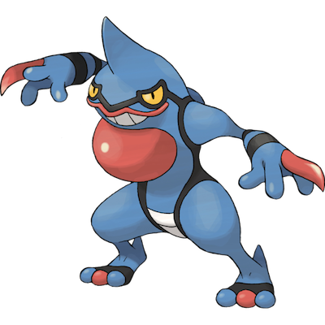

# Toxicroak

| **Name** | **Index** | **Type 1** | **Type 2** |
|----|----|----|----|
| Toxicroak | 454 | Poison | Fighting  |

**Toxicroak** 

| **Id** | **Name** | **Species Id** | **Height dm** | **Weight hg** | **Base Experience** |
|--------|----------|----------------|------------|------------|---------------------|
| 454 | Toxicroak | 454 | 13 | 444 | 172 |

## Stats

| **Hit Points** | **Attack** | **Defense** | **Special Attack** | **Special Defense** | **Speed** | **Total** |
|----------------|------------|-------------|--------------------|---------------------|-----------|-----------|
| 83 | 106 | 65 | 86 | 65 | 85 | 490 |

## See also

- [List of Pokémon](../pokemon.md)
- [National Pokédex](../national_pokedex.md)
- [Pokédex](../pokedex.md)
- [README](../README.md)
