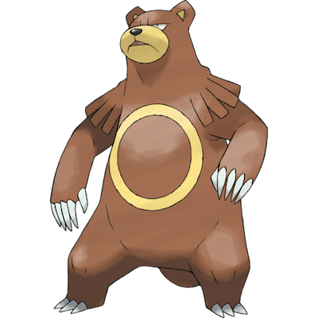

# Ursaring

| **Name** | **Index** | **Type 1** | **Type 2** |
|----|----|----|----|
| Ursaring | 217 | Normal  |  |

**Ursaring** 

Height is measured in decimeters (1/10th of a meter)

Weight is measured in hectograms (1/10th of a kilogram)

| **Id** | **Name** | **Species Id** | **Height** | **Weight** | **Base Experience** |
|--------|----------|----------------|------------|------------|---------------------|
| 217 | Ursaring | 217 | 18 | 1258 | 175 |

## See also

[List of Pokémon](../pokemon.md)
