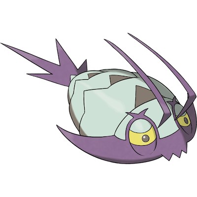

# Wimpod

| **Name** | **Index** | **Type 1** | **Type 2** |
|----|----|----|----|
| Wimpod | 767 | Bug | Water  |

**Wimpod** 

Height is measured in decimeters (1/10th of a meter)

Weight is measured in hectograms (1/10th of a kilogram)

| **Id** | **Name** | **Species Id** | **Height** | **Weight** | **Base Experience** |
|--------|----------|----------------|------------|------------|---------------------|
| 767 | Wimpod | 767 | 5 | 120 | 46 |

## See also

[List of Pokémon](../pokemon.md)
