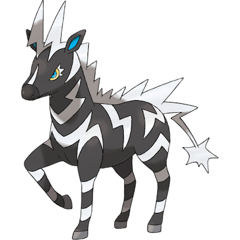

# Zebstrika

| **Name** | **Index** | **Type 1** | **Type 2** |
|----|----|----|----|
| Zebstrika | 523 | Electric  |  |

**Zebstrika** 

| **Id** | **Name** | **Species Id** | **Height dm** | **Weight hg** | **Base Experience** |
|--------|----------|----------------|------------|------------|---------------------|
| 523 | Zebstrika | 523 | 16 | 795 | 174 |

## Stats

| **Hit Points** | **Attack** | **Defense** | **Special Attack** | **Special Defense** | **Speed** | **Total** |
|----------------|------------|-------------|--------------------|---------------------|-----------|-----------|
| 75 | 100 | 63 | 80 | 63 | 116 | 497 |

## See also

- [List of Pokémon](../pokemon.md)
- [National Pokédex](../national_pokedex.md)
- [Pokédex](../pokedex.md)
- [README](../README.md)
