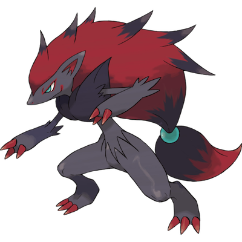

# Zoroark

| **Name** | **Index** | **Type 1** | **Type 2** |
|----|----|----|----|
| Zoroark | 571 | Normal | Ghost form=Hisui  |

**Zoroark** 

Height is measured in decimeters (1/10th of a meter)

Weight is measured in hectograms (1/10th of a kilogram)

| **Id** | **Name** | **Species Id** | **Height** | **Weight** | **Base Experience** |
|--------|----------|----------------|------------|------------|---------------------|
| 571 | Zoroark | 571 | 16 | 811 | 179 |

## See also

- [List of Pokémon](../pokemon.md)
- [National Pokédex](../national_pokedex.md)
- [Pokédex](../pokedex.md)
- [README](../README.md)
