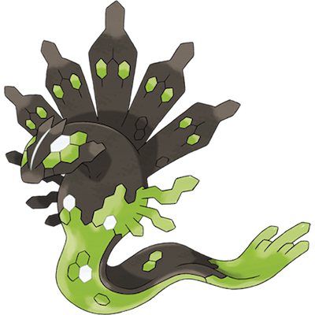

# Zygarde

| **Name** | **Index** | **Type 1** | **Type 2** |
|----|----|----|----|
| Zygarde | 718 | Dragon | Ground  |

**Zygarde** 

## Stats

| **Hit Points** | **Attack** | **Defense** | **Special Attack** | **Special Defense** | **Speed** | **Total** |
|----------------|------------|-------------|--------------------|---------------------|-----------|-----------|
| 216 | 100 | 121 | 91 | 95 | 85 | 708 |

| **Species Id** | **Height dm** | **Weight hg** | **Base Experience** |
|----------------|------------|------------|---------------------|
| 718 | 12 | 335 | 243 |

## See also

- [List of Pokémon](../pokemon.md)
- [National Pokédex](../national_pokedex.md)
- [Pokédex](../pokedex.md)
- [README](../README.md)
