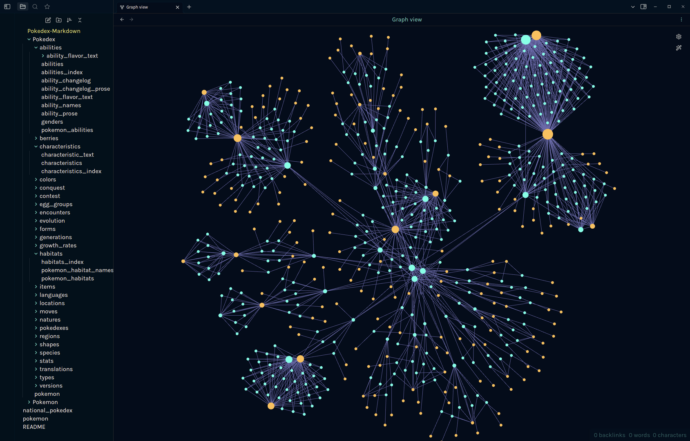

# Markdown Pokédex

The Pokédex (Pokémon Encyclopedia) is an electronic device designed to catalog and provide information regarding the various species of Pokémon. The name Pokédex is a portmanteau of Pokémon and index. In the video games, whenever a Pokémon is first caught, its height, weight, species type, and a short description will be added to a player's Pokédex. Each region has its own Pokédex, which differ in appearance, species of Pokémon catalogued, and functions. In *Pokémon Legends: Arceus*, which takes place long before any other Pokémon games, players are tasked with assembling the first ever Pokédex.

The [National Pokédex](national_pokedex.md) allows Pokémon from all regions to be catalogued. After its removal from *Pokémon Sword and Shield*, many fans were upset, due to the lack of a National Pokédex meaning that not every Pokémon would be transferrable to *Sword and Shield*. Although the National Pokédex returned in *Brilliant Diamond and Shining Pearl*, albeit only allowing Pokémon transferrable to the original Diamond and Pearl games, it has remained absent in original titles.

This repository contains a Pokémon Pokédex in markdown format. It was generated from [Veekun's Pokédex](https://github.com/veekun/pokedex) by converting the CSV format Pokédex to Markdown using a script I wrote for [Asciiville](https://github.com/doctorfree/Asciiville.git).

**[Note:]** Some of these markdown files are quite large. Some markdown viewers/editors perform an indexing of all markdown documents in the "vault" or collection. This indexing operation may consume quite a bit of time. Hopefully your markdown viewer/editor is smart enough to perform the indexing only once (e.g. Obsidian will only perform indexing when the vault is initially added). The largest markdown files were split using the [markdown split script](#split-markdown) but several remain over 1MB.

## Table of Contents

- [Usage](#usage)
- [Pokémon](pokemon.md)
- [National Pokédex](national_pokedex.md)
- [Pokédex Categories](#pokédex-categories)
- [Pokédex](Pokedex/pokemon.md)
- [Pokémon Generations](generations.md)
- [Obsidian Graph View](#obsidian-graph-view)
- [Tools](#tools)
    - [Pokemon Fetch](#pokemon-fetch)
    - [CSV to Markdown](#csv-to-markdown)
    - [Split Markdown](#split-markdown)
    - [Splitting large markdown](#splitting-large-markdown)

## Usage

This repository is organized as an Obsidian vault containing the Pokédex in markdown format. It can be viewed using any markdown viewer but if Obsidian is used then many additional features will be available including queries using the [Dataview](https://blacksmithgu.github.io/obsidian-dataview/) plugin for [Obsidian](https://obsidian.md/).

### **For the optimal experience, open this vault in Obsidian!**

1. [Download the vault](https://github.com/doctorfree/Pokedex-Markdown/releases/latest)
3. Open the vault in Obsidian via "Open another vault -> Open folder as vault"
4. Trust us. :) 
5. When Obsidian opens the settings, hit the switch on "Dataview" to enable the plugin
6. Done! The Pokédex Markdown vault is now available to you in its purest and most useful form!

## Pokémon

View [Pokémon](pokemon.md) types with an overview of the Pokédex.

## Pokédex Categories

|    |    |    |    |    |
|----|----|----|----|----|
| **[Abilities](Pokedex/abilities/abilities_index.md)** | **[Berries](Pokedex/berries/berries_index.md)** | **[Characteristics](Pokedex/characteristics/characteristics_index.md)** | **[Colors](Pokedex/colors/colors_index.md)** | **[Conquest](Pokedex/conquest/conquest_index.md)** |
| **[Contest](Pokedex/contest/contest_index.md)** | **[Encounters](Pokedex/encounters/encounters_index.md)** | **[Evolution](Pokedex/evolution/evolution_index.md)** | **[Forms](Pokedex/forms/forms_index.md)** | **[Generations](Pokedex/generations/generations_index.md)** |
| **[Growth rates](Pokedex/growth_rates/growth_rates_index.md)** | **[Habitats](Pokedex/habitats/habitats_index.md)** | **[Items](Pokedex/items/items_index.md)** | **[Languages](Pokedex/languages/languages_index.md)** | **[Locations](Pokedex/locations/locations_index.md)** |
| **[Moves](Pokedex/moves/moves_index.md)** | **[Natures](Pokedex/natures/natures_index.md)** | **[Pokedexes](Pokedex/pokedexes/pokedexes_index.md)** | **[Regions](Pokedex/regions/regions_index.md)** | **[Shapes](Pokedex/shapes/shapes_index.md)** |
| **[Species](Pokedex/species/species_index.md)** | **[Stats](Pokedex/stats/stats_index.md)** | **[Translations](Pokedex/translations/translations.md)** | **[Types](Pokedex/types/types_index.md)** | **[Versions](Pokedex/versions/versions_index.md)** |

Included here as well is an `.obsidian` directory populated with my [Doctorfree Obsidian Theme](https://github.com/doctorfree/Obsidian-Doctorfree) and other [Obsidian](https://obsidian.md) initialization. We recommend using Obsidian to browse, view, edit, and manage this repository. Obsidian is not open source but it is free and there is a rich set of community contributed plugins and themes that are open source.

## Pokédex

Enter the [Pokédex](Pokedex/pokemon.md) and behold the astonishing wealth of Pokémon data.

View a list of the [Pokémon](pokemon.md) and [Pokémon data](pokedex.md).

## Pokémon Generations

View a list of the [Generations of Pokémon](generations.md)

## Obsidian Graph View

The graph view in [Obsidian](https://obsidian.md) shows the connections between nodes and tags in the Markdown Pokédex Obsidian vault.



## Tools

To create this markdown Pokédex, the following tools were used in the retrieval, conversion, and modification of Pokémon data.

### Pokemon fetch

The `pokefetch` command was written by Ronald Record. It retrieves and displays a Pokemon using the `pokeapi`. Pokemon to be retrieved can be specified by name or id.

```shell
#!/bin/bash

# Prepare ----------------------------------------------------------------------

have_gum=$(type -p gum)
[ "${have_gum}" ] || exit 1

usage() {
    printf "\nUsage: pokefetch [-aA] [-i id] [-n name] [-u]"
	printf "\nWhere:"
	printf "\n\t-a indicates no art"
	printf "\n\t-A indicates do not use ANSI code sequences (e.g. for colors)"
	printf "\n\t\t-A implies -a since retrieved art includes ANSI code sequences"
	printf "\n\t-i 'id' specifies the Pokemon ID to retrieve"
	printf "\n\t-n 'name' specifies the Pokemon name to retrieve"
	printf "\n\t-u displays this usage message and exits"
	printf "\nDefault: random Pokemon ID"
	printf "\nExample: pokefetch -n Genesect\n"
	exit 1
}

pokemon=
fetchart=1
use_ansi=1
while getopts "aAi:n:u" flag; do
    case $flag in
        a)
            fetchart=
            ;;
        A)
            fetchart=
            use_ansi=
            ;;
        i)
            pokemon="$OPTARG"
			[ ${pokemon} -lt 1 ] || [ ${pokemon} -gt 905 ] && pokemon= 
            ;;
        n)
            pokemon="$OPTARG"
            pokemon=`echo "${pokemon}" | tr '[:upper:]' '[:lower:]'`
            ;;
        u)
            usage
            ;;
    esac
done
shift $(( OPTIND - 1 ))

[ "${pokemon}" ] || pokemon=${1:-$(shuf -i 1-905 -n 1)}

data_pokemon=$(curl -fsLS "https://pokeapi.co/api/v2/pokemon/${pokemon}")
data_species=$(curl -fsLS "$(echo "${data_pokemon}" | jq --raw-output .species.url)")

id=$(echo "${data_species}" | jq --raw-output .id)
name=$(echo "${data_species}" | jq --raw-output '.names | .[] | select(.language.name == "en").name')
category=$(echo "${data_species}" | jq --raw-output '.genera | .[] | select(.language.name == "en").genus')
if [ "${use_ansi}" ]
then
  title="▐ No.$(printf '%03d' "${id}") ▌ ${name} - ${category}"
else
  title=" Number $(printf '%03d' "${id}") ${name} - ${category}"
fi

for type in $(echo "${data_pokemon}" | jq --raw-output '.types | .[].type.name' | tr '[:lower:]' '[:upper:]'); do
	case "${type}" in
		NORMAL)   color=7  ;;
		FIRE)     color=9  ;;
		WATER)    color=12 ;;
		ELECTRIC) color=11 ;;
		GRASS)    color=10 ;;
		ICE)      color=14 ;;
		FIGHTING) color=1  ;;
		POISON)   color=5  ;;
		GROUND)   color=11 ;;
		FLYING)   color=6  ;;
		PSYCHIC)  color=13 ;;
		BUG)      color=2  ;;
		ROCK)     color=3  ;;
		GHOST)    color=4  ;;
		DRAGON)   color=4  ;;
		DARK)     color=3  ;;
		STEEL)    color=8  ;;
		FAIRY)    color=13 ;;
	esac

    if [ "${use_ansi}" ]
    then
	  types="${types} [7;38;5;${color}m ${type}  "
	else
	  types="${types} ${type} "
	fi
done

height=$(awk "BEGIN{ print $(echo "${data_pokemon}" | jq --raw-output .height) / 10 }")
weight=$(awk "BEGIN{ print $(echo "${data_pokemon}" | jq --raw-output .weight) / 10 }")
if [ "${use_ansi}" ]
then
  status=$(gum style --align center --width 44 "${types}" "Height: ${height}m      Weight: ${weight}kg")
else
  status=$(gum style --align center --width 44 "${types}" "Height: ${height}m      Weight: ${weight}kg")
fi

info=$(gum join --vertical "${title}" '' "${status}")

entries=$(gum style --border normal --padding '0 1' --width 42 "$(echo "${data_species}" | \
jq --raw-output 'last(.flavor_text_entries | .[] | select(.language.name == "en")).flavor_text' | tr -d "\n")")

pokemon_path=$(echo "${data_pokemon}" | jq --raw-output .name)
[ "${fetchart}" ] && {
  art=$(gum style "$(curl -fsLS \
    "https://gitlab.com/phoneybadger/pokemon-colorscripts/-/raw/main/colorscripts/small/regular/${pokemon_path}" \
    | sed -e 's/$//g')")
}


# Display ------------------------------------------------------------------------------------------

terminal_size=$(stty size)
terminal_height=${terminal_size% *}
terminal_width=${terminal_size#* }

prompt_height=${PROMPT_HEIGHT:-1}

print_test() {
	no_color=$(printf '%b' "${1}" | sed -e 's/\x1B\[[0-9;]*[JKmsu]//g')

	[ "$(printf '%s' "${no_color}" | wc --lines)" -gt $(( terminal_height - prompt_height )) ] && return 1
	[ "$(printf '%s' "${no_color}" | wc --max-line-length)" -gt "${terminal_width}" ] && return 1

	gum style --align center --width="${terminal_width}" "${1}" ''
    [ "${use_ansi}" ] && printf '%b' "\033[A"

	exit 0
}


# Landscape layout
group_info_entries=$(gum join --vertical "${info}" '' "${entries}")
[ "${fetchart}" ] && {
  print_test "$(gum join --horizontal --align center "${art}" '  ' "${group_info_entries}")"

  # Portrait layout
  print_test "$(gum join --vertical --align center "${info}" '' "${art}" "${entries}")"
}

# Other layout
print_test "${group_info_entries}"

exit 1
```

### CSV to Markdown

The `csv2md` command converts a CSV format document to Markdown. For some very large files on which `csv2md` produced inadequate markdown, [Pandoc](https://pandoc.org) was used.

```shell
#!/bin/bash
#
# csv2md - convert CSV format file to Markdown
#
# Adapted by Ronald Record from:
# https://www.log4code.com/converting-a-csv-file-to-markdown-using-sqlite/
#
# Requires pandoc or sqlite3 3.30.0 or later (preferred)
#
# Usage: ./csv2md [-h] [-r] file.csv
# Where:    -r indicates remove input CSV file after conversion
#
# Output: file.md

help() {
    printf "\nUsage: ./csv2md [-h] [-r] file.csv"
    printf "\nWhere:"
    printf "\n\t-h indicates display this usage message and exit"
    printf "\n\t-r indicates remove input CSV file after conversion\n"
    exit 1
}

# Set any options to defaults
remove=

# Process all the command line options
while :; do
    case $1 in
        # Two hyphens ends the options parsing
        --)
            shift
            break
            ;;
        -h|--help)
            help
            exit
            ;;
        -r|--remove)
            remove=1
            ;;
        -?*)
            echo "The command line option is unknown: $1"
            help
            ;;
        # Anything remaining is treated as content not a parseable option
        *)
            break
            ;;
    esac
    shift
done

[ -f "$1" ] || {
    echo "$1 does not exist or is not a regular file. Exiting."
    exit 1
}

have_sqlite=`type -p sqlite3`
have_pandoc=`type -p pandoc`

inputFile="$1"
baseFile=`echo ${inputFile} | sed -e "s/\.csv//"`

outputFile="${baseFile}.md"
rm -f ${outputFile}

if [ "${have_sqlite}" ]
then
  cmd=$({ grep -v '^#' <<EOF
.headers on
.mode csv
drop table if exists temp_csvFile;
.import ${inputFile} temp_csvFile
.mode markdown
.headers on
.output ${outputFile}
select * from temp_csvFile;
EOF
})

  echo -e "${cmd}" | sqlite3 ''
else
  if [ "${have_pandoc}" ]
  then
    pandoc -f csv -t markdown -o ${outputFile} ${inputFile}
  else
    echo "Neither sqlite3 nor pandoc found. No conversion performed."
  fi
fi

[ "${remove}" ] && rm -f "${inputFile}"
```

### Splitting large markdown

Many of the Pokédex CSV files produced very large markdown files. These were split into manageable chunks using the `split_markdown` script I wrote:

```shell
#!/bin/bash
#
# split_markdown - split a markdown file into smaller parts
#
# usage: split_markdown filename.md number_of_parts
#
# assumes the first two lines of the input file are table heading and divider

inputFile=$1
numFiles=$2
numLines=`cat ${inputFile} | wc -l`
baseFile=`echo ${inputFile} | sed -e "s/\.md//"`

split -da 2 \
      -l $((numLines / numFiles)) \
      ${inputFile} ${baseFile}_ --additional-suffix=".md"

rm -f ${inputFile}
firstFile=`echo *_00.md`
table_heading=`head -1 ${firstFile}`
table_divider=`head -2 ${firstFile} | tail -1`

for inputFile in *.md
do
  [ "${inputFile}" == "*.md" ] && continue
  [ "${inputFile}" == "${firstFile}" ] && continue
  echo -e "${table_heading}\n${table_divider}\n$(cat ${inputFile})" > ${inputFile}
done
```
