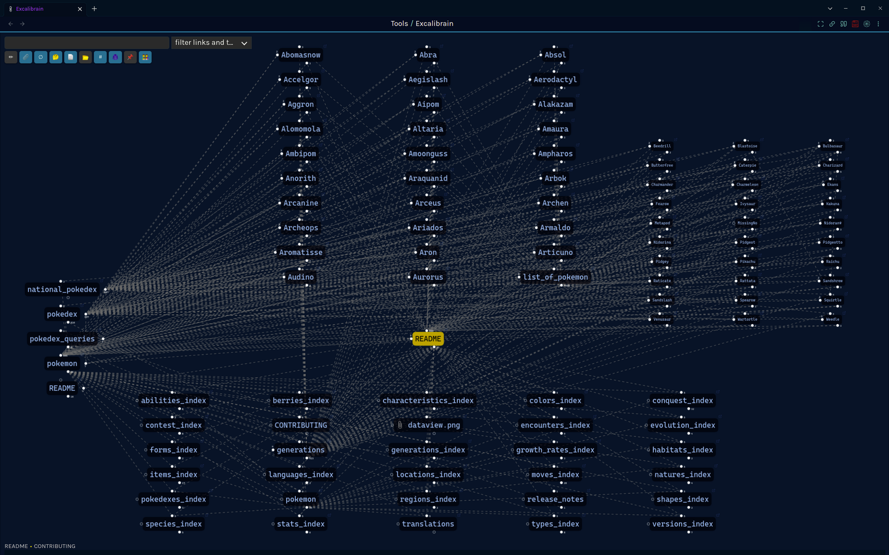

# Markdown Pokédex

The Pokédex (Pokémon Encyclopedia) is an electronic device designed to catalog and provide information regarding the various species of Pokémon. The name Pokédex is a portmanteau of Pokémon and index. In the video games, whenever a Pokémon is first caught, its height, weight, species type, and a short description will be added to a player's Pokédex. Each region has its own Pokédex, which differ in appearance, species of Pokémon catalogued, and functions. In *Pokémon Legends: Arceus*, which takes place long before any other Pokémon games, players are tasked with assembling the first ever Pokédex.

The [National Pokédex](national_pokedex.md) allows Pokémon from all regions to be catalogued.

This repository contains a Pokémon Pokédex in markdown format. It was generated from [Veekun's Pokédex](https://github.com/veekun/pokedex) by converting the CSV format Pokédex to Markdown using a script I wrote for [Asciiville](https://github.com/doctorfree/Asciiville.git).

## Table of Contents

- [Usage](#usage)
    - [Release Notes](release_notes.md)
    - [Pokédex Queries](pokedex_queries.md)
    - [Recommended Obsidian Plugins](#recommended_obsidian_plugins)
- [Pokémon](pokemon.md)
- [National Pokédex](national_pokedex.md)
- [Pokédex Categories](#pokédex_categories)
- [Pokédex](Pokedex/pokemon.md)
- [Pokémon Generations](generations.md)
- [Obsidian Graph View](#obsidian_graph_view)
- [Obsidian Excalibrain](#obsidian_excalibrain)
- [Contributing](CONTRIBUTING.md)
- [Support](#support)
- [Tools](#tools)

## Usage

This repository is organized as an Obsidian vault containing the Pokédex in markdown format. It can be viewed using any markdown viewer but if Obsidian is used then many additional features will be available including queries using the [Dataview](https://blacksmithgu.github.io/obsidian-dataview/) plugin for [Obsidian](https://obsidian.md/).

### **For the optimal experience, open this vault in Obsidian!**

1. [Download the vault](https://github.com/doctorfree/Pokedex-Markdown/releases/latest)
3. Open the vault in Obsidian via "Open another vault -> Open folder as vault"
4. Trust us. :) 
5. When Obsidian opens the settings, verify the "Dataview", "Excalidraw", and "Excalibrain" plugins are enabled
6. Done! The Markdown Pokédex vault is now available to you in its purest and most useful form!

### Release Notes

The full Release Notes for the current version of the Markdown Pokédex can be found in [release_notes.md](release_notes.md).

### Pokédex Queries

The Markdown Pokédex has been curated with metadata allowing queries to be performed using the Obsidian Dataview plugin. Sample queries along with the code used to perform them can be viewed in the [Pokédex Queries](pokedex_queries.md) document.

### Recommended_Obsidian_Plugins

Obsidian community plugins we have found useful and can recommend include the following:

- [Contextual Typography](https://github.com/mgmeyers/obsidian-contextual-typography): Enables enhanced preview typography
- [Dataview](https://github.com/blacksmithgu/obsidian-dataview): Treats an Obsidian Vault as a database from which you can query
- [Excalibrain](https://github.com/zsviczian/excalibrain): An interactive structured mind-map of an Obsidian vault
- [Excalidraw](https://github.com/zsviczian/obsidian-excalidraw-plugin): Edit and view Excalidraw in Obsidian
- [Hider](https://github.com/kepano/obsidian-hider): Hides various elements of the UI
- [Hover-editor](https://github.com/nothingislost/obsidian-hover-editor): Turns the hover popover into a full featured editor
- [Pandoc](https://github.com/OliverBalfour/obsidian-pandoc): Adds command palette options to export your notes to a variety of formats
- [Quickadd](https://github.com/chhoumann/quickadd): Quickly add content to a vault
- [Shellcommands](https://github.com/Taitava/obsidian-shellcommands): Define and run shell commands
- [Style Settings](https://github.com/mgmeyers/obsidian-style-settings): Enables theme customization
- [Templater](https://github.com/SilentVoid13/Templater): Defines a powerful templating language

## Screenshot of Example Pokédex Queries

## Pokémon

View an overview of [Pokémon](pokemon.md).

View a list of [Pokémon](pokemon.md).

## Pokédex_Categories

|    |    |    |    |    |
|----|----|----|----|----|
| **[Abilities](Pokedex/abilities/abilities_index.md)** | **[Berries](Pokedex/berries/berries_index.md)** | **[Characteristics](Pokedex/characteristics/characteristics_index.md)** | **[Colors](Pokedex/colors/colors_index.md)** | **[Conquest](Pokedex/conquest/conquest_index.md)** |
| **[Contest](Pokedex/contest/contest_index.md)** | **[Encounters](Pokedex/encounters/encounters_index.md)** | **[Evolution](Pokedex/evolution/evolution_index.md)** | **[Forms](Pokedex/forms/forms_index.md)** | **[Generations](Pokedex/generations/generations_index.md)** |
| **[Growth rates](Pokedex/growth_rates/growth_rates_index.md)** | **[Habitats](Pokedex/habitats/habitats_index.md)** | **[Items](Pokedex/items/items_index.md)** | **[Languages](Pokedex/languages/languages_index.md)** | **[Locations](Pokedex/locations/locations_index.md)** |
| **[Moves](Pokedex/moves/moves_index.md)** | **[Natures](Pokedex/natures/natures_index.md)** | **[Pokedexes](Pokedex/pokedexes/pokedexes_index.md)** | **[Regions](Pokedex/regions/regions_index.md)** | **[Shapes](Pokedex/shapes/shapes_index.md)** |
| **[Species](Pokedex/species/species_index.md)** | **[Stats](Pokedex/stats/stats_index.md)** | **[Translations](Pokedex/translations/translations.md)** | **[Types](Pokedex/types/types_index.md)** | **[Versions](Pokedex/versions/versions_index.md)** |

Included here as well is an `.obsidian` directory populated with my [Doctorfree Obsidian Theme](https://github.com/doctorfree/Obsidian-Doctorfree) and other [Obsidian](https://obsidian.md) initialization. We recommend using Obsidian to browse, view, edit, and manage this repository. Obsidian is not open source but it is free and there is a rich set of community contributed plugins and themes that are open source.

## Pokédex

Enter the [Pokédex](Pokedex/pokemon.md) and behold the astonishing wealth of Pokémon data.

View a list of the [Pokémon](pokemon.md) and [Pokémon data](pokedex.md).

## Pokémon Generations

View a list of the [Generations of Pokémon](generations.md)

## Obsidian_Graph_View

The graph view in [Obsidian](https://obsidian.md) shows the connections between nodes and tags in the Markdown Pokédex Obsidian vault.

## Obsidian_Excalibrain

The [Obsidian Excalibrain plugin](https://github.com/zsviczian/excalibrain) shows the connections between nodes and tags in the Markdown Pokédex Obsidian vault in a contextual sense.

## Contributing

The Markdown Pokédex is in continual development and improvement. To contribute to this project, see the [Contributing guidelines](CONTRIBUTING.md).

## Support

Support the development and improvement of the Markdown Pokédex by [sponsoring the Projects of Doctorfree](https://github.com/sponsors/doctorfree).

## Tools

To create this markdown Pokédex, several custom tools were used in the retrieval, conversion, and modification of Pokémon data. See the [Tools folder](Tools/README.md) to view these.

## Connect

[][website]
[][youtube]
[][twitter]
[][linkedin]
[][instagram]

 

