# Pokédex

Table of Pokémon types, abilities, and data:

|**Image**|**Pokémon**|**Types**|**Abilities**|**HP**|**Atk**|**Def**|**SpA**|**SpD**|**Spe**|**Total**|**Egg Groups**|
|---------|-----------|---------|-------------|------|-------|-------|-------|-------|-------|---------|--------------|
||[Bulbasaur](Pokemon/Bulbasaur.md)|Grass, Poison|Overgrow, (Hidden) Chlorophyll|45|49|49|65|65|45|318|Monster, Grass |
|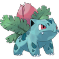|[Ivysaur](Pokemon/Ivysaur.md)|Grass, Poison|Overgrow, (Hidden) Chlorophyll|60|62|63|80|80|60|405|Monster, Grass |
|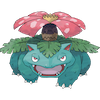|[Venusaur](Pokemon/Venusaur.md)|Grass, Poison|Overgrow, (Hidden) Chlorophyll|80|82|83|100|100|80|525|Monster, Grass |
||[Venusaur](Pokemon/Venusaur.md) (Mega)|Grass, Poison|Thick Fat|80|100|123|122|120|80|625|Monster, Grass |
||[Charmander](Pokemon/Charmander.md)|Fire|Blaze, (Hidden) Solar Power|39|52|43|60|50|65|309|Monster, Dragon |
|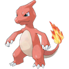|[Charmeleon](Pokemon/Charmeleon.md)|Fire|Blaze, (Hidden) Solar Power|58|64|58|80|65|80|405|Monster, Dragon |
|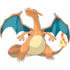|[Charizard](Pokemon/Charizard.md)|Fire, Flying|Blaze, (Hidden) Solar Power|78|84|78|109|85|100|534|Monster, Dragon |
||[Charizard](Pokemon/Charizard.md) (Mega X)|Fire, Dragon|Tough Claws|78|130|111|130|85|100|634|Monster, Dragon |
||[Charizard](Pokemon/Charizard.md) (Mega Y)|Fire, Flying|Drought|78|104|78|159|115|100|634|Monster, Dragon |
||[Squirtle](Pokemon/Squirtle.md)|Water|Torrent, (Hidden) Rain Dish|44|48|65|50|64|43|314|Monster, Water 1 |
||[Wartortle](Pokemon/Wartortle.md)|Water|Torrent, (Hidden) Rain Dish|59|63|80|65|80|58|405|Monster, Water 1 |
|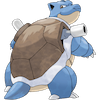|[Blastoise](Pokemon/Blastoise.md)|Water|Torrent, (Hidden) Rain Dish|79|83|100|85|105|78|530|Monster, Water 1 |
||[Blastoise](Pokemon/Blastoise.md) (Mega)|Water|Mega Launcher|79|103|120|135|115|78|630|Monster, Water 1 |
|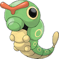|[Caterpie](Pokemon/Caterpie.md)|Bug|Shield Dust, (Hidden) Run Away|45|30|35|20|20|45|195|Bug |
|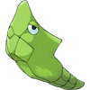|[Metapod](Pokemon/Metapod.md)|Bug|Shed Skin|50|20|55|25|25|30|205|Bug |
|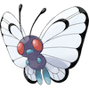|[Butterfree](Pokemon/Butterfree.md)|Bug, Flying|Compound Eyes, (Hidden) Tinted Lens|60|45|50|90|80|70|395|Bug |
|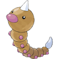|[Weedle](Pokemon/Weedle.md)|Bug, Poison|Shield Dust, (Hidden) Run Away|40|35|30|20|20|50|195|Bug |
|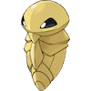|[Kakuna](Pokemon/Kakuna.md)|Bug, Poison|Shed Skin|45|25|50|25|25|35|205|Bug |
|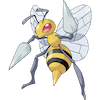|[Beedrill](Pokemon/Beedrill.md)|Bug, Poison|Swarm, (Hidden) Sniper|65|90|40|45|80|75|395|Bug |
||[Beedrill](Pokemon/Beedrill.md) (Mega)|Bug, Poison|Adaptability|65|150|40|15|80|145|495|Bug |
|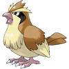|[Pidgey](Pokemon/Pidgey.md)|Normal, Flying|Keen Eye, Tangled Feet, Big Pecks|40|45|40|35|35|56|251|Flying |
|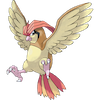|[Pidgeotto](Pokemon/Pidgeotto.md)|Normal, Flying|Keen Eye, Tangled Feet, Big Pecks|63|60|55|50|50|71|349|Flying |
|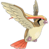|[Pidgeot](Pokemon/Pidgeot.md)|Normal, Flying|Keen Eye, Tangled Feet, Big Pecks|83|80|75|70|70|101|479|Flying |
||[Pidgeot](Pokemon/Pidgeot.md) (Mega)|Normal, Flying|No Guard|83|80|80|135|80|121|579|Flying |
|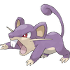|[Rattata](Pokemon/Rattata.md)|Normal|Run Away, Guts, Hustle|30|56|35|25|35|72|253|Field |
||[Rattata](Pokemon/Rattata.md) (Alolan)|Dark, Normal|Gluttony, Hustle, Thick Fat|30|56|35|25|35|72|253|Field |
|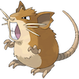|[Raticate](Pokemon/Raticate.md)|Normal|Run Away, Guts, Hustle|55|81|60|50|70|97|413|Field |
||[Raticate](Pokemon/Raticate.md) (Alolan)|Dark, Normal|Gluttony, Hustle, Thick Fat|75|71|70|40|80|77|413|Field |
|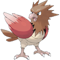|[Spearow](Pokemon/Spearow.md)|Normal, Flying|Keen Eye, (Hidden) Sniper|40|60|30|31|31|70|262|Flying |
|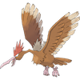|[Fearow](Pokemon/Fearow.md)|Normal, Flying|Keen Eye, (Hidden) Sniper|65|90|65|61|61|100|442|Flying |
|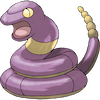|[Ekans](Pokemon/Ekans.md)|Poison|Intimidate, Shed Skin, Unnerve|35|60|44|40|54|55|288|Field, Dragon |
|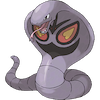|[Arbok](Pokemon/Arbok.md)|Poison|Intimidate, Shed Skin, Unnerve|60|95|69|65|79|80|448|Field, Dragon |
||[Pikachu](Pokemon/Pikachu.md)|Electric|Static, (Hidden) Lightning Rod|35|55|40|50|50|90|320|Field, Fairy |
|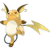|[Raichu](Pokemon/Raichu.md)|Electric|Static, (Hidden) Lightning Rod|60|90|55|90|80|110|485|Field, Fairy |
||[Raichu](Pokemon/Raichu.md) (Alolan)|Electric, Psychic|Surge Surfer|60|85|50|95|85|110|485|Field, Fairy |
|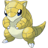|[Sandshrew](Pokemon/Sandshrew.md)|Ground|Sand Veil, (Hidden) Sand Rush|50|75|85|20|30|40|300|Field |
||[Sandshrew](Pokemon/Sandshrew.md) (Alolan)|Ice, Steel|Snow Cloak, (Hidden) Slush Rush|50|75|90|10|35|40|300|Field |
|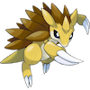|[Sandslash](Pokemon/Sandslash.md)|Ground|Sand Veil, (Hidden) Sand Rush|75|100|110|45|55|65|450|Field |
||[Sandslash](Pokemon/Sandslash.md) (Alolan)|Ice, Steel|Snow Cloak, (Hidden) Slush Rush|75|100|120|25|65|65|450|Field |
||[Nidoran♀](Pokemon/Nidoran♀.md)|Poison|Poison Point, Rivalry, Hustle|55|47|52|40|40|41|275|Monster, Field |
|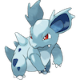|[Nidorina](Pokemon/Nidorina.md)|Poison|Poison Point, Rivalry, Hustle|70|62|67|55|55|56|365|Undiscovered |
|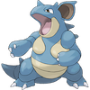|[Nidoqueen](Pokemon/Nidoqueen.md)|Poison, Ground|Poison Point, Rivalry, Sheer Force|90|92|87|75|85|76|505|Undiscovered |
|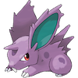|[Nidoran♂](Pokemon/Nidoran♂.md)|Poison|Poison Point, Rivalry, Hustle|46|57|40|40|40|50|273|Monster, Field |
|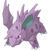|[Nidorino](Pokemon/Nidorino.md)|Poison|Poison Point, Rivalry, Hustle|61|72|57|55|55|65|365|Monster, Field |
|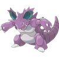|[Nidoking](Pokemon/Nidoking.md)|Poison, Ground|Poison Point, Rivalry, Sheer Force|81|102|77|85|75|85|505|Monster, Field |
||[Clefairy](Pokemon/Clefairy.md)|Fairy|Cute Charm, Magic Guard, Friend Guard|70|45|48|60|65|35|323|Fairy |
||[Clefable](Pokemon/Clefable.md)|Fairy|Cute Charm, Magic Guard, Unaware|95|70|73|95|90|60|483|Fairy |
|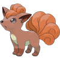|[Vulpix](Pokemon/Vulpix.md)|Fire|Flash Fire, (Hidden) Drought|38|41|40|50|65|65|299|Field |
||[Vulpix](Pokemon/Vulpix.md) (Alolan)|Ice|Snow Cloak, (Hidden) Snow Warning|38|41|40|50|65|65|299|Field |
|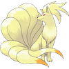|[Ninetales](Pokemon/Ninetales.md)|Fire|Flash Fire, (Hidden) Drought|73|76|75|81|100|100|505|Field |
||[Ninetales](Pokemon/Ninetales.md) (Alolan)|Ice, Fairy|Snow Cloak, (Hidden) Snow Warning|73|67|75|81|100|109|505|Field |
||[Jigglypuff](Pokemon/Jigglypuff.md)|Normal, Fairy|Cute Charm, Competitive, Friend Guard|115|45|20|45|25|20|270|Fairy |
||[Wigglytuff](Pokemon/Wigglytuff.md)|Normal, Fairy|Cute Charm, Competitive, Frisk|140|70|45|85|50|45|435|Fairy |
|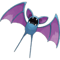|[Zubat](Pokemon/Zubat.md)|Poison, Flying|Inner Focus, (Hidden) Infiltrator|40|45|35|30|40|55|245|Flying |
|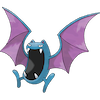|[Golbat](Pokemon/Golbat.md)|Poison, Flying|Inner Focus, (Hidden) Infiltrator|75|80|70|65|75|90|455|Flying |
|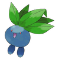|[Oddish](Pokemon/Oddish.md)|Grass, Poison|Chlorophyll, (Hidden) Run Away|45|50|55|75|65|30|320|Grass |
|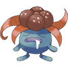|[Gloom](Pokemon/Gloom.md)|Grass, Poison|Chlorophyll, (Hidden) Stench|60|65|70|85|75|40|395|Grass |
|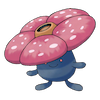|[Vileplume](Pokemon/Vileplume.md)|Grass, Poison|Chlorophyll, (Hidden) Effect Spore|75|80|85|110|90|50|490|Grass |
|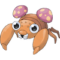|[Paras](Pokemon/Paras.md)|Bug, Grass|Effect Spore, Dry Skin, Damp|35|70|55|45|55|25|285|Bug, Grass |
|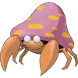|[Parasect](Pokemon/Parasect.md)|Bug, Grass|Effect Spore, Dry Skin, Damp|60|95|80|60|80|30|405|Bug, Grass |
|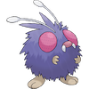|[Venonat](Pokemon/Venonat.md)|Bug, Poison|Compound Eyes, Tinted Lens, Run Away|60|55|50|40|55|45|305|Bug |
|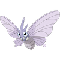|[Venomoth](Pokemon/Venomoth.md)|Bug, Poison|Shield Dust, Tinted Lens, Wonder Skin|70|65|60|90|75|90|450|Bug |
||[Diglett](Pokemon/Diglett.md)|Ground|Sand Veil, Arena Trap, Sand Force|10|55|25|35|45|95|265|Field |
||[Diglett](Pokemon/Diglett.md) (Alolan)|Ground, Steel|Sand Veil, Tangling Hair, Sand Force|10|55|30|35|45|90|265|Field |
|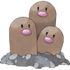|[Dugtrio](Pokemon/Dugtrio.md)|Ground|Sand Veil, Arena Trap, Sand Force|35|100|50|50|70|120|425|Field |
||[Dugtrio](Pokemon/Dugtrio.md) (Alolan)|Ground, Steel|Sand Veil, Tangling Hair, Sand Force|35|100|60|50|70|110|425|Field |
|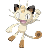|[Meowth](Pokemon/Meowth.md)|Normal|Pickup, Technician, Unnerve|40|45|35|40|40|90|290|Field |
||[Meowth](Pokemon/Meowth.md) (Alolan)|Dark|Pickup, Technician, Rattled|40|35|35|50|40|90|290|Field |
|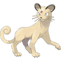|[Persian](Pokemon/Persian.md)|Normal|Limber, Technician, Unnerve|65|70|60|65|65|115|440|Field |
||[Persian](Pokemon/Persian.md) (Alolan)|Dark|Fur Coat, Technician, Rattled|65|60|60|75|65|115|440|Field |
||[Psyduck](Pokemon/Psyduck.md)|Water|Damp, Cloud Nine, Swift Swim|50|52|48|65|50|55|320|Water 1, Field |
|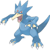|[Golduck](Pokemon/Golduck.md)|Water|Damp, Cloud Nine, Swift Swim|80|82|78|95|80|85|500|Water 1, Field |
|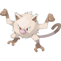|[Mankey](Pokemon/Mankey.md)|Fighting|Vital Spirit, Anger Point, Defiant|40|80|35|35|45|70|305|Field |
|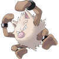|[Primeape](Pokemon/Primeape.md)|Fighting|Vital Spirit, Anger Point, Defiant|65|105|60|60|70|95|455|Field |
|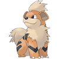|[Growlithe](Pokemon/Growlithe.md)|Fire|Intimidate, Flash Fire, Justified|55|70|45|70|50|60|350|Field |
|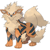|[Arcanine](Pokemon/Arcanine.md)|Fire|Intimidate, Flash Fire, Justified|90|110|80|100|80|95|555|Field |
||[Poliwag](Pokemon/Poliwag.md)|Water|Water Absorb, Damp, Swift Swim|40|50|40|40|40|90|300|Water 1 |
||[Poliwhirl](Pokemon/Poliwhirl.md)|Water|Water Absorb, Damp, Swift Swim|65|65|65|50|50|90|385|Water 1 |
|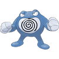|[Poliwrath](Pokemon/Poliwrath.md)|Water, Fighting|Water Absorb, Damp, Swift Swim|90|95|95|70|90|70|510|Water 1 |
|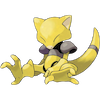|[Abra](Pokemon/Abra.md)|Psychic|Synchronize, Inner Focus, Magic Guard|25|20|15|105|55|90|310|Human-Like |
|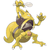|[Kadabra](Pokemon/Kadabra.md)|Psychic|Synchronize, Inner Focus, Magic Guard|40|35|30|120|70|105|400|Human-Like |
||[Alakazam](Pokemon/Alakazam.md)|Psychic|Synchronize, Inner Focus, Magic Guard|55|50|45|135|95|120|500|Human-Like |
||[Alakazam](Pokemon/Alakazam.md) (Mega)|Psychic|Trace|55|50|65|175|105|150|600|Human-Like |
||[Machop](Pokemon/Machop.md)|Fighting|Guts, No Guard, Steadfast|70|80|50|35|35|35|305|Human-Like |
||[Machoke](Pokemon/Machoke.md)|Fighting|Guts, No Guard, Steadfast|80|100|70|50|60|45|405|Human-Like |
||[Machamp](Pokemon/Machamp.md)|Fighting|Guts, No Guard, Steadfast|90|130|80|65|85|55|505|Human-Like |
||[Bellsprout](Pokemon/Bellsprout.md)|Grass, Poison|Chlorophyll, (Hidden) Gluttony|50|75|35|70|30|40|300|Grass |
||[Weepinbell](Pokemon/Weepinbell.md)|Grass, Poison|Chlorophyll, (Hidden) Gluttony|65|90|50|85|45|55|390|Grass |
||[Victreebel](Pokemon/Victreebel.md)|Grass, Poison|Chlorophyll, (Hidden) Gluttony|80|105|65|100|70|70|490|Grass |
||[Tentacool](Pokemon/Tentacool.md)|Water, Poison|Clear Body, Liquid Ooze, Rain Dish|40|40|35|50|100|70|335|Water 3 |
||[Tentacruel](Pokemon/Tentacruel.md)|Water, Poison|Clear Body, Liquid Ooze, Rain Dish|80|70|65|80|120|100|515|Water 3 |
||[Geodude](Pokemon/Geodude.md)|Rock, Ground|Rock Head, Sturdy, Sand Veil|40|80|100|30|30|20|300|Mineral |
||[Geodude](Pokemon/Geodude.md) (Alolan)|Rock, Electric|Magnet Pull, Sturdy, Galvanize|40|80|100|30|30|20|300|Mineral |
||[Graveler](Pokemon/Graveler.md)|Rock, Ground|Rock Head, Sturdy, Sand Veil|55|95|115|45|45|35|390|Mineral |
||[Graveler](Pokemon/Graveler.md) (Alolan)|Rock, Electric|Magnet Pull, Sturdy, Galvanize|55|95|115|45|45|35|390|Mineral |
||[Golem](Pokemon/Golem.md)|Rock, Ground|Rock Head, Sturdy, Sand Veil|80|120|130|55|65|45|495|Mineral |
||[Golem](Pokemon/Golem.md) (Alolan)|Rock, Electric|Magnet Pull, Sturdy, Galvanize|80|120|130|55|65|45|495|Mineral |
||[Ponyta](Pokemon/Ponyta.md)|Fire|Run Away, Flash Fire, Flame Body|50|85|55|65|65|90|410|Field |
||[Rapidash](Pokemon/Rapidash.md)|Fire|Run Away, Flash Fire, Flame Body|65|100|70|80|80|105|500|Field |
||[Slowpoke](Pokemon/Slowpoke.md)|Water, Psychic|Oblivious, Own Tempo, Regenerator|90|65|65|40|40|15|315|Monster, Water 1 |
||[Slowbro](Pokemon/Slowbro.md)|Water, Psychic|Oblivious, Own Tempo, Regenerator|95|75|110|100|80|30|490|Monster, Water 1 |
||[Slowbro](Pokemon/Slowbro.md) (Mega)|Water, Psychic|Shell Armor|95|75|180|130|80|30|590|Monster, Water 1 |
||[Magnemite](Pokemon/Magnemite.md)|Electric, Steel|Magnet Pull, Sturdy, Analytic|25|35|70|95|55|45|325|Mineral |
||[Magneton](Pokemon/Magneton.md)|Electric, Steel|Magnet Pull, Sturdy, Analytic|50|60|95|120|70|70|465|Mineral |
||[Farfetch'd](Pokemon/Farfetch'd.md)|Normal, Flying|Keen Eye, Inner Focus, Defiant|52|90|55|58|62|60|377|Flying, Field |
||[Doduo](Pokemon/Doduo.md)|Normal, Flying|Run Away, Early Bird, Tangled Feet|35|85|45|35|35|75|310|Flying |
||[Dodrio](Pokemon/Dodrio.md)|Normal, Flying|Run Away, Early Bird, Tangled Feet|60|110|70|60|60|110|470|Flying |
||[Seel](Pokemon/Seel.md)|Water|Thick Fat, Hydration, Ice Body|65|45|55|45|70|45|325|Water 1, Field |
||[Dewgong](Pokemon/Dewgong.md)|Water, Ice|Thick Fat, Hydration, Ice Body|90|70|80|70|95|70|475|Water 1, Field |
||[Grimer](Pokemon/Grimer.md)|Poison|Stench, Sticky Hold, Poison Touch|80|80|50|40|50|25|325|Amorphous |
||[Grimer](Pokemon/Grimer.md) (Alolan)|Poison, Dark|Poison Touch, Gluttony, Power of Alchemy|80|80|50|40|50|25|325|Amorphous |
||[Muk](Pokemon/Muk.md)|Poison|Stench, Sticky Hold, Poison Touch|105|105|75|65|100|50|500|Amorphous |
||[Muk](Pokemon/Muk.md) (Alolan)|Poison, Dark|Poison Touch, Gluttony, Power of Alchemy|105|105|75|65|100|50|500|Amorphous |
||[Shellder](Pokemon/Shellder.md)|Water|Shell Armor, Skill Link, Overcoat|30|65|100|45|25|40|305|Water 3 |
||[Cloyster](Pokemon/Cloyster.md)|Water, Ice|Shell Armor, Skill Link, Overcoat|50|95|180|85|45|70|525|Water 3 |
||[Gastly](Pokemon/Gastly.md)|Ghost, Poison|Levitate|30|35|30|100|35|80|310|Amorphous |
||[Haunter](Pokemon/Haunter.md)|Ghost, Poison|Levitate|45|50|45|115|55|95|405|Amorphous |
||[Gengar](Pokemon/Gengar.md)|Ghost, Poison|Cursed Body|60|65|60|130|75|110|500|Amorphous |
||[Gengar](Pokemon/Gengar.md) (Mega)|Ghost, Poison|Shadow Tag|60|65|80|170|95|130|600|Amorphous |
||[Onix](Pokemon/Onix.md)|Rock, Ground|Rock Head, Sturdy, Weak Armor|35|45|160|30|45|70|385|Mineral |
||[Drowzee](Pokemon/Drowzee.md)|Psychic|Insomnia, Forewarn, Inner Focus|60|48|45|43|90|42|328|Human-Like |
||[Hypno](Pokemon/Hypno.md)|Psychic|Insomnia, Forewarn, Inner Focus|85|73|70|73|115|67|483|Human-Like |
||[Krabby](Pokemon/Krabby.md)|Water|Hyper Cutter, Shell Armor, Sheer Force|30|105|90|25|25|50|325|Water 3 |
||[Kingler](Pokemon/Kingler.md)|Water|Hyper Cutter, Shell Armor, Sheer Force|55|130|115|50|50|75|475|Water 3 |
||[Voltorb](Pokemon/Voltorb.md)|Electric|Soundproof, Static, Aftermath|40|30|50|55|55|100|330|Mineral |
||[Electrode](Pokemon/Electrode.md)|Electric|Soundproof, Static, Aftermath|60|50|70|80|80|150|490|Mineral |
||[Exeggcute](Pokemon/Exeggcute.md)|Grass, Psychic|Chlorophyll, (Hidden) Harvest|60|40|80|60|45|40|325|Grass |
||[Exeggutor](Pokemon/Exeggutor.md)|Grass, Psychic|Chlorophyll, (Hidden) Harvest|95|95|85|125|75|55|530|Grass |
||[Exeggutor](Pokemon/Exeggutor.md) (Alolan)|Grass, Dragon|Frisk, (Hidden) Harvest|95|105|85|125|75|45|530|Grass |
||[Cubone](Pokemon/Cubone.md)|Ground|Rock Head, Lightning Rod, Battle Armor|50|50|95|40|50|35|320|Monster |
||[Marowak](Pokemon/Marowak.md)|Ground|Rock Head, Lightning Rod, Battle Armor|60|80|110|50|80|45|425|Monster |
||[Marowak](Pokemon/Marowak.md) (Alolan)|Fire, Ghost|Cursed Body, Lightning Rod, Rock Head|60|80|110|50|80|45|425|Monster |
||[Hitmonlee](Pokemon/Hitmonlee.md)|Fighting|Limber, Reckless, Unburden|50|120|53|35|110|87|455|Human-Like |
||[Hitmonchan](Pokemon/Hitmonchan.md)|Fighting|Keen Eye, Iron Fist, Inner Focus|50|105|79|35|110|76|455|Human-Like |
||[Lickitung](Pokemon/Lickitung.md)|Normal|Own Tempo, Oblivious, Cloud Nine|90|55|75|60|75|30|385|Monster |
||[Koffing](Pokemon/Koffing.md)|Poison|Levitate|40|65|95|60|45|35|340|Amorphous |
||[Weezing](Pokemon/Weezing.md)|Poison|Levitate|65|90|120|85|70|60|490|Amorphous |
||[Rhyhorn](Pokemon/Rhyhorn.md)|Ground, Rock|Lightning Rod, Rock Head, Reckless|80|85|95|30|30|25|345|Monster, Field |
||[Rhydon](Pokemon/Rhydon.md)|Ground, Rock|Lightning Rod, Rock Head, Reckless|105|130|120|45|45|40|485|Monster, Field |
||[Chansey](Pokemon/Chansey.md)|Normal|Natural Cure, Serene Grace, Healer|250|5|5|35|105|50|450|Fairy |
||[Tangela](Pokemon/Tangela.md)|Grass|Chlorophyll, Leaf Guard, Regenerator|65|55|115|100|40|60|435|Grass |
||[Kangaskhan](Pokemon/Kangaskhan.md)|Normal|Early Bird, Scrappy, Inner Focus|105|95|80|40|80|90|490|Monster |
||[Kangaskhan](Pokemon/Kangaskhan.md) (Mega)|Normal|Parental Bond|105|125|100|60|100|100|590|Monster |
||[Horsea](Pokemon/Horsea.md)|Water|Swift Swim, Sniper, Damp|30|40|70|70|25|60|295|Water 1, Dragon |
||[Seadra](Pokemon/Seadra.md)|Water|Poison Point, Sniper, Damp|55|65|95|95|45|85|440|Water 1, Dragon |
||[Goldeen](Pokemon/Goldeen.md)|Water|Swift Swim, Water Veil, Lightning Rod|45|67|60|35|50|63|320|Water 2 |
||[Seaking](Pokemon/Seaking.md)|Water|Swift Swim, Water Veil, Lightning Rod|80|92|65|65|80|68|450|Water 2 |
||[Staryu](Pokemon/Staryu.md)|Water|Illuminate, Natural Cure, Analytic|30|45|55|70|55|85|340|Water 3 |
||[Starmie](Pokemon/Starmie.md)|Water, Psychic|Illuminate, Natural Cure, Analytic|60|75|85|100|85|115|520|Water 3 |
||[Mr. Mime](Pokemon/Mr-Mime.md)|Psychic, Fairy|Soundproof, Filter, Technician|40|45|65|100|120|90|460|Human-Like |
||[Scyther](Pokemon/Scyther.md)|Bug, Flying|Swarm, Technician, Steadfast|70|110|80|55|80|105|500|Bug |
||[Jynx](Pokemon/Jynx.md)|Ice, Psychic|Oblivious, Forewarn, Dry Skin|65|50|35|115|95|95|455|Human-Like |
||[Electabuzz](Pokemon/Electabuzz.md)|Electric|Static, (Hidden) Vital Spirit|65|83|57|95|85|105|490|Human-Like |
||[Magmar](Pokemon/Magmar.md)|Fire|Flame Body, (Hidden) Vital Spirit|65|95|57|100|85|93|495|Human-Like |
||[Pinsir](Pokemon/Pinsir.md)|Bug|Hyper Cutter, Mold Breaker, Moxie|65|125|100|55|70|85|500|Bug |
||[Pinsir](Pokemon/Pinsir.md) (Mega)|Bug, Flying|Aerilate|65|155|120|65|90|105|600|Bug |
||[Tauros](Pokemon/Tauros.md)|Normal|Intimidate, Anger Point, Sheer Force|75|100|95|40|70|110|490|Field |
||[Magikarp](Pokemon/Magikarp.md)|Water|Swift Swim, (Hidden) Rattled|20|10|55|15|20|80|200|Water 2, Dragon |
||[Gyarados](Pokemon/Gyarados.md)|Water, Flying|Intimidate, (Hidden) Moxie|95|125|79|60|100|81|540|Water 2, Dragon |
||[Gyarados](Pokemon/Gyarados.md) (Mega)|Water, Dark|Mold Breaker|95|155|109|70|130|81|640|Water 2, Dragon |
||[Lapras](Pokemon/Lapras.md)|Water, Ice|Water Absorb, Shell Armor, Hydration|130|85|80|85|95|60|535|Monster, Water 1 |
||[Ditto](Pokemon/Ditto.md)|Normal|Limber, (Hidden) Imposter|48|48|48|48|48|48|288|Ditto |
||[Eevee](Pokemon/Eevee.md)|Normal|Run Away, Adaptability, Anticipation|55|55|50|45|65|55|325|Field |
||[Vaporeon](Pokemon/Vaporeon.md)|Water|Water Absorb, (Hidden) Hydration|130|65|60|110|95|65|525|Field |
||[Jolteon](Pokemon/Jolteon.md)|Electric|Volt Absorb, (Hidden) Quick Feet|65|65|60|110|95|130|525|Field |
||[Flareon](Pokemon/Flareon.md)|Fire|Flash Fire, (Hidden) Guts|65|130|60|95|110|65|525|Field |
||[Porygon](Pokemon/Porygon.md)|Normal|Trace, Download, Analytic|65|60|70|85|75|40|395|Mineral |
||[Omanyte](Pokemon/Omanyte.md)|Rock, Water|Swift Swim, Shell Armor, Weak Armor|35|40|100|90|55|35|355|Water 1, Water 3 |
||[Omastar](Pokemon/Omastar.md)|Rock, Water|Swift Swim, Shell Armor, Weak Armor|70|60|125|115|70|55|495|Water 1, Water 3 |
||[Kabuto](Pokemon/Kabuto.md)|Rock, Water|Swift Swim, Battle Armor, Weak Armor|30|80|90|55|45|55|355|Water 1, Water 3 |
||[Kabutops](Pokemon/Kabutops.md)|Rock, Water|Swift Swim, Battle Armor, Weak Armor|60|115|105|65|70|80|495|Water 1, Water 3 |
||[Aerodactyl](Pokemon/Aerodactyl.md)|Rock, Flying|Rock Head, Pressure, Unnerve|80|105|65|60|75|130|515|Flying |
||[Aerodactyl](Pokemon/Aerodactyl.md) (Mega)|Rock, Flying|Tough Claws|80|135|85|70|95|150|615|Flying |
||[Snorlax](Pokemon/Snorlax.md)|Normal|Immunity, Thick Fat, Gluttony|160|110|65|65|110|30|540|Monster |
||[Articuno](Pokemon/Articuno.md)|Ice, Flying|Pressure, (Hidden) Snow Cloak|90|85|100|95|125|85|580|Undiscovered |
||[Zapdos](Pokemon/Zapdos.md)|Electric, Flying|Pressure, (Hidden) Static|90|90|85|125|90|100|580|Undiscovered |
||[Moltres](Pokemon/Moltres.md)|Fire, Flying|Pressure, (Hidden) Flame Body|90|100|90|125|85|90|580|Undiscovered |
||[Dratini](Pokemon/Dratini.md)|Dragon|Shed Skin, (Hidden) Marvel Scale|41|64|45|50|50|50|300|Water 1, Dragon |
||[Dragonair](Pokemon/Dragonair.md)|Dragon|Shed Skin, (Hidden) Marvel Scale|61|84|65|70|70|70|420|Water 1, Dragon |
||[Dragonite](Pokemon/Dragonite.md)|Dragon, Flying|Inner Focus, (Hidden) Multiscale|91|134|95|100|100|80|600|Water 1, Dragon |
||[Mewtwo](Pokemon/Mewtwo.md)|Psychic|Pressure, (Hidden) Unnerve|106|110|90|154|90|130|680|Undiscovered |
||[Mewtwo](Pokemon/Mewtwo.md) (Mega X)|Psychic, Fighting|Steadfast|106|190|100|154|100|130|780|Undiscovered |
||[Mewtwo](Pokemon/Mewtwo.md) (Mega Y)|Psychic|Insomnia|106|150|70|194|120|140|780|Undiscovered |
||[Mew](Pokemon/Mew.md)|Psychic|Synchronize|100|100|100|100|100|100|600|Undiscovered |
||[Chikorita](Pokemon/Chikorita.md)|Grass|Overgrow, (Hidden) Leaf Guard|45|49|65|49|65|45|318|Monster, Grass |
||[Bayleef](Pokemon/Bayleef.md)|Grass|Overgrow, (Hidden) Leaf Guard|60|62|80|63|80|60|405|Monster, Grass |
||[Meganium](Pokemon/Meganium.md)|Grass|Overgrow, (Hidden) Leaf Guard|80|82|100|83|100|80|525|Monster, Grass |
||[Cyndaquil](Pokemon/Cyndaquil.md)|Fire|Blaze, (Hidden) Flash Fire|39|52|43|60|50|65|309|Field |
||[Quilava](Pokemon/Quilava.md)|Fire|Blaze, (Hidden) Flash Fire|58|64|58|80|65|80|405|Field |
||[Typhlosion](Pokemon/Typhlosion.md)|Fire|Blaze, (Hidden) Flash Fire|78|84|78|109|85|100|534|Field |
||[Totodile](Pokemon/Totodile.md)|Water|Torrent, (Hidden) Sheer Force|50|65|64|44|48|43|314|Monster, Water 1 |
||[Croconaw](Pokemon/Croconaw.md)|Water|Torrent, (Hidden) Sheer Force|65|80|80|59|63|58|405|Monster, Water 1 |
||[Feraligatr](Pokemon/Feraligatr.md)|Water|Torrent, (Hidden) Sheer Force|85|105|100|79|83|78|530|Monster, Water 1 |
||[Sentret](Pokemon/Sentret.md)|Normal|Run Away, Keen Eye, Frisk|35|46|34|35|45|20|215|Field |
||[Furret](Pokemon/Furret.md)|Normal|Run Away, Keen Eye, Frisk|85|76|64|45|55|90|415|Field |
||[Hoothoot](Pokemon/Hoothoot.md)|Normal, Flying|Insomnia, Keen Eye, Tinted Lens|60|30|30|36|56|50|262|Flying |
||[Noctowl](Pokemon/Noctowl.md)|Normal, Flying|Insomnia, Keen Eye, Tinted Lens|100|50|50|86|96|70|452|Flying |
||[Ledyba](Pokemon/Ledyba.md)|Bug, Flying|Swarm, Early Bird, Rattled|40|20|30|40|80|55|265|Bug |
||[Ledian](Pokemon/Ledian.md)|Bug, Flying|Swarm, Early Bird, Iron Fist|55|35|50|55|110|85|390|Bug |
||[Spinarak](Pokemon/Spinarak.md)|Bug, Poison|Swarm, Insomnia, Sniper|40|60|40|40|40|30|250|Bug |
||[Ariados](Pokemon/Ariados.md)|Bug, Poison|Swarm, Insomnia, Sniper|70|90|70|60|70|40|400|Bug |
||[Crobat](Pokemon/Crobat.md)|Poison, Flying|Inner Focus, (Hidden) Infiltrator|85|90|80|70|80|130|535|Flying |
||[Chinchou](Pokemon/Chinchou.md)|Water, Electric|Volt Absorb, Illuminate, Water Absorb|75|38|38|56|56|67|330|Water 2 |
||[Lanturn](Pokemon/Lanturn.md)|Water, Electric|Volt Absorb, Illuminate, Water Absorb|125|58|58|76|76|67|460|Water 2 |
||[Pichu](Pokemon/Pichu.md)|Electric|Static, (Hidden) Lightning Rod|20|40|15|35|35|60|205|Undiscovered |
||[Cleffa](Pokemon/Cleffa.md)|Fairy|Cute Charm, Magic Guard, Friend Guard|50|25|28|45|55|15|218|Undiscovered |
||[Igglybuff](Pokemon/Igglybuff.md)|Normal, Fairy|Cute Charm, Competitive, Friend Guard|90|30|15|40|20|15|210|Undiscovered |
||[Togepi](Pokemon/Togepi.md)|Fairy|Hustle, Serene Grace, Super Luck|35|20|65|40|65|20|245|Undiscovered |
||[Togetic](Pokemon/Togetic.md)|Fairy, Flying|Hustle, Serene Grace, Super Luck|55|40|85|80|105|40|405|Flying, Fairy |
||[Natu](Pokemon/Natu.md)|Psychic, Flying|Synchronize, Early Bird, Magic Bounce|40|50|45|70|45|70|320|Flying |
||[Xatu](Pokemon/Xatu.md)|Psychic, Flying|Synchronize, Early Bird, Magic Bounce|65|75|70|95|70|95|470|Flying |
||[Mareep](Pokemon/Mareep.md)|Electric|Static, (Hidden) Plus|55|40|40|65|45|35|280|Monster, Field |
||[Flaaffy](Pokemon/Flaaffy.md)|Electric|Static, (Hidden) Plus|70|55|55|80|60|45|365|Monster, Field |
||[Ampharos](Pokemon/Ampharos.md)|Electric|Static, (Hidden) Plus|90|75|85|115|90|55|510|Monster, Field |
||[Ampharos](Pokemon/Ampharos.md) (Mega)|Electric, Dragon|Mold Breaker|90|95|105|165|110|45|610|Monster, Field |
||[Bellossom](Pokemon/Bellossom.md)|Grass|Chlorophyll, (Hidden) Healer|75|80|95|90|100|50|490|Grass |
||[Marill](Pokemon/Marill.md)|Water, Fairy|Thick Fat, Huge Power, Sap Sipper|70|20|50|20|50|40|250|Water 1, Fairy |
||[Azumarill](Pokemon/Azumarill.md)|Water, Fairy|Thick Fat, Huge Power, Sap Sipper|100|50|80|60|80|50|420|Water 1, Fairy |
||[Sudowoodo](Pokemon/Sudowoodo.md)|Rock|Sturdy, Rock Head, Rattled|70|100|115|30|65|30|410|Mineral |
||[Politoed](Pokemon/Politoed.md)|Water|Water Absorb, Damp, Drizzle|90|75|75|90|100|70|500|Water 1 |
||[Hoppip](Pokemon/Hoppip.md)|Grass, Flying|Chlorophyll, Leaf Guard, Infiltrator|35|35|40|35|55|50|250|Fairy, Grass |
||[Skiploom](Pokemon/Skiploom.md)|Grass, Flying|Chlorophyll, Leaf Guard, Infiltrator|55|45|50|45|65|80|340|Fairy, Grass |
||[Jumpluff](Pokemon/Jumpluff.md)|Grass, Flying|Chlorophyll, Leaf Guard, Infiltrator|75|55|70|55|95|110|460|Fairy, Grass |
||[Aipom](Pokemon/Aipom.md)|Normal|Run Away, Pickup, Skill Link|55|70|55|40|55|85|360|Field |
||[Sunkern](Pokemon/Sunkern.md)|Grass|Chlorophyll, Solar Power, Early Bird|30|30|30|30|30|30|180|Grass |
||[Sunflora](Pokemon/Sunflora.md)|Grass|Chlorophyll, Solar Power, Early Bird|75|75|55|105|85|30|425|Grass |
||[Yanma](Pokemon/Yanma.md)|Bug, Flying|Speed Boost, Compound Eyes, Frisk|65|65|45|75|45|95|390|Bug |
||[Wooper](Pokemon/Wooper.md)|Water, Ground|Damp, Water Absorb, Unaware|55|45|45|25|25|15|210|Water 1, Field |
||[Quagsire](Pokemon/Quagsire.md)|Water, Ground|Damp, Water Absorb, Unaware|95|85|85|65|65|35|430|Water 1, Field |
||[Espeon](Pokemon/Espeon.md)|Psychic|Synchronize, (Hidden) Magic Bounce|65|65|60|130|95|110|525|Field |
||[Umbreon](Pokemon/Umbreon.md)|Dark|Synchronize, (Hidden) Inner Focus|95|65|110|60|130|65|525|Field |
||[Murkrow](Pokemon/Murkrow.md)|Dark, Flying|Insomnia, Super Luck, Prankster|60|85|42|85|42|91|405|Flying |
||[Slowking](Pokemon/Slowking.md)|Water, Psychic|Oblivious, Own Tempo, Regenerator|95|75|80|100|110|30|490|Monster, Water 1 |
||[Misdreavus](Pokemon/Misdreavus.md)|Ghost|Levitate|60|60|60|85|85|85|435|Amorphous |
||[Unown](Pokemon/Unown.md)|Psychic|Levitate|48|72|48|72|48|48|336|Undiscovered |
||[Wobbuffet](Pokemon/Wobbuffet.md)|Psychic|Shadow Tag, (Hidden) Telepathy|190|33|58|33|58|33|405|Amorphous |
||[Girafarig](Pokemon/Girafarig.md)|Normal, Psychic|Inner Focus, Early Bird, Sap Sipper|70|80|65|90|65|85|455|Field |
||[Pineco](Pokemon/Pineco.md)|Bug|Sturdy, (Hidden) Overcoat|50|65|90|35|35|15|290|Bug |
||[Forretress](Pokemon/Forretress.md)|Bug, Steel|Sturdy, (Hidden) Overcoat|75|90|140|60|60|40|465|Bug |
||[Dunsparce](Pokemon/Dunsparce.md)|Normal|Serene Grace, Run Away, Rattled|100|70|70|65|65|45|415|Field |
||[Gligar](Pokemon/Gligar.md)|Ground, Flying|Hyper Cutter, Sand Veil, Immunity|65|75|105|35|65|85|430|Bug |
||[Steelix](Pokemon/Steelix.md)|Steel, Ground|Rock Head, Sturdy, Sheer Force|75|85|200|55|65|30|510|Mineral |
||[Steelix](Pokemon/Steelix.md) (Mega)|Steel, Ground|Sand Force|75|125|230|55|95|30|610|Mineral |
||[Snubbull](Pokemon/Snubbull.md)|Fairy|Intimidate, Run Away, Rattled|60|80|50|40|40|30|300|Field, Fairy |
||[Granbull](Pokemon/Granbull.md)|Fairy|Intimidate, Quick Feet, Rattled|90|120|75|60|60|45|450|Field, Fairy |
||[Qwilfish](Pokemon/Qwilfish.md)|Water, Poison|Poison Point, Swift Swim, Intimidate|65|95|85|55|55|85|440|Water 2 |
||[Scizor](Pokemon/Scizor.md)|Bug, Steel|Swarm, Technician, Light Metal|70|130|100|55|80|65|500|Bug |
||[Scizor](Pokemon/Scizor.md) (Mega)|Bug, Steel|Technician|70|150|140|65|100|75|600|Bug |
||[Shuckle](Pokemon/Shuckle.md)|Bug, Rock|Sturdy, Gluttony, Contrary|20|10|230|10|230|5|505|Bug |
||[Heracross](Pokemon/Heracross.md)|Bug, Fighting|Swarm, Guts, Moxie|80|125|75|40|95|85|500|Bug |
||[Heracross](Pokemon/Heracross.md) (Mega)|Bug, Fighting|Skill Link|80|185|115|40|105|75|600|Bug |
||[Sneasel](Pokemon/Sneasel.md)|Dark, Ice|Inner Focus, Keen Eye, Pickpocket|55|95|55|35|75|115|430|Field |
||[Teddiursa](Pokemon/Teddiursa.md)|Normal|Pickup, Quick Feet, Honey Gather|60|80|50|50|50|40|330|Field |
||[Ursaring](Pokemon/Ursaring.md)|Normal|Guts, Quick Feet, Unnerve|90|130|75|75|75|55|500|Field |
||[Slugma](Pokemon/Slugma.md)|Fire|Magma Armor, Flame Body, Weak Armor|40|40|40|70|40|20|250|Amorphous |
||[Magcargo](Pokemon/Magcargo.md)|Fire, Rock|Magma Armor, Flame Body, Weak Armor|60|50|120|90|80|30|430|Amorphous |
||[Swinub](Pokemon/Swinub.md)|Ice, Ground|Oblivious, Snow Cloak, Thick Fat|50|50|40|30|30|50|250|Field |
||[Piloswine](Pokemon/Piloswine.md)|Ice, Ground|Oblivious, Snow Cloak, Thick Fat|100|100|80|60|60|50|450|Field |
||[Corsola](Pokemon/Corsola.md)|Water, Rock|Hustle, Natural Cure, Regenerator|65|55|95|65|95|35|410|Water 1, Water 3 |
||[Remoraid](Pokemon/Remoraid.md)|Water|Hustle, Sniper, Moody|35|65|35|65|35|65|300|Water 1, Water 2 |
||[Octillery](Pokemon/Octillery.md)|Water|Suction Cups, Sniper, Moody|75|105|75|105|75|45|480|Water 1, Water 2 |
||[Delibird](Pokemon/Delibird.md)|Ice, Flying|Vital Spirit, Hustle, Insomnia|45|55|45|65|45|75|330|Water 1, Field |
||[Mantine](Pokemon/Mantine.md)|Water, Flying|Swift Swim, Water Absorb, Water Veil|85|40|70|80|140|70|485|Water 1 |
||[Skarmory](Pokemon/Skarmory.md)|Steel, Flying|Keen Eye, Sturdy, Weak Armor|65|80|140|40|70|70|465|Flying |
||[Houndour](Pokemon/Houndour.md)|Dark, Fire|Early Bird, Flash Fire, Unnerve|45|60|30|80|50|65|330|Field |
||[Houndoom](Pokemon/Houndoom.md)|Dark, Fire|Early Bird, Flash Fire, Unnerve|75|90|50|110|80|95|500|Field |
||[Houndoom](Pokemon/Houndoom.md) (Mega)|Dark, Fire|Solar Power|75|90|90|140|90|115|600|Field |
||[Kingdra](Pokemon/Kingdra.md)|Water, Dragon|Swift Swim, Sniper, Damp|75|95|95|95|95|85|540|Water 1, Dragon |
||[Phanpy](Pokemon/Phanpy.md)|Ground|Pickup, (Hidden) Sand Veil|90|60|60|40|40|40|330|Field |
||[Donphan](Pokemon/Donphan.md)|Ground|Sturdy, (Hidden) Sand Veil|90|120|120|60|60|50|500|Field |
||[Porygon2](Pokemon/Porygon2.md)|Normal|Trace, Download, Analytic|85|80|90|105|95|60|515|Mineral |
||[Stantler](Pokemon/Stantler.md)|Normal|Intimidate, Frisk, Sap Sipper|73|95|62|85|65|85|465|Field |
||[Smeargle](Pokemon/Smeargle.md)|Normal|Own Tempo, Technician, Moody|55|20|35|20|45|75|250|Field |
||[Tyrogue](Pokemon/Tyrogue.md)|Fighting|Guts, Steadfast, Vital Spirit|35|35|35|35|35|35|210|Undiscovered |
||[Hitmontop](Pokemon/Hitmontop.md)|Fighting|Intimidate, Technician, Steadfast|50|95|95|35|110|70|455|Human-Like |
||[Smoochum](Pokemon/Smoochum.md)|Ice, Psychic|Oblivious, Forewarn, Hydration|45|30|15|85|65|65|305|Undiscovered |
||[Elekid](Pokemon/Elekid.md)|Electric|Static, (Hidden) Vital Spirit|45|63|37|65|55|95|360|Undiscovered |
||[Magby](Pokemon/Magby.md)|Fire|Flame Body, (Hidden) Vital Spirit|45|75|37|70|55|83|365|Undiscovered |
||[Miltank](Pokemon/Miltank.md)|Normal|Thick Fat, Scrappy, Sap Sipper|95|80|105|40|70|100|490|Field |
||[Blissey](Pokemon/Blissey.md)|Normal|Natural Cure, Serene Grace, Healer|255|10|10|75|135|55|540|Fairy |
||[Raikou](Pokemon/Raikou.md)|Electric|Pressure, (Hidden) Inner Focus|90|85|75|115|100|115|580|Undiscovered |
||[Entei](Pokemon/Entei.md)|Fire|Pressure, (Hidden) Inner Focus|115|115|85|90|75|100|580|Undiscovered |
||[Suicune](Pokemon/Suicune.md)|Water|Pressure, (Hidden) Inner Focus|100|75|115|90|115|85|580|Undiscovered |
||[Larvitar](Pokemon/Larvitar.md)|Rock, Ground|Guts, (Hidden) Sand Veil|50|64|50|45|50|41|300|Monster |
||[Pupitar](Pokemon/Pupitar.md)|Rock, Ground|Shed Skin|70|84|70|65|70|51|410|Monster |
||[Tyranitar](Pokemon/Tyranitar.md)|Rock, Dark|Sand Stream, (Hidden) Unnerve|100|134|110|95|100|61|600|Monster |
||[Tyranitar](Pokemon/Tyranitar.md) (Mega)|Rock, Dark|Sand Stream|100|164|150|95|120|71|700|Monster |
||[Lugia](Pokemon/Lugia.md)|Psychic, Flying|Pressure, (Hidden) Multiscale|106|90|130|90|154|110|680|Undiscovered |
||[Ho-Oh](Pokemon/Ho-Oh.md)|Fire, Flying|Pressure, (Hidden) Regenerator|106|130|90|110|154|90|680|Undiscovered |
||[Celebi](Pokemon/Celebi.md)|Psychic, Grass|Natural Cure|100|100|100|100|100|100|600|Undiscovered |
||[Treecko](Pokemon/Treecko.md)|Grass|Overgrow, (Hidden) Unburden|40|45|35|65|55|70|310|Monster, Dragon |
||[Grovyle](Pokemon/Grovyle.md)|Grass|Overgrow, (Hidden) Unburden|50|65|45|85|65|95|405|Monster, Dragon |
||[Sceptile](Pokemon/Sceptile.md)|Grass|Overgrow, (Hidden) Unburden|70|85|65|105|85|120|530|Monster, Dragon |
||[Sceptile](Pokemon/Sceptile.md) (Mega)|Grass, Dragon|Lightning Rod|70|110|75|145|85|145|630|Monster, Dragon |
||[Torchic](Pokemon/Torchic.md)|Fire|Blaze, (Hidden) Speed Boost|45|60|40|70|50|45|310|Field |
||[Combusken](Pokemon/Combusken.md)|Fire, Fighting|Blaze, (Hidden) Speed Boost|60|85|60|85|60|55|405|Field |
||[Blaziken](Pokemon/Blaziken.md)|Fire, Fighting|Blaze, (Hidden) Speed Boost|80|120|70|110|70|80|530|Field |
||[Blaziken](Pokemon/Blaziken.md) (Mega)|Fire, Fighting|Speed Boost|80|160|80|130|80|100|630|Field |
||[Mudkip](Pokemon/Mudkip.md)|Water|Torrent, (Hidden) Damp|50|70|50|50|50|40|310|Monster, Water 1 |
||[Marshtomp](Pokemon/Marshtomp.md)|Water, Ground|Torrent, (Hidden) Damp|70|85|70|60|70|50|405|Monster, Water 1 |
||[Swampert](Pokemon/Swampert.md)|Water, Ground|Torrent, (Hidden) Damp|100|110|90|85|90|60|535|Monster, Water 1 |
||[Swampert](Pokemon/Swampert.md) (Mega)|Water, Ground|Swift Swim|100|150|110|95|110|70|635|Monster, Water 1 |
||[Poochyena](Pokemon/Poochyena.md)|Dark|Run Away, Quick Feet, Rattled|35|55|35|30|30|35|220|Field |
||[Mightyena](Pokemon/Mightyena.md)|Dark|Intimidate, Quick Feet, Moxie|70|90|70|60|60|70|420|Field |
||[Zigzagoon](Pokemon/Zigzagoon.md)|Normal|Pickup, Gluttony, Quick Feet|38|30|41|30|41|60|240|Field |
||[Linoone](Pokemon/Linoone.md)|Normal|Pickup, Gluttony, Quick Feet|78|70|61|50|61|100|420|Field |
||[Wurmple](Pokemon/Wurmple.md)|Bug|Shield Dust, (Hidden) Run Away|45|45|35|20|30|20|195|Bug |
||[Silcoon](Pokemon/Silcoon.md)|Bug|Shed Skin|50|35|55|25|25|15|205|Bug |
||[Beautifly](Pokemon/Beautifly.md)|Bug, Flying|Swarm, (Hidden) Rivalry|60|70|50|100|50|65|395|Bug |
||[Cascoon](Pokemon/Cascoon.md)|Bug|Shed Skin|50|35|55|25|25|15|205|Bug |
||[Dustox](Pokemon/Dustox.md)|Bug, Poison|Shield Dust, (Hidden) Compound Eyes|60|50|70|50|90|65|385|Bug |
||[Lotad](Pokemon/Lotad.md)|Water, Grass|Swift Swim, Rain Dish, Own Tempo|40|30|30|40|50|30|220|Water 1, Grass |
||[Lombre](Pokemon/Lombre.md)|Water, Grass|Swift Swim, Rain Dish, Own Tempo|60|50|50|60|70|50|340|Water 1, Grass |
||[Ludicolo](Pokemon/Ludicolo.md)|Water, Grass|Swift Swim, Rain Dish, Own Tempo|80|70|70|90|100|70|480|Water 1, Grass |
||[Seedot](Pokemon/Seedot.md)|Grass|Chlorophyll, Early Bird, Pickpocket|40|40|50|30|30|30|220|Field, Grass |
||[Nuzleaf](Pokemon/Nuzleaf.md)|Grass, Dark|Chlorophyll, Early Bird, Pickpocket|70|70|40|60|40|60|340|Field, Grass |
||[Shiftry](Pokemon/Shiftry.md)|Grass, Dark|Chlorophyll, Early Bird, Pickpocket|90|100|60|90|60|80|480|Field, Grass |
||[Taillow](Pokemon/Taillow.md)|Normal, Flying|Guts, (Hidden) Scrappy|40|55|30|30|30|85|270|Flying |
||[Swellow](Pokemon/Swellow.md)|Normal, Flying|Guts, (Hidden) Scrappy|60|85|60|75|50|125|455|Flying |
||[Wingull](Pokemon/Wingull.md)|Water, Flying|Keen Eye, Hydration, Rain Dish|40|30|30|55|30|85|270|Water 1, Flying |
||[Pelipper](Pokemon/Pelipper.md)|Water, Flying|Keen Eye, Drizzle, Rain Dish|60|50|100|95|70|65|440|Water 1, Flying |
||[Ralts](Pokemon/Ralts.md)|Psychic, Fairy|Synchronize, Trace, Telepathy|28|25|25|45|35|40|198|Amorphous |
||[Kirlia](Pokemon/Kirlia.md)|Psychic, Fairy|Synchronize, Trace, Telepathy|38|35|35|65|55|50|278|Amorphous |
||[Gardevoir](Pokemon/Gardevoir.md)|Psychic, Fairy|Synchronize, Trace, Telepathy|68|65|65|125|115|80|518|Amorphous |
||[Gardevoir](Pokemon/Gardevoir.md) (Mega)|Psychic, Fairy|Pixilate|68|85|65|165|135|100|618|Amorphous |
||[Surskit](Pokemon/Surskit.md)|Bug, Water|Swift Swim, (Hidden) Rain Dish|40|30|32|50|52|65|269|Water 1, Bug |
||[Masquerain](Pokemon/Masquerain.md)|Bug, Flying|Intimidate, (Hidden) Unnerve|70|60|62|100|82|80|454|Water 1, Bug |
||[Shroomish](Pokemon/Shroomish.md)|Grass|Effect Spore, Poison Heal, Quick Feet|60|40|60|40|60|35|295|Fairy, Grass |
||[Breloom](Pokemon/Breloom.md)|Grass, Fighting|Effect Spore, Poison Heal, Technician|60|130|80|60|60|70|460|Fairy, Grass |
||[Slakoth](Pokemon/Slakoth.md)|Normal|Truant|60|60|60|35|35|30|280|Field |
||[Vigoroth](Pokemon/Vigoroth.md)|Normal|Vital Spirit|80|80|80|55|55|90|440|Field |
||[Slaking](Pokemon/Slaking.md)|Normal|Truant|150|160|100|95|65|100|670|Field |
||[Nincada](Pokemon/Nincada.md)|Bug, Ground|Compound Eyes, (Hidden) Run Away|31|45|90|30|30|40|266|Bug |
||[Ninjask](Pokemon/Ninjask.md)|Bug, Flying|Speed Boost, (Hidden) Infiltrator|61|90|45|50|50|160|456|Bug |
||[Shedinja](Pokemon/Shedinja.md)|Bug, Ghost|Wonder Guard|1|90|45|30|30|40|236|Mineral |
||[Whismur](Pokemon/Whismur.md)|Normal|Soundproof, (Hidden) Rattled|64|51|23|51|23|28|240|Monster, Field |
||[Loudred](Pokemon/Loudred.md)|Normal|Soundproof, (Hidden) Scrappy|84|71|43|71|43|48|360|Monster, Field |
||[Exploud](Pokemon/Exploud.md)|Normal|Soundproof, (Hidden) Scrappy|104|91|63|91|73|68|490|Monster, Field |
||[Makuhita](Pokemon/Makuhita.md)|Fighting|Thick Fat, Guts, Sheer Force|72|60|30|20|30|25|237|Human-Like |
||[Hariyama](Pokemon/Hariyama.md)|Fighting|Thick Fat, Guts, Sheer Force|144|120|60|40|60|50|474|Human-Like |
||[Azurill](Pokemon/Azurill.md)|Normal, Fairy|Thick Fat, Huge Power, Sap Sipper|50|20|40|20|40|20|190|Undiscovered |
||[Nosepass](Pokemon/Nosepass.md)|Rock|Sturdy, Magnet Pull, Sand Force|30|45|135|45|90|30|375|Mineral |
||[Skitty](Pokemon/Skitty.md)|Normal|Cute Charm, Normalize, Wonder Skin|50|45|45|35|35|50|260|Field, Fairy |
||[Delcatty](Pokemon/Delcatty.md)|Normal|Cute Charm, Normalize, Wonder Skin|70|65|65|55|55|90|400|Field, Fairy |
||[Sableye](Pokemon/Sableye.md)|Dark, Ghost|Keen Eye, Stall, Prankster|50|75|75|65|65|50|380|Human-Like |
||[Sableye](Pokemon/Sableye.md) (Mega)|Dark, Ghost|Magic Bounce|50|85|125|85|115|20|480|Human-Like |
||[Mawile](Pokemon/Mawile.md)|Steel, Fairy|Hyper Cutter, Intimidate, Sheer Force|50|85|85|55|55|50|380|Field, Fairy |
||[Mawile](Pokemon/Mawile.md) (Mega)|Steel, Fairy|Huge Power|50|105|125|55|95|50|480|Field, Fairy |
||[Aron](Pokemon/Aron.md)|Steel, Rock|Sturdy, Rock Head, Heavy Metal|50|70|100|40|40|30|330|Monster |
||[Lairon](Pokemon/Lairon.md)|Steel, Rock|Sturdy, Rock Head, Heavy Metal|60|90|140|50|50|40|430|Monster |
||[Aggron](Pokemon/Aggron.md)|Steel, Rock|Sturdy, Rock Head, Heavy Metal|70|110|180|60|60|50|530|Monster |
||[Aggron](Pokemon/Aggron.md) (Mega)|Steel|Filter|70|140|230|60|80|50|630|Monster |
||[Meditite](Pokemon/Meditite.md)|Fighting, Psychic|Pure Power, (Hidden) Telepathy|30|40|55|40|55|60|280|Human-Like |
||[Medicham](Pokemon/Medicham.md)|Fighting, Psychic|Pure Power, (Hidden) Telepathy|60|60|75|60|75|80|410|Human-Like |
||[Medicham](Pokemon/Medicham.md) (Mega)|Fighting, Psychic|Pure Power|60|100|85|80|85|100|510|Human-Like |
||[Electrike](Pokemon/Electrike.md)|Electric|Static, Lightning Rod, Minus|40|45|40|65|40|65|295|Field |
||[Manectric](Pokemon/Manectric.md)|Electric|Static, Lightning Rod, Minus|70|75|60|105|60|105|475|Field |
||[Manectric](Pokemon/Manectric.md) (Mega)|Electric|Intimidate|70|75|80|135|80|135|575|Field |
||[Plusle](Pokemon/Plusle.md)|Electric|Plus, (Hidden) Lightning Rod|60|50|40|85|75|95|405|Fairy |
||[Minun](Pokemon/Minun.md)|Electric|Minus, (Hidden) Volt Absorb|60|40|50|75|85|95|405|Fairy |
||[Volbeat](Pokemon/Volbeat.md)|Bug|Illuminate, Swarm, Prankster|65|73|75|47|85|85|430|Bug, Human-Like |
||[Illumise](Pokemon/Illumise.md)|Bug|Oblivious, Tinted Lens, Prankster|65|47|75|73|85|85|430|Bug, Human-Like |
||[Roselia](Pokemon/Roselia.md)|Grass, Poison|Natural Cure, Poison Point, Leaf Guard|50|60|45|100|80|65|400|Fairy, Grass |
||[Gulpin](Pokemon/Gulpin.md)|Poison|Liquid Ooze, Sticky Hold, Gluttony|70|43|53|43|53|40|302|Amorphous |
||[Swalot](Pokemon/Swalot.md)|Poison|Liquid Ooze, Sticky Hold, Gluttony|100|73|83|73|83|55|467|Amorphous |
||[Carvanha](Pokemon/Carvanha.md)|Water, Dark|Rough Skin, (Hidden) Speed Boost|45|90|20|65|20|65|305|Water 2 |
||[Sharpedo](Pokemon/Sharpedo.md)|Water, Dark|Rough Skin, (Hidden) Speed Boost|70|120|40|95|40|95|460|Water 2 |
||[Sharpedo](Pokemon/Sharpedo.md) (Mega)|Water, Dark|Strong Jaw|70|140|70|110|65|105|560|Water 2 |
||[Wailmer](Pokemon/Wailmer.md)|Water|Water Veil, Oblivious, Pressure|130|70|35|70|35|60|400|Field, Water 2 |
||[Wailord](Pokemon/Wailord.md)|Water|Water Veil, Oblivious, Pressure|170|90|45|90|45|60|500|Field, Water 2 |
||[Numel](Pokemon/Numel.md)|Fire, Ground|Oblivious, Simple, Own Tempo|60|60|40|65|45|35|305|Field |
||[Camerupt](Pokemon/Camerupt.md)|Fire, Ground|Magma Armor, Solid Rock, Anger Point|70|100|70|105|75|40|460|Field |
||[Camerupt](Pokemon/Camerupt.md) (Mega)|Fire, Ground|Sheer Force|70|120|100|145|105|20|560|Field |
||[Torkoal](Pokemon/Torkoal.md)|Fire|White Smoke, Drought, Shell Armor|70|85|140|85|70|20|470|Field |
||[Spoink](Pokemon/Spoink.md)|Psychic|Thick Fat, Own Tempo, Gluttony|60|25|35|70|80|60|330|Field |
||[Grumpig](Pokemon/Grumpig.md)|Psychic|Thick Fat, Own Tempo, Gluttony|80|45|65|90|110|80|470|Field |
||[Spinda](Pokemon/Spinda.md)|Normal|Own Tempo, Tangled Feet, Contrary|60|60|60|60|60|60|360|Field, Human-Like |
||[Trapinch](Pokemon/Trapinch.md)|Ground|Hyper Cutter, Arena Trap, Sheer Force|45|100|45|45|45|10|290|Bug |
||[Vibrava](Pokemon/Vibrava.md)|Ground, Dragon|Levitate|50|70|50|50|50|70|340|Bug |
||[Flygon](Pokemon/Flygon.md)|Ground, Dragon|Levitate|80|100|80|80|80|100|520|Bug |
||[Cacnea](Pokemon/Cacnea.md)|Grass|Sand Veil, (Hidden) Water Absorb|50|85|40|85|40|35|335|Grass, Human-Like |
||[Cacturne](Pokemon/Cacturne.md)|Grass, Dark|Sand Veil, (Hidden) Water Absorb|70|115|60|115|60|55|475|Grass, Human-Like |
||[Swablu](Pokemon/Swablu.md)|Normal, Flying|Natural Cure, (Hidden) Cloud Nine|45|40|60|40|75|50|310|Flying, Dragon |
||[Altaria](Pokemon/Altaria.md)|Dragon, Flying|Natural Cure, (Hidden) Cloud Nine|75|70|90|70|105|80|490|Flying, Dragon |
||[Altaria](Pokemon/Altaria.md) (Mega)|Dragon, Fairy|Pixilate|75|110|110|110|105|80|590|Flying, Dragon |
||[Zangoose](Pokemon/Zangoose.md)|Normal|Immunity, (Hidden) Toxic Boost|73|115|60|60|60|90|458|Field |
||[Seviper](Pokemon/Seviper.md)|Poison|Shed Skin, (Hidden) Infiltrator|73|100|60|100|60|65|458|Field, Dragon |
||[Lunatone](Pokemon/Lunatone.md)|Rock, Psychic|Levitate|90|55|65|95|85|70|460|Mineral |
||[Solrock](Pokemon/Solrock.md)|Rock, Psychic|Levitate|90|95|85|55|65|70|460|Mineral |
||[Barboach](Pokemon/Barboach.md)|Water, Ground|Oblivious, Anticipation, Hydration|50|48|43|46|41|60|288|Water 2 |
||[Whiscash](Pokemon/Whiscash.md)|Water, Ground|Oblivious, Anticipation, Hydration|110|78|73|76|71|60|468|Water 2 |
||[Corphish](Pokemon/Corphish.md)|Water|Hyper Cutter, Shell Armor, Adaptability|43|80|65|50|35|35|308|Water 1, Water 3 |
||[Crawdaunt](Pokemon/Crawdaunt.md)|Water, Dark|Hyper Cutter, Shell Armor, Adaptability|63|120|85|90|55|55|468|Water 1, Water 3 |
||[Baltoy](Pokemon/Baltoy.md)|Ground, Psychic|Levitate|40|40|55|40|70|55|300|Mineral |
||[Claydol](Pokemon/Claydol.md)|Ground, Psychic|Levitate|60|70|105|70|120|75|500|Mineral |
||[Lileep](Pokemon/Lileep.md)|Rock, Grass|Suction Cups, (Hidden) Storm Drain|66|41|77|61|87|23|355|Water 3 |
||[Cradily](Pokemon/Cradily.md)|Rock, Grass|Suction Cups, (Hidden) Storm Drain|86|81|97|81|107|43|495|Water 3 |
||[Anorith](Pokemon/Anorith.md)|Rock, Bug|Battle Armor, (Hidden) Swift Swim|45|95|50|40|50|75|355|Water 3 |
||[Armaldo](Pokemon/Armaldo.md)|Rock, Bug|Battle Armor, (Hidden) Swift Swim|75|125|100|70|80|45|495|Water 3 |
||[Feebas](Pokemon/Feebas.md)|Water|Swift Swim, Oblivious, Adaptability|20|15|20|10|55|80|200|Water 1, Dragon |
||[Milotic](Pokemon/Milotic.md)|Water|Marvel Scale, Competitive, Cute Charm|95|60|79|100|125|81|540|Water 1, Dragon |
||[Castform](Pokemon/Castform.md)|Normal|Forecast|70|70|70|70|70|70|420|Fairy, Amorphous |
||[Kecleon](Pokemon/Kecleon.md)|Normal|Color Change, (Hidden) Protean|60|90|70|60|120|40|440|Field |
||[Shuppet](Pokemon/Shuppet.md)|Ghost|Insomnia, Frisk, Cursed Body|44|75|35|63|33|45|295|Amorphous |
||[Banette](Pokemon/Banette.md)|Ghost|Insomnia, Frisk, Cursed Body|64|115|65|83|63|65|455|Amorphous |
||[Banette](Pokemon/Banette.md) (Mega)|Ghost|Prankster|64|165|75|93|83|75|555|Amorphous |
||[Duskull](Pokemon/Duskull.md)|Ghost|Levitate, (Hidden) Frisk|20|40|90|30|90|25|295|Amorphous |
||[Dusclops](Pokemon/Dusclops.md)|Ghost|Pressure, (Hidden) Frisk|40|70|130|60|130|25|455|Amorphous |
||[Tropius](Pokemon/Tropius.md)|Grass, Flying|Chlorophyll, Solar Power, Harvest|99|68|83|72|87|51|460|Monster, Grass |
||[Chimecho](Pokemon/Chimecho.md)|Psychic|Levitate|75|50|80|95|90|65|455|Amorphous |
||[Absol](Pokemon/Absol.md)|Dark|Pressure, Super Luck, Justified|65|130|60|75|60|75|465|Field |
||[Absol](Pokemon/Absol.md) (Mega)|Dark|Magic Bounce|65|150|60|115|60|115|565|Field |
||[Wynaut](Pokemon/Wynaut.md)|Psychic|Shadow Tag, (Hidden) Telepathy|95|23|48|23|48|23|260|Undiscovered |
||[Snorunt](Pokemon/Snorunt.md)|Ice|Inner Focus, Ice Body, Moody|50|50|50|50|50|50|300|Fairy, Mineral |
||[Glalie](Pokemon/Glalie.md)|Ice|Inner Focus, Ice Body, Moody|80|80|80|80|80|80|480|Fairy, Mineral |
||[Glalie](Pokemon/Glalie.md) (Mega)|Ice|Refrigerate|80|120|80|120|80|100|580|Fairy, Mineral |
||[Spheal](Pokemon/Spheal.md)|Ice, Water|Thick Fat, Ice Body, Oblivious|70|40|50|55|50|25|290|Water 1, Field |
||[Sealeo](Pokemon/Sealeo.md)|Ice, Water|Thick Fat, Ice Body, Oblivious|90|60|70|75|70|45|410|Water 1, Field |
||[Walrein](Pokemon/Walrein.md)|Ice, Water|Thick Fat, Ice Body, Oblivious|110|80|90|95|90|65|530|Water 1, Field |
||[Clamperl](Pokemon/Clamperl.md)|Water|Shell Armor, (Hidden) Rattled|35|64|85|74|55|32|345|Water 1 |
||[Huntail](Pokemon/Huntail.md)|Water|Swift Swim, (Hidden) Water Veil|55|104|105|94|75|52|485|Water 1 |
||[Gorebyss](Pokemon/Gorebyss.md)|Water|Swift Swim, (Hidden) Hydration|55|84|105|114|75|52|485|Water 1 |
||[Relicanth](Pokemon/Relicanth.md)|Water, Rock|Swift Swim, Rock Head, Sturdy|100|90|130|45|65|55|485|Water 1, Water 2 |
||[Luvdisc](Pokemon/Luvdisc.md)|Water|Swift Swim, (Hidden) Hydration|43|30|55|40|65|97|330|Water 2 |
||[Bagon](Pokemon/Bagon.md)|Dragon|Rock Head, (Hidden) Sheer Force|45|75|60|40|30|50|300|Dragon |
||[Shelgon](Pokemon/Shelgon.md)|Dragon|Rock Head, (Hidden) Overcoat|65|95|100|60|50|50|420|Dragon |
||[Salamence](Pokemon/Salamence.md)|Dragon, Flying|Intimidate, (Hidden) Moxie|95|135|80|110|80|100|600|Dragon |
||[Salamence](Pokemon/Salamence.md) (Mega)|Dragon, Flying|Aerilate|95|145|130|120|90|120|700|Dragon |
||[Beldum](Pokemon/Beldum.md)|Steel, Psychic|Clear Body, (Hidden) Light Metal|40|55|80|35|60|30|300|Mineral |
||[Metang](Pokemon/Metang.md)|Steel, Psychic|Clear Body, (Hidden) Light Metal|60|75|100|55|80|50|420|Mineral |
||[Metagross](Pokemon/Metagross.md)|Steel, Psychic|Clear Body, (Hidden) Light Metal|80|135|130|95|90|70|600|Mineral |
||[Metagross](Pokemon/Metagross.md) (Mega)|Steel, Psychic|Tough Claws|80|145|150|105|110|110|700|Mineral |
||[Regirock](Pokemon/Regirock.md)|Rock|Clear Body, (Hidden) Sturdy|80|100|200|50|100|50|580|Undiscovered |
||[Regice](Pokemon/Regice.md)|Ice|Clear Body, (Hidden) Ice Body|80|50|100|100|200|50|580|Undiscovered |
||[Registeel](Pokemon/Registeel.md)|Steel|Clear Body, (Hidden) Light Metal|80|75|150|75|150|50|580|Undiscovered |
||[Latias](Pokemon/Latias.md)|Dragon, Psychic|Levitate|80|80|90|110|130|110|600|Undiscovered |
||[Latias](Pokemon/Latias.md) (Mega)|Dragon, Psychic|Levitate|80|100|120|140|150|110|700|Undiscovered |
||[Latios](Pokemon/Latios.md)|Dragon, Psychic|Levitate|80|90|80|130|110|110|600|Undiscovered |
||[Latios](Pokemon/Latios.md) (Mega)|Dragon, Psychic|Levitate|80|130|100|160|120|110|700|Undiscovered |
||[Kyogre](Pokemon/Kyogre.md)|Water|Drizzle|100|100|90|150|140|90|670|Undiscovered |
||[Kyogre](Pokemon/Kyogre.md) (Primal)|Water|Primordial Sea|100|150|90|180|160|90|770|Undiscovered |
||[Groudon](Pokemon/Groudon.md)|Ground|Drought|100|150|140|100|90|90|670|Undiscovered |
||[Groudon](Pokemon/Groudon.md) (Primal)|Ground, Fire|Desolate Land|100|180|160|150|90|90|770|Undiscovered |
||[Rayquaza](Pokemon/Rayquaza.md)|Dragon, Flying|Air Lock|105|150|90|150|90|95|680|Undiscovered |
||[Rayquaza](Pokemon/Rayquaza.md) (Mega)|Dragon, Flying|Delta Stream|105|180|100|180|100|115|780|Undiscovered |
||[Jirachi](Pokemon/Jirachi.md)|Steel, Psychic|Serene Grace|100|100|100|100|100|100|600|Undiscovered |
||[Deoxys](Pokemon/Deoxys.md) (Normal Forme)|Psychic|Pressure|50|150|50|150|50|150|600|Undiscovered |
||[Deoxys](Pokemon/Deoxys.md) (Attack Forme)|Psychic|Pressure|50|180|20|180|20|150|600|Undiscovered |
||[Deoxys](Pokemon/Deoxys.md) (Defense Forme)|Psychic|Pressure|50|70|160|70|160|90|600|Undiscovered |
||[Deoxys](Pokemon/Deoxys.md) (Speed Forme)|Psychic|Pressure|50|95|90|95|90|180|600|Undiscovered |
||[Turtwig](Pokemon/Turtwig.md)|Grass|Overgrow, (Hidden) Shell Armor|55|68|64|45|55|31|318|Monster, Grass |
||[Grotle](Pokemon/Grotle.md)|Grass|Overgrow, (Hidden) Shell Armor|75|89|85|55|65|36|405|Monster, Grass |
||[Torterra](Pokemon/Torterra.md)|Grass, Ground|Overgrow, (Hidden) Shell Armor|95|109|105|75|85|56|525|Monster, Grass |
||[Chimchar](Pokemon/Chimchar.md)|Fire|Blaze, (Hidden) Iron Fist|44|58|44|58|44|61|309|Field, Human-Like |
||[Monferno](Pokemon/Monferno.md)|Fire, Fighting|Blaze, (Hidden) Iron Fist|64|78|52|78|52|81|405|Field, Human-Like |
||[Infernape](Pokemon/Infernape.md)|Fire, Fighting|Blaze, (Hidden) Iron Fist|76|104|71|104|71|108|534|Field, Human-Like |
||[Piplup](Pokemon/Piplup.md)|Water|Torrent, (Hidden) Defiant|53|51|53|61|56|40|314|Water 1, Field |
||[Prinplup](Pokemon/Prinplup.md)|Water|Torrent, (Hidden) Defiant|64|66|68|81|76|50|405|Water 1, Field |
||[Empoleon](Pokemon/Empoleon.md)|Water, Steel|Torrent, (Hidden) Defiant|84|86|88|111|101|60|530|Water 1, Field |
||[Starly](Pokemon/Starly.md)|Normal, Flying|Keen Eye, (Hidden) Reckless|40|55|30|30|30|60|245|Flying |
||[Staravia](Pokemon/Staravia.md)|Normal, Flying|Intimidate, (Hidden) Reckless|55|75|50|40|40|80|340|Flying |
||[Staraptor](Pokemon/Staraptor.md)|Normal, Flying|Intimidate, (Hidden) Reckless|85|120|70|50|60|100|485|Flying |
||[Bidoof](Pokemon/Bidoof.md)|Normal|Simple, Unaware, Moody|59|45|40|35|40|31|250|Water 1, Field |
||[Bibarel](Pokemon/Bibarel.md)|Normal, Water|Simple, Unaware, Moody|79|85|60|55|60|71|410|Water 1, Field |
||[Kricketot](Pokemon/Kricketot.md)|Bug|Shed Skin, (Hidden) Run Away|37|25|41|25|41|25|194|Bug |
||[Kricketune](Pokemon/Kricketune.md)|Bug|Swarm, (Hidden) Technician|77|85|51|55|51|65|384|Bug |
||[Shinx](Pokemon/Shinx.md)|Electric|Rivalry, Intimidate, Guts|45|65|34|40|34|45|263|Field |
||[Luxio](Pokemon/Luxio.md)|Electric|Rivalry, Intimidate, Guts|60|85|49|60|49|60|363|Field |
||[Luxray](Pokemon/Luxray.md)|Electric|Rivalry, Intimidate, Guts|80|120|79|95|79|70|523|Field |
||[Budew](Pokemon/Budew.md)|Grass, Poison|Natural Cure, Poison Point, Leaf Guard|40|30|35|50|70|55|280|Undiscovered |
||[Roserade](Pokemon/Roserade.md)|Grass, Poison|Natural Cure, Poison Point, Technician|60|70|65|125|105|90|515|Fairy, Grass |
||[Cranidos](Pokemon/Cranidos.md)|Rock|Mold Breaker, (Hidden) Sheer Force|67|125|40|30|30|58|350|Monster |
||[Rampardos](Pokemon/Rampardos.md)|Rock|Mold Breaker, (Hidden) Sheer Force|97|165|60|65|50|58|495|Monster |
||[Shieldon](Pokemon/Shieldon.md)|Rock, Steel|Sturdy, (Hidden) Soundproof|30|42|118|42|88|30|350|Monster |
||[Bastiodon](Pokemon/Bastiodon.md)|Rock, Steel|Sturdy, (Hidden) Soundproof|60|52|168|47|138|30|495|Monster |
||[Burmy](Pokemon/Burmy.md)|Bug|Shed Skin, (Hidden) Overcoat|40|29|45|29|45|36|224|Bug |
||[Wormadam](Pokemon/Wormadam.md) (Plant Cloak)|Bug, Grass|Anticipation, (Hidden) Overcoat|60|59|85|79|105|36|424|Bug |
||[Wormadam](Pokemon/Wormadam.md) (Sandy Cloak)|Bug, Ground|Anticipation, (Hidden) Overcoat|60|79|105|59|85|36|424|Bug |
||[Wormadam](Pokemon/Wormadam.md) (Trash Cloak)|Bug, Steel|Anticipation, (Hidden) Overcoat|60|69|95|69|95|36|424|Bug |
||[Mothim](Pokemon/Mothim.md)|Bug, Flying|Swarm, (Hidden) Tinted Lens|70|94|50|94|50|66|424|Bug |
||[Combee](Pokemon/Combee.md)|Bug, Flying|Honey Gather, (Hidden) Hustle|30|30|42|30|42|70|244|Bug |
||[Vespiquen](Pokemon/Vespiquen.md)|Bug, Flying|Pressure, (Hidden) Unnerve|70|80|102|80|102|40|474|Bug |
||[Pachirisu](Pokemon/Pachirisu.md)|Electric|Run Away, Pickup, Volt Absorb|60|45|70|45|90|95|405|Field, Fairy |
||[Buizel](Pokemon/Buizel.md)|Water|Swift Swim, (Hidden) Water Veil|55|65|35|60|30|85|330|Water 1, Field |
||[Floatzel](Pokemon/Floatzel.md)|Water|Swift Swim, (Hidden) Water Veil|85|105|55|85|50|115|495|Water 1, Field |
||[Cherubi](Pokemon/Cherubi.md)|Grass|Chlorophyll|45|35|45|62|53|35|275|Fairy, Grass |
||[Cherrim](Pokemon/Cherrim.md)|Grass|Flower Gift|70|60|70|87|78|85|450|Fairy, Grass |
||[Shellos](Pokemon/Shellos.md)|Water|Sticky Hold, Storm Drain, Sand Force|76|48|48|57|62|34|325|Water 1, Amorphous |
||[Gastrodon](Pokemon/Gastrodon.md)|Water, Ground|Sticky Hold, Storm Drain, Sand Force|111|83|68|92|82|39|475|Water 1, Amorphous |
||[Ambipom](Pokemon/Ambipom.md)|Normal|Technician, Pickup, Skill Link|75|100|66|60|66|115|482|Field |
||[Drifloon](Pokemon/Drifloon.md)|Ghost, Flying|Aftermath, Unburden, Flare Boost|90|50|34|60|44|70|348|Amorphous |
||[Drifblim](Pokemon/Drifblim.md)|Ghost, Flying|Aftermath, Unburden, Flare Boost|150|80|44|90|54|80|498|Amorphous |
||[Buneary](Pokemon/Buneary.md)|Normal|Run Away, Klutz, Limber|55|66|44|44|56|85|350|Field, Human-Like |
||[Lopunny](Pokemon/Lopunny.md)|Normal|Cute Charm, Klutz, Limber|65|76|84|54|96|105|480|Field, Human-Like |
||[Lopunny](Pokemon/Lopunny.md) (Mega)|Normal, Fighting|Scrappy|65|136|94|54|96|135|580|Field, Human-Like |
||[Mismagius](Pokemon/Mismagius.md)|Ghost|Levitate|60|60|60|105|105|105|495|Amorphous |
||[Honchkrow](Pokemon/Honchkrow.md)|Dark, Flying|Insomnia, Super Luck, Moxie|100|125|52|105|52|71|505|Flying |
||[Glameow](Pokemon/Glameow.md)|Normal|Limber, Own Tempo, Keen Eye|49|55|42|42|37|85|310|Field |
||[Purugly](Pokemon/Purugly.md)|Normal|Thick Fat, Own Tempo, Defiant|71|82|64|64|59|112|452|Field |
||[Chingling](Pokemon/Chingling.md)|Psychic|Levitate|45|30|50|65|50|45|285|Undiscovered |
||[Stunky](Pokemon/Stunky.md)|Poison, Dark|Stench, Aftermath, Keen Eye|63|63|47|41|41|74|329|Field |
||[Skuntank](Pokemon/Skuntank.md)|Poison, Dark|Stench, Aftermath, Keen Eye|103|93|67|71|61|84|479|Field |
||[Bronzor](Pokemon/Bronzor.md)|Steel, Psychic|Levitate, Heatproof, Heavy Metal|57|24|86|24|86|23|300|Mineral |
||[Bronzong](Pokemon/Bronzong.md)|Steel, Psychic|Levitate, Heatproof, Heavy Metal|67|89|116|79|116|33|500|Mineral |
||[Bonsly](Pokemon/Bonsly.md)|Rock|Sturdy, Rock Head, Rattled|50|80|95|10|45|10|290|Undiscovered |
||Mime Jr.|Psychic, Fairy|Soundproof, Filter, Technician|20|25|45|70|90|60|310|Undiscovered |
||[Happiny](Pokemon/Happiny.md)|Normal|Natural Cure, Serene Grace, Friend Guard|100|5|5|15|65|30|220|Undiscovered |
||[Chatot](Pokemon/Chatot.md)|Normal, Flying|Keen Eye, Tangled Feet, Big Pecks|76|65|45|92|42|91|411|Flying |
||[Spiritomb](Pokemon/Spiritomb.md)|Ghost, Dark|Pressure, (Hidden) Infiltrator|50|92|108|92|108|35|485|Amorphous |
||[Gible](Pokemon/Gible.md)|Dragon, Ground|Sand Veil, (Hidden) Rough Skin|58|70|45|40|45|42|300|Monster, Dragon |
||[Gabite](Pokemon/Gabite.md)|Dragon, Ground|Sand Veil, (Hidden) Rough Skin|68|90|65|50|55|82|410|Monster, Dragon |
||[Garchomp](Pokemon/Garchomp.md)|Dragon, Ground|Sand Veil, (Hidden) Rough Skin|108|130|95|80|85|102|600|Monster, Dragon |
||[Garchomp](Pokemon/Garchomp.md) (Mega)|Dragon, Ground|Sand Force|108|170|115|120|95|92|700|Monster, Dragon |
||[Munchlax](Pokemon/Munchlax.md)|Normal|Pickup, Thick Fat, Gluttony|135|85|40|40|85|5|390|Undiscovered |
||[Riolu](Pokemon/Riolu.md)|Fighting|Steadfast, Inner Focus, Prankster|40|70|40|35|40|60|285|Undiscovered |
||[Lucario](Pokemon/Lucario.md)|Fighting, Steel|Steadfast, Inner Focus, Justified|70|110|70|115|70|90|525|Field, Human-Like |
||[Lucario](Pokemon/Lucario.md) (Mega)|Fighting, Steel|Adaptability|70|145|88|140|70|112|625|Field, Human-Like |
||[Hippopotas](Pokemon/Hippopotas.md)|Ground|Sand Stream, (Hidden) Sand Force|68|72|78|38|42|32|330|Field |
||[Hippowdon](Pokemon/Hippowdon.md)|Ground|Sand Stream, (Hidden) Sand Force|108|112|118|68|72|47|525|Field |
||[Skorupi](Pokemon/Skorupi.md)|Poison, Bug|Battle Armor, Sniper, Keen Eye|40|50|90|30|55|65|330|Bug, Water 3 |
||[Drapion](Pokemon/Drapion.md)|Poison, Dark|Battle Armor, Sniper, Keen Eye|70|90|110|60|75|95|500|Bug, Water 3 |
||[Croagunk](Pokemon/Croagunk.md)|Poison, Fighting|Anticipation, Dry Skin, Poison Touch|48|61|40|61|40|50|300|Human-Like |
||[Toxicroak](Pokemon/Toxicroak.md)|Poison, Fighting|Anticipation, Dry Skin, Poison Touch|83|106|65|86|65|85|490|Human-Like |
||[Carnivine](Pokemon/Carnivine.md)|Grass|Levitate|74|100|72|90|72|46|454|Grass |
||[Finneon](Pokemon/Finneon.md)|Water|Swift Swim, Storm Drain, Water Veil|49|49|56|49|61|66|330|Water 2 |
||[Lumineon](Pokemon/Lumineon.md)|Water|Swift Swim, Storm Drain, Water Veil|69|69|76|69|86|91|460|Water 2 |
||[Mantyke](Pokemon/Mantyke.md)|Water, Flying|Swift Swim, Water Absorb, Water Veil|45|20|50|60|120|50|345|Undiscovered |
||[Snover](Pokemon/Snover.md)|Grass, Ice|Snow Warning, (Hidden) Soundproof|60|62|50|62|60|40|334|Monster, Grass |
||[Abomasnow](Pokemon/Abomasnow.md)|Grass, Ice|Snow Warning, (Hidden) Soundproof|90|92|75|92|85|60|494|Monster, Grass |
||[Abomasnow](Pokemon/Abomasnow.md) (Mega)|Grass, Ice|Snow Warning|90|132|105|132|105|30|594|Monster, Grass |
||[Weavile](Pokemon/Weavile.md)|Dark, Ice|Pressure, (Hidden) Pickpocket|70|120|65|45|85|125|510|Field |
||[Magnezone](Pokemon/Magnezone.md)|Electric, Steel|Magnet Pull, Sturdy, Analytic|70|70|115|130|90|60|535|Mineral |
||[Lickilicky](Pokemon/Lickilicky.md)|Normal|Own Tempo, Oblivious, Cloud Nine|110|85|95|80|95|50|515|Monster |
||[Rhyperior](Pokemon/Rhyperior.md)|Ground, Rock|Lightning Rod, Solid Rock, Reckless|115|140|130|55|55|40|535|Monster, Field |
||[Tangrowth](Pokemon/Tangrowth.md)|Grass|Chlorophyll, Leaf Guard, Regenerator|100|100|125|110|50|50|535|Grass |
||[Electivire](Pokemon/Electivire.md)|Electric|Motor Drive, (Hidden) Vital Spirit|75|123|67|95|85|95|540|Human-Like |
||[Magmortar](Pokemon/Magmortar.md)|Fire|Flame Body, (Hidden) Vital Spirit|75|95|67|125|95|83|540|Human-Like |
||[Togekiss](Pokemon/Togekiss.md)|Fairy, Flying|Hustle, Serene Grace, Super Luck|85|50|95|120|115|80|545|Flying, Fairy |
||[Yanmega](Pokemon/Yanmega.md)|Bug, Flying|Speed Boost, Tinted Lens, Frisk|86|76|86|116|56|95|515|Bug |
||[Leafeon](Pokemon/Leafeon.md)|Grass|Leaf Guard, (Hidden) Chlorophyll|65|110|130|60|65|95|525|Field |
||[Glaceon](Pokemon/Glaceon.md)|Ice|Snow Cloak, (Hidden) Ice Body|65|60|110|130|95|65|525|Field |
||[Gliscor](Pokemon/Gliscor.md)|Ground, Flying|Hyper Cutter, Sand Veil, Poison Heal|75|95|125|45|75|95|510|Bug |
||[Mamoswine](Pokemon/Mamoswine.md)|Ice, Ground|Oblivious, Snow Cloak, Thick Fat|110|130|80|70|60|80|530|Field |
||[Porygon-Z](Pokemon/Porygon-Z.md)|Normal|Adaptability, Download, Analytic|85|80|70|135|75|90|535|Mineral |
||[Gallade](Pokemon/Gallade.md)|Psychic, Fighting|Steadfast, (Hidden) Justified|68|125|65|65|115|80|518|Amorphous |
||[Gallade](Pokemon/Gallade.md) (Mega)|Psychic, Fighting|Inner Focus|68|165|95|65|115|110|618|Amorphous |
||[Probopass](Pokemon/Probopass.md)|Rock, Steel|Sturdy, Magnet Pull, Sand Force|60|55|145|75|150|40|525|Mineral |
||[Dusknoir](Pokemon/Dusknoir.md)|Ghost|Pressure, (Hidden) Frisk|45|100|135|65|135|45|525|Amorphous |
||[Froslass](Pokemon/Froslass.md)|Ice, Ghost|Snow Cloak, (Hidden) Cursed Body|70|80|70|80|70|110|480|Fairy, Mineral |
||[Rotom](Pokemon/Rotom.md)|Electric, Ghost|Levitate|50|50|77|95|77|91|440|Amorphous |
||[Rotom](Pokemon/Rotom.md) (Heat)|Electric, Fire|Levitate|50|65|107|105|107|86|520|Amorphous |
||[Rotom](Pokemon/Rotom.md) (Wash)|Electric, Water|Levitate|50|65|107|105|107|86|520|Amorphous |
||[Rotom](Pokemon/Rotom.md) (Frost)|Electric, Ice|Levitate|50|65|107|105|107|86|520|Amorphous |
||[Rotom](Pokemon/Rotom.md) (Fan)|Electric, Flying|Levitate|50|65|107|105|107|86|520|Amorphous |
||[Rotom](Pokemon/Rotom.md) (Mow)|Electric, Grass|Levitate|50|65|107|105|107|86|520|Amorphous |
||[Uxie](Pokemon/Uxie.md)|Psychic|Levitate|75|75|130|75|130|95|580|Undiscovered |
||[Mesprit](Pokemon/Mesprit.md)|Psychic|Levitate|80|105|105|105|105|80|580|Undiscovered |
||[Azelf](Pokemon/Azelf.md)|Psychic|Levitate|75|125|70|125|70|115|580|Undiscovered |
||[Dialga](Pokemon/Dialga.md)|Steel, Dragon|Pressure, (Hidden) Telepathy|100|120|120|150|100|90|680|Undiscovered |
||[Palkia](Pokemon/Palkia.md)|Water, Dragon|Pressure, (Hidden) Telepathy|90|120|100|150|120|100|680|Undiscovered |
||[Heatran](Pokemon/Heatran.md)|Fire, Steel|Flash Fire, (Hidden) Flame Body|91|90|106|130|106|77|600|Undiscovered |
||[Regigigas](Pokemon/Regigigas.md)|Normal|Slow Start|110|160|110|80|110|100|670|Undiscovered |
||[Giratina](Pokemon/Giratina.md) (Altered Forme)|Ghost, Dragon|Pressure, (Hidden) Telepathy|150|100|120|100|120|90|680|Undiscovered |
||[Giratina](Pokemon/Giratina.md) (Origin Forme)|Ghost, Dragon|Levitate|150|120|100|120|100|90|680|Undiscovered |
||[Cresselia](Pokemon/Cresselia.md)|Psychic|Levitate|120|70|120|75|130|85|600|Undiscovered |
||[Phione](Pokemon/Phione.md)|Water|Hydration|80|80|80|80|80|80|480|Water 1, Fairy |
||[Manaphy](Pokemon/Manaphy.md)|Water|Hydration|100|100|100|100|100|100|600|Water 1, Fairy |
||[Darkrai](Pokemon/Darkrai.md)|Dark|Bad Dreams|70|90|90|135|90|125|600|Undiscovered |
||[Shaymin](Pokemon/Shaymin.md) (Land Forme)|Grass|Natural Cure|100|100|100|100|100|100|600|Undiscovered |
||[Shaymin](Pokemon/Shaymin.md) (Sky Forme)|Grass, Flying|Serene Grace|100|103|75|120|75|127|600|Undiscovered |
||[Arceus](Pokemon/Arceus.md)|Normal|Multitype|120|120|120|120|120|120|720|Undiscovered |
||[Victini](Pokemon/Victini.md)|Psychic, Fire|Victory Star|100|100|100|100|100|100|600|Undiscovered |
||[Snivy](Pokemon/Snivy.md)|Grass|Overgrow, (Hidden) Contrary|45|45|55|45|55|63|308|Field, Grass |
||[Servine](Pokemon/Servine.md)|Grass|Overgrow, (Hidden) Contrary|60|60|75|60|75|83|413|Field, Grass |
||[Serperior](Pokemon/Serperior.md)|Grass|Overgrow, (Hidden) Contrary|75|75|95|75|95|113|528|Field, Grass |
||[Tepig](Pokemon/Tepig.md)|Fire|Blaze, (Hidden) Thick Fat|65|63|45|45|45|45|308|Field |
||[Pignite](Pokemon/Pignite.md)|Fire, Fighting|Blaze, (Hidden) Thick Fat|90|93|55|70|55|55|418|Field |
||[Emboar](Pokemon/Emboar.md)|Fire, Fighting|Blaze, (Hidden) Reckless|110|123|65|100|65|65|528|Field |
||[Oshawott](Pokemon/Oshawott.md)|Water|Torrent, (Hidden) Shell Armor|55|55|45|63|45|45|308|Field |
||[Dewott](Pokemon/Dewott.md)|Water|Torrent, (Hidden) Shell Armor|75|75|60|83|60|60|413|Field |
||[Samurott](Pokemon/Samurott.md)|Water|Torrent, (Hidden) Shell Armor|95|100|85|108|70|70|528|Field |
||[Patrat](Pokemon/Patrat.md)|Normal|Run Away, Keen Eye, Analytic|45|55|39|35|39|42|255|Field |
||[Watchog](Pokemon/Watchog.md)|Normal|Illuminate, Keen Eye, Analytic|60|85|69|60|69|77|420|Field |
||[Lillipup](Pokemon/Lillipup.md)|Normal|Vital Spirit, Pickup, Run Away|45|60|45|25|45|55|275|Field |
||[Herdier](Pokemon/Herdier.md)|Normal|Intimidate, Sand Rush, Scrappy|65|80|65|35|65|60|370|Field |
||[Stoutland](Pokemon/Stoutland.md)|Normal|Intimidate, Sand Rush, Scrappy|85|110|90|45|90|80|500|Field |
||[Purrloin](Pokemon/Purrloin.md)|Dark|Limber, Unburden, Prankster|41|50|37|50|37|66|281|Field |
||[Liepard](Pokemon/Liepard.md)|Dark|Limber, Unburden, Prankster|64|88|50|88|50|106|446|Field |
||[Pansage](Pokemon/Pansage.md)|Grass|Gluttony, (Hidden) Overgrow|50|53|48|53|48|64|316|Field |
||[Simisage](Pokemon/Simisage.md)|Grass|Gluttony, (Hidden) Overgrow|75|98|63|98|63|101|498|Field |
||[Pansear](Pokemon/Pansear.md)|Fire|Gluttony, (Hidden) Blaze|50|53|48|53|48|64|316|Field |
||[Simisear](Pokemon/Simisear.md)|Fire|Gluttony, (Hidden) Blaze|75|98|63|98|63|101|498|Field |
||[Panpour](Pokemon/Panpour.md)|Water|Gluttony, (Hidden) Torrent|50|53|48|53|48|64|316|Field |
||[Simipour](Pokemon/Simipour.md)|Water|Gluttony, (Hidden) Torrent|75|98|63|98|63|101|498|Field |
||[Munna](Pokemon/Munna.md)|Psychic|Forewarn, Synchronize, Telepathy|76|25|45|67|55|24|292|Field |
||[Musharna](Pokemon/Musharna.md)|Psychic|Forewarn, Synchronize, Telepathy|116|55|85|107|95|29|487|Field |
||[Pidove](Pokemon/Pidove.md)|Normal, Flying|Big Pecks, Super Luck, Rivalry|50|55|50|36|30|43|264|Flying |
||[Tranquill](Pokemon/Tranquill.md)|Normal, Flying|Big Pecks, Super Luck, Rivalry|62|77|62|50|42|65|358|Flying |
||[Unfezant](Pokemon/Unfezant.md)|Normal, Flying|Big Pecks, Super Luck, Rivalry|80|115|80|65|55|93|488|Flying |
||[Blitzle](Pokemon/Blitzle.md)|Electric|Lightning Rod, Motor Drive, Sap Sipper|45|60|32|50|32|76|295|Field |
||[Zebstrika](Pokemon/Zebstrika.md)|Electric|Lightning Rod, Motor Drive, Sap Sipper|75|100|63|80|63|116|497|Field |
||[Roggenrola](Pokemon/Roggenrola.md)|Rock|Sturdy, Weak Armor, Sand Force|55|75|85|25|25|15|280|Mineral |
||[Boldore](Pokemon/Boldore.md)|Rock|Sturdy, Weak Armor, Sand Force|70|105|105|50|40|20|390|Mineral |
||[Gigalith](Pokemon/Gigalith.md)|Rock|Sturdy, Sand Stream, Sand Force|85|135|130|60|80|25|515|Mineral |
||[Woobat](Pokemon/Woobat.md)|Psychic, Flying|Unaware, Klutz, Simple|65|45|43|55|43|72|323|Field, Flying |
||[Swoobat](Pokemon/Swoobat.md)|Psychic, Flying|Unaware, Klutz, Simple|67|57|55|77|55|114|425|Field, Flying |
||[Drilbur](Pokemon/Drilbur.md)|Ground|Sand Rush, Sand Force, Mold Breaker|60|85|40|30|45|68|328|Field |
||[Excadrill](Pokemon/Excadrill.md)|Ground, Steel|Sand Rush, Sand Force, Mold Breaker|110|135|60|50|65|88|508|Field |
||[Audino](Pokemon/Audino.md)|Normal|Healer, Regenerator, Klutz|103|60|86|60|86|50|445|Fairy |
||[Audino](Pokemon/Audino.md) (Mega)|Normal, Fairy|Healer|103|60|126|80|126|50|545|Fairy |
||[Timburr](Pokemon/Timburr.md)|Fighting|Guts, Sheer Force, Iron Fist|75|80|55|25|35|35|305|Human-Like |
||[Gurdurr](Pokemon/Gurdurr.md)|Fighting|Guts, Sheer Force, Iron Fist|85|105|85|40|50|40|405|Human-Like |
||[Conkeldurr](Pokemon/Conkeldurr.md)|Fighting|Guts, Sheer Force, Iron Fist|105|140|95|55|65|45|505|Human-Like |
||[Tympole](Pokemon/Tympole.md)|Water|Swift Swim, Hydration, Water Absorb|50|50|40|50|40|64|294|Water 1 |
||[Palpitoad](Pokemon/Palpitoad.md)|Water, Ground|Swift Swim, Hydration, Water Absorb|75|65|55|65|55|69|384|Water 1 |
||[Seismitoad](Pokemon/Seismitoad.md)|Water, Ground|Swift Swim, Poison Touch, Water Absorb|105|95|75|85|75|74|509|Water 1 |
||[Throh](Pokemon/Throh.md)|Fighting|Guts, Inner Focus, Mold Breaker|120|100|85|30|85|45|465|Human-Like |
||[Sawk](Pokemon/Sawk.md)|Fighting|Sturdy, Inner Focus, Mold Breaker|75|125|75|30|75|85|465|Human-Like |
||[Sewaddle](Pokemon/Sewaddle.md)|Bug, Grass|Swarm, Chlorophyll, Overcoat|45|53|70|40|60|42|310|Bug |
||[Swadloon](Pokemon/Swadloon.md)|Bug, Grass|Leaf Guard, Chlorophyll, Overcoat|55|63|90|50|80|42|380|Bug |
||[Leavanny](Pokemon/Leavanny.md)|Bug, Grass|Swarm, Chlorophyll, Overcoat|75|103|80|70|80|92|500|Bug |
||[Venipede](Pokemon/Venipede.md)|Bug, Poison|Poison Point, Swarm, Speed Boost|30|45|59|30|39|57|260|Bug |
||[Whirlipede](Pokemon/Whirlipede.md)|Bug, Poison|Poison Point, Swarm, Speed Boost|40|55|99|40|79|47|360|Bug |
||[Scolipede](Pokemon/Scolipede.md)|Bug, Poison|Poison Point, Swarm, Speed Boost|60|100|89|55|69|112|485|Bug |
||[Cottonee](Pokemon/Cottonee.md)|Grass, Fairy|Prankster, Infiltrator, Chlorophyll|40|27|60|37|50|66|280|Grass, Fairy |
||[Whimsicott](Pokemon/Whimsicott.md)|Grass, Fairy|Prankster, Infiltrator, Chlorophyll|60|67|85|77|75|116|480|Grass, Fairy |
||[Petilil](Pokemon/Petilil.md)|Grass|Chlorophyll, Own Tempo, Leaf Guard|45|35|50|70|50|30|280|Grass |
||[Lilligant](Pokemon/Lilligant.md)|Grass|Chlorophyll, Own Tempo, Leaf Guard|70|60|75|110|75|90|480|Grass |
||[Basculin](Pokemon/Basculin.md) (Red-Striped)|Water|Reckless, Adaptability, Mold Breaker|70|92|65|80|55|98|460|Water 2 |
||[Basculin](Pokemon/Basculin.md) (Blue-Striped)|Water|Rock Head, Adaptability, Mold Breaker|70|92|65|80|55|98|460|Water 2 |
||[Sandile](Pokemon/Sandile.md)|Ground, Dark|Intimidate, Moxie, Anger Point|50|72|35|35|35|65|292|Field |
||[Krokorok](Pokemon/Krokorok.md)|Ground, Dark|Intimidate, Moxie, Anger Point|60|82|45|45|45|74|351|Field |
||[Krookodile](Pokemon/Krookodile.md)|Ground, Dark|Intimidate, Moxie, Anger Point|95|117|80|65|70|92|519|Field |
||[Darumaka](Pokemon/Darumaka.md)|Fire|Hustle, (Hidden) Inner Focus|70|90|45|15|45|50|315|Field |
||[Darmanitan](Pokemon/Darmanitan.md) (Standard Mode)|Fire|Sheer Force, (Hidden) Zen Mode|105|140|55|30|55|95|480|Field |
||[Darmanitan](Pokemon/Darmanitan.md) (Zen Mode)|Fire, Psychic|Sheer Force, (Hidden) Zen Mode|105|30|105|140|105|55|540|Field |
||[Maractus](Pokemon/Maractus.md)|Grass|Water Absorb, Chlorophyll, Storm Drain|75|86|67|106|67|60|461|Grass |
||[Dwebble](Pokemon/Dwebble.md)|Bug, Rock|Sturdy, Shell Armor, Weak Armor|50|65|85|35|35|55|325|Bug, Mineral |
||[Crustle](Pokemon/Crustle.md)|Bug, Rock|Sturdy, Shell Armor, Weak Armor|70|105|125|65|75|45|485|Bug, Mineral |
||[Scraggy](Pokemon/Scraggy.md)|Dark, Fighting|Shed Skin, Moxie, Intimidate|50|75|70|35|70|48|348|Field, Dragon |
||[Scrafty](Pokemon/Scrafty.md)|Dark, Fighting|Shed Skin, Moxie, Intimidate|65|90|115|45|115|58|488|Field, Dragon |
||[Sigilyph](Pokemon/Sigilyph.md)|Psychic, Flying|Wonder Skin, Magic Guard, Tinted Lens|72|58|80|103|80|97|490|Flying |
||[Yamask](Pokemon/Yamask.md)|Ghost|Mummy|38|30|85|55|65|30|303|Mineral, Amorphous |
||[Cofagrigus](Pokemon/Cofagrigus.md)|Ghost|Mummy|58|50|145|95|105|30|483|Mineral, Amorphous |
||[Tirtouga](Pokemon/Tirtouga.md)|Water, Rock|Solid Rock, Sturdy, Swift Swim|54|78|103|53|45|22|355|Water 1, Water 3 |
||[Carracosta](Pokemon/Carracosta.md)|Water, Rock|Solid Rock, Sturdy, Swift Swim|74|108|133|83|65|32|495|Water 1, Water 3 |
||[Archen](Pokemon/Archen.md)|Rock, Flying|Defeatist|55|112|45|74|45|70|401|Flying, Water 3 |
||[Archeops](Pokemon/Archeops.md)|Rock, Flying|Defeatist|75|140|65|112|65|110|567|Flying, Water 3 |
||[Trubbish](Pokemon/Trubbish.md)|Poison|Stench, Sticky Hold, Aftermath|50|50|62|40|62|65|329|Mineral |
||[Garbodor](Pokemon/Garbodor.md)|Poison|Stench, Weak Armor, Aftermath|80|95|82|60|82|75|474|Mineral |
||[Zorua](Pokemon/Zorua.md)|Dark|Illusion|40|65|40|80|40|65|330|Field |
||[Zoroark](Pokemon/Zoroark.md)|Dark|Illusion|60|105|60|120|60|105|510|Field |
||[Minccino](Pokemon/Minccino.md)|Normal|Cute Charm, Technician, Skill Link|55|50|40|40|40|75|300|Field |
||[Cinccino](Pokemon/Cinccino.md)|Normal|Cute Charm, Technician, Skill Link|75|95|60|65|60|115|470|Field |
||[Gothita](Pokemon/Gothita.md)|Psychic|Frisk, Competitive, Shadow Tag|45|30|50|55|65|45|290|Human-Like |
||[Gothorita](Pokemon/Gothorita.md)|Psychic|Frisk, Competitive, Shadow Tag|60|45|70|75|85|55|390|Human-Like |
||[Gothitelle](Pokemon/Gothitelle.md)|Psychic|Frisk, Competitive, Shadow Tag|70|55|95|95|110|65|490|Human-Like |
||[Solosis](Pokemon/Solosis.md)|Psychic|Overcoat, Magic Guard, Regenerator|45|30|40|105|50|20|290|Amorphous |
||[Duosion](Pokemon/Duosion.md)|Psychic|Overcoat, Magic Guard, Regenerator|65|40|50|125|60|30|370|Amorphous |
||[Reuniclus](Pokemon/Reuniclus.md)|Psychic|Overcoat, Magic Guard, Regenerator|110|65|75|125|85|30|490|Amorphous |
||[Ducklett](Pokemon/Ducklett.md)|Water, Flying|Keen Eye, Big Pecks, Hydration|62|44|50|44|50|55|305|Water 1, Flying |
||[Swanna](Pokemon/Swanna.md)|Water, Flying|Keen Eye, Big Pecks, Hydration|75|87|63|87|63|98|473|Water 1, Flying |
||[Vanillite](Pokemon/Vanillite.md)|Ice|Ice Body, Snow Cloak, Weak Armor|36|50|50|65|60|44|305|Mineral |
||[Vanillish](Pokemon/Vanillish.md)|Ice|Ice Body, Snow Cloak, Weak Armor|51|65|65|80|75|59|395|Mineral |
||[Vanilluxe](Pokemon/Vanilluxe.md)|Ice|Ice Body, Snow Warning, Weak Armor|71|95|85|110|95|79|535|Mineral |
||[Deerling](Pokemon/Deerling.md)|Normal, Grass|Chlorophyll, Sap Sipper, Serene Grace|60|60|50|40|50|75|335|Field |
||[Sawsbuck](Pokemon/Sawsbuck.md)|Normal, Grass|Chlorophyll, Sap Sipper, Serene Grace|80|100|70|60|70|95|475|Field |
||[Emolga](Pokemon/Emolga.md)|Electric, Flying|Static, (Hidden) Motor Drive|55|75|60|75|60|103|428|Field |
||[Karrablast](Pokemon/Karrablast.md)|Bug|Swarm, Shed Skin, No Guard|50|75|45|40|45|60|315|Bug |
||[Escavalier](Pokemon/Escavalier.md)|Bug, Steel|Swarm, Shell Armor, Overcoat|70|135|105|60|105|20|495|Bug |
||[Foongus](Pokemon/Foongus.md)|Grass, Poison|Effect Spore, (Hidden) Regenerator|69|55|45|55|55|15|294|Grass |
||[Amoonguss](Pokemon/Amoonguss.md)|Grass, Poison|Effect Spore, (Hidden) Regenerator|114|85|70|85|80|30|464|Grass |
||[Frillish](Pokemon/Frillish.md)|Water, Ghost|Water Absorb, Cursed Body, Damp|55|40|50|65|85|40|335|Amorphous |
||[Jellicent](Pokemon/Jellicent.md)|Water, Ghost|Water Absorb, Cursed Body, Damp|100|60|70|85|105|60|480|Amorphous |
||[Alomomola](Pokemon/Alomomola.md)|Water|Healer, Hydration, Regenerator|165|75|80|40|45|65|470|Water 1, Water 2 |
||[Joltik](Pokemon/Joltik.md)|Bug, Electric|Compound Eyes, Unnerve, Swarm|50|47|50|57|50|65|319|Bug |
||[Galvantula](Pokemon/Galvantula.md)|Bug, Electric|Compound Eyes, Unnerve, Swarm|70|77|60|97|60|108|472|Bug |
||[Ferroseed](Pokemon/Ferroseed.md)|Grass, Steel|Iron Barbs|44|50|91|24|86|10|305|Grass, Mineral |
||[Ferrothorn](Pokemon/Ferrothorn.md)|Grass, Steel|Iron Barbs, (Hidden) Anticipation|74|94|131|54|116|20|489|Grass, Mineral |
||[Klink](Pokemon/Klink.md)|Steel|Plus, Minus, Clear Body|40|55|70|45|60|30|300|Mineral |
||[Klang](Pokemon/Klang.md)|Steel|Plus, Minus, Clear Body|60|80|95|70|85|50|440|Mineral |
||[Klinklang](Pokemon/Klinklang.md)|Steel|Plus, Minus, Clear Body|60|100|115|70|85|90|520|Mineral |
||[Tynamo](Pokemon/Tynamo.md)|Electric|Levitate|35|55|40|45|40|60|275|Amorphous |
||[Eelektrik](Pokemon/Eelektrik.md)|Electric|Levitate|65|85|70|75|70|40|405|Amorphous |
||[Eelektross](Pokemon/Eelektross.md)|Electric|Levitate|85|115|80|105|80|50|515|Amorphous |
||[Elgyem](Pokemon/Elgyem.md)|Psychic|Telepathy, Synchronize, Analytic|55|55|55|85|55|30|335|Human-Like |
||[Beheeyem](Pokemon/Beheeyem.md)|Psychic|Telepathy, Synchronize, Analytic|75|75|75|125|95|40|485|Human-Like |
||[Litwick](Pokemon/Litwick.md)|Ghost, Fire|Flash Fire, Flame Body, Infiltrator|50|30|55|65|55|20|275|Amorphous |
||[Lampent](Pokemon/Lampent.md)|Ghost, Fire|Flash Fire, Flame Body, Infiltrator|60|40|60|95|60|55|370|Amorphous |
||[Chandelure](Pokemon/Chandelure.md)|Ghost, Fire|Flash Fire, Flame Body, Infiltrator|60|55|90|145|90|80|520|Amorphous |
||[Axew](Pokemon/Axew.md)|Dragon|Rivalry, Mold Breaker, Unnerve|46|87|60|30|40|57|320|Monster, Dragon |
||[Fraxure](Pokemon/Fraxure.md)|Dragon|Rivalry, Mold Breaker, Unnerve|66|117|70|40|50|67|410|Monster, Dragon |
||[Haxorus](Pokemon/Haxorus.md)|Dragon|Rivalry, Mold Breaker, Unnerve|76|147|90|60|70|97|540|Monster, Dragon |
||[Cubchoo](Pokemon/Cubchoo.md)|Ice|Snow Cloak, Slush Rush, Rattled|55|70|40|60|40|40|305|Field |
||[Beartic](Pokemon/Beartic.md)|Ice|Snow Cloak, Slush Rush, Swift Swim|95|130|80|70|80|50|505|Field |
||[Cryogonal](Pokemon/Cryogonal.md)|Ice|Levitate|80|50|50|95|135|105|515|Mineral |
||[Shelmet](Pokemon/Shelmet.md)|Bug|Hydration, Shell Armor, Overcoat|50|40|85|40|65|25|305|Bug |
||[Accelgor](Pokemon/Accelgor.md)|Bug|Hydration, Sticky Hold, Unburden|80|70|40|100|60|145|495|Bug |
||[Stunfisk](Pokemon/Stunfisk.md)|Ground, Electric|Static, Limber, Sand Veil|109|66|84|81|99|32|471|Water 1, Amorphous |
||[Mienfoo](Pokemon/Mienfoo.md)|Fighting|Inner Focus, Regenerator, Reckless|45|85|50|55|50|65|350|Field, Human-Like |
||[Mienshao](Pokemon/Mienshao.md)|Fighting|Inner Focus, Regenerator, Reckless|65|125|60|95|60|105|510|Field, Human-Like |
||[Druddigon](Pokemon/Druddigon.md)|Dragon|Rough Skin, Sheer Force, Mold Breaker|77|120|90|60|90|48|485|Dragon, Monster |
||[Golett](Pokemon/Golett.md)|Ground, Ghost|Iron Fist, Klutz, No Guard|59|74|50|35|50|35|303|Mineral |
||[Golurk](Pokemon/Golurk.md)|Ground, Ghost|Iron Fist, Klutz, No Guard|89|124|80|55|80|55|483|Mineral |
||[Pawniard](Pokemon/Pawniard.md)|Dark, Steel|Defiant, Inner Focus, Pressure|45|85|70|40|40|60|340|Human-Like |
||[Bisharp](Pokemon/Bisharp.md)|Dark, Steel|Defiant, Inner Focus, Pressure|65|125|100|60|70|70|490|Human-Like |
||[Bouffalant](Pokemon/Bouffalant.md)|Normal|Reckless, Sap Sipper, Soundproof|95|110|95|40|95|55|490|Field |
||[Rufflet](Pokemon/Rufflet.md)|Normal, Flying|Keen Eye, Sheer Force, Hustle|70|83|50|37|50|60|350|Flying |
||[Braviary](Pokemon/Braviary.md)|Normal, Flying|Keen Eye, Sheer Force, Defiant|100|123|75|57|75|80|510|Flying |
||[Vullaby](Pokemon/Vullaby.md)|Dark, Flying|Big Pecks, Overcoat, Weak Armor|70|55|75|45|65|60|370|Flying |
||[Mandibuzz](Pokemon/Mandibuzz.md)|Dark, Flying|Big Pecks, Overcoat, Weak Armor|110|65|105|55|95|80|510|Flying |
||[Heatmor](Pokemon/Heatmor.md)|Fire|Gluttony, Flash Fire, White Smoke|85|97|66|105|66|65|484|Field |
||[Durant](Pokemon/Durant.md)|Bug, Steel|Swarm, Hustle, Truant|58|109|112|48|48|109|484|Bug |
||[Deino](Pokemon/Deino.md)|Dark, Dragon|Hustle|52|65|50|45|50|38|300|Dragon |
||[Zweilous](Pokemon/Zweilous.md)|Dark, Dragon|Hustle|72|85|70|65|70|58|420|Dragon |
||[Hydreigon](Pokemon/Hydreigon.md)|Dark, Dragon|Levitate|92|105|90|125|90|98|600|Dragon |
||[Larvesta](Pokemon/Larvesta.md)|Bug, Fire|Flame Body, (Hidden) Swarm|55|85|55|50|55|60|360|Bug |
||[Volcarona](Pokemon/Volcarona.md)|Bug, Fire|Flame Body, (Hidden) Swarm|85|60|65|135|105|100|550|Bug |
||[Cobalion](Pokemon/Cobalion.md)|Steel, Fighting|Justified|91|90|129|90|72|108|580|Undiscovered |
||[Terrakion](Pokemon/Terrakion.md)|Rock, Fighting|Justified|91|129|90|72|90|108|580|Undiscovered |
||[Virizion](Pokemon/Virizion.md)|Grass, Fighting|Justified|91|90|72|90|129|108|580|Undiscovered |
||[Tornadus](Pokemon/Tornadus.md) (Incarnate Forme)|Flying|Prankster, (Hidden) Defiant|79|115|70|125|80|111|580|Undiscovered |
||[Tornadus](Pokemon/Tornadus.md) (Therian Forme)|Flying|Regenerator|79|100|80|110|90|121|580|Undiscovered |
||[Thundurus](Pokemon/Thundurus.md) (Incarnate Forme)|Electric, Flying|Prankster, (Hidden) Defiant|79|115|70|125|80|111|580|Undiscovered |
||[Thundurus](Pokemon/Thundurus.md) (Therian Forme)|Electric, Flying|Volt Absorb|79|105|70|145|80|101|580|Undiscovered |
||[Reshiram](Pokemon/Reshiram.md)|Dragon, Fire|Turboblaze|100|120|100|150|120|90|680|Undiscovered |
||[Zekrom](Pokemon/Zekrom.md)|Dragon, Electric|Teravolt|100|150|120|120|100|90|680|Undiscovered |
||[Landorus](Pokemon/Landorus.md) (Incarnate Forme)|Ground, Flying|Sand Force, (Hidden) Sheer Force|89|125|90|115|80|101|600|Undiscovered |
||[Landorus](Pokemon/Landorus.md) (Therian Forme)|Ground, Flying|Intimidate|89|145|90|105|80|91|600|Undiscovered |
||[Kyurem](Pokemon/Kyurem.md)|Dragon, Ice|Pressure|125|130|90|130|90|95|660|Undiscovered |
||[Kyurem](Pokemon/Kyurem.md) (White)|Dragon, Ice|Turboblaze|125|120|90|170|100|95|700|Undiscovered |
||[Kyurem](Pokemon/Kyurem.md) (Black)|Dragon, Ice|Teravolt|125|170|100|120|90|95|700|Undiscovered |
||[Keldeo](Pokemon/Keldeo.md) (Ordinary Forme)|Water, Fighting|Justified|91|72|90|129|90|108|580|Undiscovered |
||[Keldeo](Pokemon/Keldeo.md) (Resolute Forme)|Water, Fighting|Justified|91|72|90|129|90|108|580|Undiscovered |
||[Meloetta](Pokemon/Meloetta.md) (Aria Forme)|Normal, Psychic|Serene Grace|100|77|77|128|128|90|600|Undiscovered |
||[Meloetta](Pokemon/Meloetta.md) (Pirouette Forme)|Normal, Fighting|Serene Grace|100|128|90|77|77|128|600|Undiscovered |
||[Genesect](Pokemon/Genesect.md)|Bug, Steel|Download|71|120|95|120|95|99|600|Undiscovered |
||[Chespin](Pokemon/Chespin.md)|Grass|Overgrow, (Hidden) Bulletproof|56|61|65|48|45|38|313|Field |
||[Quilladin](Pokemon/Quilladin.md)|Grass|Overgrow, (Hidden) Bulletproof|61|78|95|56|58|57|405|Field |
||[Chesnaught](Pokemon/Chesnaught.md)|Grass, Fighting|Overgrow, (Hidden) Bulletproof|88|107|122|74|75|64|530|Field |
||[Fennekin](Pokemon/Fennekin.md)|Fire|Blaze, (Hidden) Magician|40|45|40|62|60|60|307|Field |
||[Braixen](Pokemon/Braixen.md)|Fire|Blaze, (Hidden) Magician|59|59|58|90|70|73|409|Field |
||[Delphox](Pokemon/Delphox.md)|Fire, Psychic|Blaze, (Hidden) Magician|75|69|72|114|100|104|534|Field |
||[Froakie](Pokemon/Froakie.md)|Water|Torrent, (Hidden) Protean|41|56|40|62|44|71|314|Water 1 |
||[Frogadier](Pokemon/Frogadier.md)|Water|Torrent, (Hidden) Protean|54|63|52|83|56|97|405|Water 1 |
||[Greninja](Pokemon/Greninja.md)|Water, Dark|Torrent, (Hidden) Protean|72|95|67|103|71|122|530|Water 1 |
||[Greninja](Pokemon/Greninja.md) (Ash-Greninja)|Water, Dark|Battle Bond|72|95|67|103|71|122|530|Undiscovered |
||[Bunnelby](Pokemon/Bunnelby.md)|Normal|Pickup, Cheek Pouch, Huge Power|38|36|38|32|36|57|237|Field |
||[Diggersby](Pokemon/Diggersby.md)|Normal, Ground|Pickup, Cheek Pouch, Huge Power|85|56|77|50|77|78|423|Field |
||[Fletchling](Pokemon/Fletchling.md)|Normal, Flying|Big Pecks, (Hidden) Gale Wings|45|50|43|40|38|62|278|Flying |
||[Fletchinder](Pokemon/Fletchinder.md)|Fire, Flying|Flame Body, (Hidden) Gale Wings|62|73|55|56|52|84|382|Flying |
||[Talonflame](Pokemon/Talonflame.md)|Fire, Flying|Flame Body, (Hidden) Gale Wings|78|81|71|74|69|126|499|Flying |
||[Scatterbug](Pokemon/Scatterbug.md)|Bug|Shield Dust, Compound Eyes, Friend Guard|38|35|40|27|25|35|200|Bug |
||[Spewpa](Pokemon/Spewpa.md)|Bug|Shed Skin, (Hidden) Friend Guard|45|22|60|27|30|29|213|Bug |
||[Vivillon](Pokemon/Vivillon.md)|Bug, Flying|Shield Dust, Compound Eyes, Friend Guard|80|52|50|90|50|89|411|Bug |
||[Litleo](Pokemon/Litleo.md)|Fire, Normal|Rivalry, Unnerve, Moxie|62|50|58|73|54|72|369|Field |
||[Pyroar](Pokemon/Pyroar.md)|Fire, Normal|Rivalry, Unnerve, Moxie|86|68|72|109|66|106|507|Field |
||[Flabébé](Pokemon/Flabébé.md)|Fairy|Flower Veil, (Hidden) Symbiosis|44|38|39|61|79|42|303|Fairy |
||[Floette](Pokemon/Floette.md)|Fairy|Flower Veil, (Hidden) Symbiosis|54|45|47|75|98|52|371|Fairy |
||[Florges](Pokemon/Florges.md)|Fairy|Flower Veil, (Hidden) Symbiosis|78|65|68|112|154|75|552|Fairy |
||[Skiddo](Pokemon/Skiddo.md)|Grass|Sap Sipper, (Hidden) Grass Pelt|66|65|48|62|57|52|350|Field |
||[Gogoat](Pokemon/Gogoat.md)|Grass|Sap Sipper, (Hidden) Grass Pelt|123|100|62|97|81|68|531|Field |
||[Pancham](Pokemon/Pancham.md)|Fighting|Iron Fist, Mold Breaker, Scrappy|67|82|62|46|48|43|348|Field, Human-Like |
||[Pangoro](Pokemon/Pangoro.md)|Fighting, Dark|Iron Fist, Mold Breaker, Scrappy|95|124|78|69|71|58|495|Field, Human-Like |
||[Furfrou](Pokemon/Furfrou.md)|Normal|Fur Coat|75|80|60|65|90|102|472|Field |
||[Espurr](Pokemon/Espurr.md)|Psychic|Keen Eye, Infiltrator, Own Tempo|62|48|54|63|60|68|355|Field |
||[Meowstic](Pokemon/Meowstic.md) (Male)|Psychic|Keen Eye, Infiltrator, Prankster|74|48|76|83|81|104|466|Field |
||[Meowstic](Pokemon/Meowstic.md) (Female)|Psychic|Keen Eye, Infiltrator, Competitive|74|48|76|83|81|104|466|Field |
||[Honedge](Pokemon/Honedge.md)|Steel, Ghost|No Guard|45|80|100|35|37|28|325|Mineral |
||[Doublade](Pokemon/Doublade.md)|Steel, Ghost|No Guard|59|110|150|45|49|35|448|Mineral |
||[Aegislash](Pokemon/Aegislash.md) (Shield Forme)|Steel, Ghost|Stance Change|60|50|150|50|150|60|520|Mineral |
||[Aegislash](Pokemon/Aegislash.md) (Blade Forme)|Steel, Ghost|Stance Change|60|150|50|150|50|60|520|Mineral |
||[Spritzee](Pokemon/Spritzee.md)|Fairy|Healer, (Hidden) Aroma Veil|78|52|60|63|65|23|341|Fairy |
||[Aromatisse](Pokemon/Aromatisse.md)|Fairy|Healer, (Hidden) Aroma Veil|101|72|72|99|89|29|462|Fairy |
||[Swirlix](Pokemon/Swirlix.md)|Fairy|Sweet Veil, (Hidden) Unburden|62|48|66|59|57|49|341|Fairy |
||[Slurpuff](Pokemon/Slurpuff.md)|Fairy|Sweet Veil, (Hidden) Unburden|82|80|86|85|75|72|480|Fairy |
||[Inkay](Pokemon/Inkay.md)|Dark, Psychic|Contrary, Suction Cups, Infiltrator|53|54|53|37|46|45|288|Water 1, Water 2 |
||[Malamar](Pokemon/Malamar.md)|Dark, Psychic|Contrary, Suction Cups, Infiltrator|86|92|88|68|75|73|482|Water 1, Water 2 |
||[Binacle](Pokemon/Binacle.md)|Rock, Water|Tough Claws, Sniper, Pickpocket|42|52|67|39|56|50|306|Water 3 |
||[Barbaracle](Pokemon/Barbaracle.md)|Rock, Water|Tough Claws, Sniper, Pickpocket|72|105|115|54|86|68|500|Water 3 |
||[Skrelp](Pokemon/Skrelp.md)|Poison, Water|Poison Point, Poison Touch, Adaptability|50|60|60|60|60|30|320|Water 1, Dragon |
||[Dragalge](Pokemon/Dragalge.md)|Poison, Dragon|Poison Point, Poison Touch, Adaptability|65|75|90|97|123|44|494|Water 1, Dragon |
||[Clauncher](Pokemon/Clauncher.md)|Water|Mega Launcher|50|53|62|58|63|44|330|Water 1, Water 3 |
||[Clawitzer](Pokemon/Clawitzer.md)|Water|Mega Launcher|71|73|88|120|89|59|500|Water 1, Water 3 |
||[Helioptile](Pokemon/Helioptile.md)|Electric, Normal|Dry Skin, Sand Veil, Solar Power|44|38|33|61|43|70|289|Monster, Dragon |
||[Heliolisk](Pokemon/Heliolisk.md)|Electric, Normal|Dry Skin, Sand Veil, Solar Power|62|55|52|109|94|109|481|Monster, Dragon |
||[Tyrunt](Pokemon/Tyrunt.md)|Rock, Dragon|Strong Jaw, (Hidden) Sturdy|58|89|77|45|45|48|362|Monster, Dragon |
||[Tyrantrum](Pokemon/Tyrantrum.md)|Rock, Dragon|Strong Jaw, (Hidden) Rock Head|82|121|119|69|59|71|521|Monster, Dragon |
||[Amaura](Pokemon/Amaura.md)|Rock, Ice|Refrigerate, (Hidden) Snow Warning|77|59|50|67|63|46|362|Monster |
||[Aurorus](Pokemon/Aurorus.md)|Rock, Ice|Refrigerate, (Hidden) Snow Warning|123|77|72|99|92|58|521|Monster |
||[Sylveon](Pokemon/Sylveon.md)|Fairy|Cute Charm, (Hidden) Pixilate|95|65|65|110|130|60|525|Field |
||[Hawlucha](Pokemon/Hawlucha.md)|Fighting, Flying|Limber, Unburden, Mold Breaker|78|92|75|74|63|118|500|Human-Like |
||[Dedenne](Pokemon/Dedenne.md)|Electric, Fairy|Cheek Pouch, Pickup, Plus|67|58|57|81|67|101|431|Field, Fairy |
||[Carbink](Pokemon/Carbink.md)|Rock, Fairy|Clear Body, (Hidden) Sturdy|50|50|150|50|150|50|500|Fairy, Mineral |
||[Goomy](Pokemon/Goomy.md)|Dragon|Sap Sipper, Hydration, Gooey|45|50|35|55|75|40|300|Dragon |
||[Sliggoo](Pokemon/Sliggoo.md)|Dragon|Sap Sipper, Hydration, Gooey|68|75|53|83|113|60|452|Dragon |
||[Goodra](Pokemon/Goodra.md)|Dragon|Sap Sipper, Hydration, Gooey|90|100|70|110|150|80|600|Dragon |
||[Klefki](Pokemon/Klefki.md)|Steel, Fairy|Prankster, (Hidden) Magician|57|80|91|80|87|75|470|Mineral |
||[Phantump](Pokemon/Phantump.md)|Ghost, Grass|Natural Cure, Frisk, Harvest|43|70|48|50|60|38|309|Grass, Amorphous |
||[Trevenant](Pokemon/Trevenant.md)|Ghost, Grass|Natural Cure, Frisk, Harvest|85|110|76|65|82|56|474|Grass, Amorphous |
||[Pumpkaboo](Pokemon/Pumpkaboo.md) (Average Size)|Ghost, Grass|Pickup, Frisk, Insomnia|49|66|70|44|55|51|335|Amorphous |
||[Pumpkaboo](Pokemon/Pumpkaboo.md) (Small Size)|Ghost, Grass|Pickup, Frisk, Insomnia|44|66|70|44|55|56|335|Amorphous |
||[Pumpkaboo](Pokemon/Pumpkaboo.md) (Large Size)|Ghost, Grass|Pickup, Frisk, Insomnia|54|66|70|44|55|46|335|Amorphous |
||[Pumpkaboo](Pokemon/Pumpkaboo.md) (Super Size)|Ghost, Grass|Pickup, Frisk, Insomnia|59|66|70|44|55|41|335|Amorphous |
||[Gourgeist](Pokemon/Gourgeist.md) (Average Size)|Ghost, Grass|Pickup, Frisk, Insomnia|65|90|122|58|75|84|494|Amorphous |
||[Gourgeist](Pokemon/Gourgeist.md) (Small Size)|Ghost, Grass|Pickup, Frisk, Insomnia|55|85|122|58|75|99|494|Amorphous |
||[Gourgeist](Pokemon/Gourgeist.md) (Large Size)|Ghost, Grass|Pickup, Frisk, Insomnia|75|95|122|58|75|69|494|Amorphous |
||[Gourgeist](Pokemon/Gourgeist.md) (Super Size)|Ghost, Grass|Pickup, Frisk, Insomnia|85|100|122|58|75|54|494|Amorphous |
||[Bergmite](Pokemon/Bergmite.md)|Ice|Own Tempo, Ice Body, Sturdy|55|69|85|32|35|28|304|Monster |
||[Avalugg](Pokemon/Avalugg.md)|Ice|Own Tempo, Ice Body, Sturdy|95|117|184|44|46|28|514|Monster |
||[Noibat](Pokemon/Noibat.md)|Flying, Dragon|Frisk, Infiltrator, Telepathy|40|30|35|45|40|55|245|Flying |
||[Noivern](Pokemon/Noivern.md)|Flying, Dragon|Frisk, Infiltrator, Telepathy|85|70|80|97|80|123|535|Flying |
||[Xerneas](Pokemon/Xerneas.md)|Fairy|Fairy Aura|126|131|95|131|98|99|680|Undiscovered |
||[Yveltal](Pokemon/Yveltal.md)|Dark, Flying|Dark Aura|126|131|95|131|98|99|680|Undiscovered |
||[Zygarde](Pokemon/Zygarde.md) (50% Forme)|Dragon, Ground|Aura Break, Power Construct|108|100|121|81|95|95|600|Undiscovered |
||[Zygarde](Pokemon/Zygarde.md) (10% Forme)|Dragon, Ground|Aura Break, Power Construct|54|100|71|61|85|115|486|Undiscovered |
||[Zygarde](Pokemon/Zygarde.md) (Complete Forme)|Dragon, Ground|Power Construct|216|100|121|91|95|85|708|Undiscovered |
||[Diancie](Pokemon/Diancie.md)|Rock, Fairy|Clear Body|50|100|150|100|150|50|600|Undiscovered |
||[Diancie](Pokemon/Diancie.md) (Mega)|Rock, Fairy|Magic Bounce|50|160|110|160|110|110|700|Undiscovered |
||[Hoopa](Pokemon/Hoopa.md) (Confined)|Psychic, Ghost|Magician|80|110|60|150|130|70|600|Undiscovered |
||[Hoopa](Pokemon/Hoopa.md) (Unbound)|Psychic, Dark|Magician|80|160|60|170|130|80|680|Undiscovered |
||[Volcanion](Pokemon/Volcanion.md)|Fire, Water|Water Absorb|80|110|120|130|90|70|600|Undiscovered |
||[Rowlet](Pokemon/Rowlet.md)|Grass, Flying|Overgrow, (Hidden) Long Reach|68|55|55|50|50|42|320|Flying |
||[Dartrix](Pokemon/Dartrix.md)|Grass, Flying|Overgrow, (Hidden) Long Reach|78|75|75|70|70|52|420|Flying |
||[Decidueye](Pokemon/Decidueye.md)|Grass, Ghost|Overgrow, (Hidden) Long Reach|78|107|75|100|100|70|530|Flying |
||[Litten](Pokemon/Litten.md)|Fire|Blaze, (Hidden) Intimidate|45|65|40|60|40|70|320|Field |
||[Torracat](Pokemon/Torracat.md)|Fire|Blaze, (Hidden) Intimidate|65|85|50|80|50|90|420|Field |
||[Incineroar](Pokemon/Incineroar.md)|Fire, Dark|Blaze, (Hidden) Intimidate|95|115|90|80|90|60|530|Field |
||[Popplio](Pokemon/Popplio.md)|Water|Torrent, (Hidden) Liquid Voice|50|54|54|66|56|40|320|Water 1, Field |
||[Brionne](Pokemon/Brionne.md)|Water|Torrent, (Hidden) Liquid Voice|60|69|69|91|81|50|420|Water 1, Field |
||[Primarina](Pokemon/Primarina.md)|Water, Fairy|Torrent, (Hidden) Liquid Voice|80|74|74|126|116|60|530|Water 1, Field |
||[Pikipek](Pokemon/Pikipek.md)|Normal, Flying|Keen Eye, Skill Link, Pickup|35|75|30|30|30|65|265|Flying |
||[Trumbeak](Pokemon/Trumbeak.md)|Normal, Flying|Keen Eye, Skill Link, Pickup|55|85|50|40|50|75|355|Flying |
||[Toucannon](Pokemon/Toucannon.md)|Normal, Flying|Keen Eye, Skill Link, Sheer Force|80|120|75|75|75|60|485|Flying |
||[Yungoos](Pokemon/Yungoos.md)|Normal|Stakeout, Strong Jaw, Adaptability|48|70|30|30|30|45|253|Field |
||[Gumshoos](Pokemon/Gumshoos.md)|Normal|Stakeout, Strong Jaw, Adaptability|88|110|60|55|60|45|418|Field |
||[Grubbin](Pokemon/Grubbin.md)|Bug|Swarm|47|62|45|55|45|46|300|Bug |
||[Charjabug](Pokemon/Charjabug.md)|Bug, Electric|Battery|57|82|95|55|75|36|400|Bug |
||[Vikavolt](Pokemon/Vikavolt.md)|Bug, Electric|Levitate|77|70|90|145|75|43|500|Bug |
||[Crabrawler](Pokemon/Crabrawler.md)|Fighting|Hyper Cutter, Iron Fist, Anger Point|47|82|57|42|47|63|338|Water 3 |
||[Crabominable](Pokemon/Crabominable.md)|Fighting, Ice|Hyper Cutter, Iron Fist, Anger Point|97|132|77|62|67|43|478|Water 3 |
||[Oricorio](Pokemon/Oricorio.md) (Baile Style)|Fire, Flying|Dancer|75|70|70|98|70|93|476|Flying |
||[Oricorio](Pokemon/Oricorio.md) (Pom-Pom Style)|Electric, Flying|Dancer|75|70|70|98|70|93|476|Flying |
||[Oricorio](Pokemon/Oricorio.md) (Pa'u Style)|Psychic, Flying|Dancer|75|70|70|98|70|93|476|Flying |
||[Oricorio](Pokemon/Oricorio.md) (Sensu Style)|Ghost, Flying|Dancer|75|70|70|98|70|93|476|Flying |
||[Cutiefly](Pokemon/Cutiefly.md)|Bug, Fairy|Honey Gather, Shield Dust, Sweet Veil|40|45|40|55|40|84|304|Bug, Fairy |
||[Ribombee](Pokemon/Ribombee.md)|Bug, Fairy|Honey Gather, Shield Dust, Sweet Veil|60|55|60|95|70|124|464|Bug, Fairy |
||[Rockruff](Pokemon/Rockruff.md)|Rock|Keen Eye, Vital Spirit, Steadfast|45|65|40|30|40|60|280|Field |
||[Lycanroc](Pokemon/Lycanroc.md) (Midday Form)|Rock|Keen Eye, Sand Rush, Steadfast|75|115|65|55|65|112|487|Field |
||[Lycanroc](Pokemon/Lycanroc.md) (Midnight Form)|Rock|Keen Eye, Vital Spirit, No Guard|85|115|75|55|75|82|487|Field |
||[Lycanroc](Pokemon/Lycanroc.md) (Dusk Form)|Rock|Tough Claws|75|117|65|55|65|110|487|Field |
||[Wishiwashi](Pokemon/Wishiwashi.md) (Solo Form)|Water|Schooling|45|20|20|25|25|40|175|Water 2 |
||[Wishiwashi](Pokemon/Wishiwashi.md) (School Form)|Water|Schooling|45|140|130|140|135|30|620|Water 2 |
||[Mareanie](Pokemon/Mareanie.md)|Poison, Water|Merciless, Limber, Regenerator|50|53|62|43|52|45|305|Water 1 |
||[Toxapex](Pokemon/Toxapex.md)|Poison, Water|Merciless, Limber, Regenerator|50|63|152|53|142|35|495|Water 1 |
||[Mudbray](Pokemon/Mudbray.md)|Ground|Own Tempo, Stamina, Inner Focus|70|100|70|45|55|45|385|Field |
||[Mudsdale](Pokemon/Mudsdale.md)|Ground|Own Tempo, Stamina, Inner Focus|100|125|100|55|85|35|500|Field |
||[Dewpider](Pokemon/Dewpider.md)|Water, Bug|Water Bubble, (Hidden) Water Absorb|38|40|52|40|72|27|269|Water 1, Bug |
||[Araquanid](Pokemon/Araquanid.md)|Water, Bug|Water Bubble, (Hidden) Water Absorb|68|70|92|50|132|42|454|Water 1, Bug |
||[Fomantis](Pokemon/Fomantis.md)|Grass|Leaf Guard, (Hidden) Contrary|40|55|35|50|35|35|250|Grass |
||[Lurantis](Pokemon/Lurantis.md)|Grass|Leaf Guard, (Hidden) Contrary|70|105|90|80|90|45|480|Grass |
||[Morelull](Pokemon/Morelull.md)|Grass, Fairy|Illuminate, Effect Spore, Rain Dish|40|35|55|65|75|15|285|Grass |
||[Shiinotic](Pokemon/Shiinotic.md)|Grass, Fairy|Illuminate, Effect Spore, Rain Dish|60|45|80|90|100|30|405|Grass |
||[Salandit](Pokemon/Salandit.md)|Poison, Fire|Corrosion, (Hidden) Oblivious|48|44|40|71|40|77|320|Monster, Dragon |
||[Salazzle](Pokemon/Salazzle.md)|Poison, Fire|Corrosion, (Hidden) Oblivious|68|64|60|111|60|117|480|Monster, Dragon |
||[Stufful](Pokemon/Stufful.md)|Normal, Fighting|Fluffy, Klutz, Cute Charm|70|75|50|45|50|50|340|Field |
||[Bewear](Pokemon/Bewear.md)|Normal, Fighting|Fluffy, Klutz, Unnerve|120|125|80|55|60|60|500|Field |
||[Bounsweet](Pokemon/Bounsweet.md)|Grass|Leaf Guard, Oblivious, Sweet Veil|42|30|38|30|38|32|210|Grass |
||[Steenee](Pokemon/Steenee.md)|Grass|Leaf Guard, Oblivious, Sweet Veil|52|40|48|40|48|62|290|Grass |
||[Tsareena](Pokemon/Tsareena.md)|Grass|Leaf Guard, Queenly Majesty, Sweet Veil|72|120|98|50|98|72|510|Grass |
||[Comfey](Pokemon/Comfey.md)|Fairy|Flower Veil, Triage, Natural Cure|51|52|90|82|110|100|485|Grass |
||[Oranguru](Pokemon/Oranguru.md)|Normal, Psychic|Inner Focus, Telepathy, Symbiosis|90|60|80|90|110|60|490|Field |
||[Passimian](Pokemon/Passimian.md)|Fighting|Receiver, (Hidden) Defiant|100|120|90|40|60|80|490|Field |
||[Wimpod](Pokemon/Wimpod.md)|Bug, Water|Wimp Out|25|35|40|20|30|80|230|Bug, Water 3 |
||[Golisopod](Pokemon/Golisopod.md)|Bug, Water|Emergency Exit|75|125|140|60|90|40|530|Bug, Water 3 |
||[Sandygast](Pokemon/Sandygast.md)|Ghost, Ground|Water Compaction, (Hidden) Sand Veil|55|55|80|70|45|15|320|Amorphous |
||[Palossand](Pokemon/Palossand.md)|Ghost, Ground|Water Compaction, (Hidden) Sand Veil|85|75|110|100|75|35|480|Amorphous |
||[Pyukumuku](Pokemon/Pyukumuku.md)|Water|Innards Out, (Hidden) Unaware|55|60|130|30|130|5|410|Water 1 |
||Type: Null|Normal|Battle Armor|95|95|95|95|95|59|534|Undiscovered |
||[Silvally](Pokemon/Silvally.md)|Normal|RKS System|95|95|95|95|95|95|570|Undiscovered |
||[Minior](Pokemon/Minior.md) (Meteor Form)|Rock, Flying|Shields Down|60|60|100|60|100|60|440|Mineral |
||[Minior](Pokemon/Minior.md) (Core Form)|Rock, Flying|Shields Down|60|100|60|100|60|120|500|Mineral |
||[Komala](Pokemon/Komala.md)|Normal|Comatose|65|115|65|75|95|65|480|Field |
||[Turtonator](Pokemon/Turtonator.md)|Fire, Dragon|Shell Armor|60|78|135|91|85|36|485|Monster, Dragon |
||[Togedemaru](Pokemon/Togedemaru.md)|Electric, Steel|Iron Barbs, Lightning Rod, Sturdy|65|98|63|40|73|96|435|Field, Fairy |
||[Mimikyu](Pokemon/Mimikyu.md)|Ghost, Fairy|Disguise|55|90|80|50|105|96|476|Amorphous |
||[Bruxish](Pokemon/Bruxish.md)|Water, Psychic|Dazzling, Strong Jaw, Wonder Skin|68|105|70|70|70|92|475|Water 2 |
||[Drampa](Pokemon/Drampa.md)|Normal, Dragon|Berserk, Sap Sipper, Cloud Nine|78|60|85|135|91|36|485|Monster, Dragon |
||[Dhelmise](Pokemon/Dhelmise.md)|Ghost, Grass|Steelworker|70|131|100|86|90|40|517|Mineral |
||[Jangmo-o](Pokemon/Jangmo-o.md)|Dragon|Bulletproof, Soundproof, Overcoat|45|55|65|45|45|45|300|Dragon |
||[Hakamo-o](Pokemon/Hakamo-o.md)|Dragon, Fighting|Bulletproof, Soundproof, Overcoat|55|75|90|65|70|65|420|Dragon |
||[Kommo-o](Pokemon/Kommo-o.md)|Dragon, Fighting|Bulletproof, Soundproof, Overcoat|75|110|125|100|105|85|600|Dragon |
||Tapu Koko|Electric, Fairy|Electric Surge, (Hidden) Telepathy|70|115|85|95|75|130|570|Undiscovered |
||Tapu Lele|Psychic, Fairy|Psychic Surge, (Hidden) Telepathy|70|85|75|130|115|95|570|Undiscovered |
||Tapu Bulu|Grass, Fairy|Grassy Surge, (Hidden) Telepathy|70|130|115|85|95|75|570|Undiscovered |
||Tapu Fini|Water, Fairy|Misty Surge, (Hidden) Telepathy|70|75|115|95|130|85|570|Undiscovered |
||[Cosmog](Pokemon/Cosmog.md)|Psychic|Unaware|43|29|31|29|31|37|200|Undiscovered |
||[Cosmoem](Pokemon/Cosmoem.md)|Psychic|Sturdy|43|29|131|29|131|37|400|Undiscovered |
||[Solgaleo](Pokemon/Solgaleo.md)|Psychic, Steel|Full Metal Body|137|137|107|113|89|97|680|Undiscovered |
||[Lunala](Pokemon/Lunala.md)|Psychic, Ghost|Shadow Shield|137|113|89|137|107|97|680|Undiscovered |
||[Nihilego](Pokemon/Nihilego.md)|Rock, Poison|Beast Boost|109|53|47|127|131|103|570|Undiscovered |
||[Buzzwole](Pokemon/Buzzwole.md)|Bug, Fighting|Beast Boost|107|139|139|53|53|79|570|Undiscovered |
||[Pheromosa](Pokemon/Pheromosa.md)|Bug, Fighting|Beast Boost|71|137|37|137|37|151|570|Undiscovered |
||[Xurkitree](Pokemon/Xurkitree.md)|Electric|Beast Boost|83|89|71|173|71|83|570|Undiscovered |
||[Celesteela](Pokemon/Celesteela.md)|Steel, Flying|Beast Boost|97|101|103|107|101|61|570|Undiscovered |
||[Kartana](Pokemon/Kartana.md)|Grass, Steel|Beast Boost|59|181|131|59|31|109|570|Undiscovered |
||[Guzzlord](Pokemon/Guzzlord.md)|Dark, Dragon|Beast Boost|223|101|53|97|53|43|570|Undiscovered |
||[Necrozma](Pokemon/Necrozma.md)|Psychic|Prism Armor|97|107|101|127|89|79|600|Undiscovered |
||[Necrozma](Pokemon/Necrozma.md) (Dusk Mane)|Psychic, Steel|Prism Armor|97|157|127|113|109|77|680|Undiscovered |
||[Necrozma](Pokemon/Necrozma.md) (Dawn Wings)|Psychic, Ghost|Prism Armor|97|113|109|157|127|77|680|Undiscovered |
||[Necrozma](Pokemon/Necrozma.md) (Ultra)|Psychic, Dragon|Neuroforce|97|167|97|167|79|129|736|Undiscovered |
||[Magearna](Pokemon/Magearna.md)|Steel, Fairy|Soul-Heart|80|95|115|130|115|65|600|Undiscovered |
||[Marshadow](Pokemon/Marshadow.md)|Fighting, Ghost|Technician|90|125|80|90|90|125|600|Undiscovered |
||[Poipole](Pokemon/Poipole.md)|Poison|Beast Boost|67|73|67|73|67|73|420|Undiscovered |
||[Naganadel](Pokemon/Naganadel.md)|Poison, Dragon|Beast Boost|73|73|73|127|73|121|540|Undiscovered |
||[Stakataka](Pokemon/Stakataka.md)|Rock, Steel|Beast Boost|61|131|211|53|101|13|570|Undiscovered |
||[Blacephalon](Pokemon/Blacephalon.md)|Fire, Ghost|Beast Boost|53|127|53|151|79|107|570|Undiscovered |
||[Zeraora](Pokemon/Zeraora.md)|Electric|Volt Absorb|88|112|75|102|80|143|600|Undiscovered |
||[Meltan](Pokemon/Meltan.md)|Steel|||||||||Undiscovered |
||[Melmetal](Pokemon/Melmetal.md)|Steel|||||||||Undiscovered |

## See also

- [National Pokédex](national_pokedex.md)
- [Pokémon](pokemon.md)
- [README](README.md)
