---
tags:
    - pokemon
    - types
categories:
    - pokemon
---

# Pokémon

## Table of Contents

- [Pokémon Overview](#pokémon-overview)
    - [Gameplay](#gameplay)
- [The Pokédex](#the-pokédex)
    - [The National Pokédex](the-national_pokedex.md)
- [Pokémon Types](#pokémon-types)
    - [Types Legend](#types-legend)
    - [List of Pokémon](#list-of-pokémon)
- [See Also](#see-also)

## Pokémon Overview

Pok&#x00e9;mon (an abbreviation for Pocket Monsters in Japan) is a Japanese media franchise managed by The Pok&#x00e9;mon Company, a company founded by Nintendo, Game Freak, and Creatures. The franchise was created by Satoshi Tajiri in 1996, and is centered on fictional creatures called "Pok&#x00e9;mon". In Pok&#x00e9;mon, humans, known as Pok&#x00e9;mon Trainers, catch and train Pok&#x00e9;mon to battle other Pok&#x00e9;mon for sport. All media works within the franchise are set in the Pok&#x00e9;mon universe. The English slogan for the franchise is "Gotta Catch &#x2018Em All!". There are currently 905 Pok&#x00e9;mon species.

The franchise began as Pocket Monsters: Red and Green (later released outside of Japan as Pok&#x00e9;mon Red and Blue), a pair of video games for the original Game Boy handheld system that were developed by Game Freak and published by Nintendo in February 1996. It soon became a media mix franchise adapted into various different media. Pok&#x00e9;mon is estimated to be the highest-grossing media franchise of all time. The Pok&#x00e9;mon video game series is the third best-selling video game franchise of all time with more than 440 million copies sold and one billion mobile downloads. The Pok&#x00e9;mon video game series spawned an anime television series that has become the most successful video game adaptation of all time with over 20 seasons and 1,000 episodes in 192 countries. The Pok&#x00e9;mon Trading Card Game is the highest-selling trading card game of all time with over 43.2 billion cards sold. In addition, the Pok&#x00e9;mon franchise includes the world's top-selling toy brand, an anime film series, a live-action film (Detective Pikachu), books, manga comics, music, merchandise, and a temporary theme park. The franchise is also represented in other Nintendo media, such as the Super Smash Bros. series, where various Pok&#x00e9;mon characters are playable.

### Gameplay

Players are designated as Pok&#x00e9;mon Trainers and have three general goals: to complete the regional Pok&#x00e9;dex by collecting all of the available Pok&#x00e9;mon species found in the fictional region where a game takes place, to complete the national Pok&#x00e9;dex by transferring Pok&#x00e9;mon from other regions, and to train a team of powerful Pok&#x00e9;mon from those they have caught to compete against teams owned by other Trainers so they may eventually win the Pok&#x00e9;mon League and become the regional Champion. These themes of collecting, training, and battling are present in almost every version of the Pok&#x00e9;mon franchise, including the video games, the anime and manga series, and the Pok&#x00e9;mon Trading Card Game (also known as TCG).

In most incarnations of the Pok&#x00e9;mon universe, a Trainer who encounters a wild Pok&#x00e9;mon has the ability to capture that Pok&#x00e9;mon by throwing a specially designed, mass-producible spherical tool called a Pok&#x00e9; Ball at it. If the Pok&#x00e9;mon is unable to escape the confines of the Pok&#x00e9; Ball, it is considered to be under the ownership of that Trainer. Afterwards, it will obey whatever commands it receives from its new Trainer, unless the Trainer demonstrates such a lack of experience that the Pok&#x00e9;mon would rather act on its own accord. Trainers can send out any of their Pok&#x00e9;mon to wage non-lethal battles against other Pok&#x00e9;mon; if the opposing Pok&#x00e9;mon is wild, the Trainer can capture that Pok&#x00e9;mon with a Pok&#x00e9; Ball, increasing their collection of creatures. In Pok&#x00e9;mon Go, and in Pok&#x00e9;mon: Let's Go, Pikachu! and Let's Go, Eevee!, wild Pok&#x00e9;mon encountered by players can be caught in Pok&#x00e9; Balls, but most cannot be battled. Pok&#x00e9;mon already owned by other Trainers cannot be captured, except under special circumstances in certain side games. If a Pok&#x00e9;mon fully defeats an opponent in battle so that the opponent is knocked out ("faints"), the winning Pok&#x00e9;mon gains experience points and may level up. Beginning with Pok&#x00e9;mon X and Y, experience points are also gained from catching Pok&#x00e9;mon in Pok&#x00e9; Balls. When leveling up, the Pok&#x00e9;mon's battling aptitude statistics ("stats", such as "Attack" and "Speed") increase. At certain levels, the Pok&#x00e9;mon may also learn new moves, which are techniques used in battle. In addition, many species of Pok&#x00e9;mon can undergo a form of metamorphosis and transform into a similar but stronger species of Pok&#x00e9;mon, a process called evolution; this process occurs spontaneously under differing circumstances, and is itself a central theme of the series. Some species of Pok&#x00e9;mon may undergo a maximum of two evolutionary transformations, while others may undergo only one, and others may not evolve at all. For example, the Pok&#x00e9;mon [Pichu](Pokemon/Pichu.md) may evolve into [Pikachu](Pokemon/Pikachu.md), which in turn may evolve into [Raichu](Pokemon/Raichu.md), following which no further evolutions may occur. Pok&#x00e9;mon X and Y introduced the concept of "Mega Evolution," by which certain fully evolved Pok&#x00e9;mon may temporarily undergo an additional evolution into a stronger form for the purpose of battling; this evolution is considered a special case, and unlike other evolutionary stages, is reversible.

### Catching Pok&#x00e9;mon

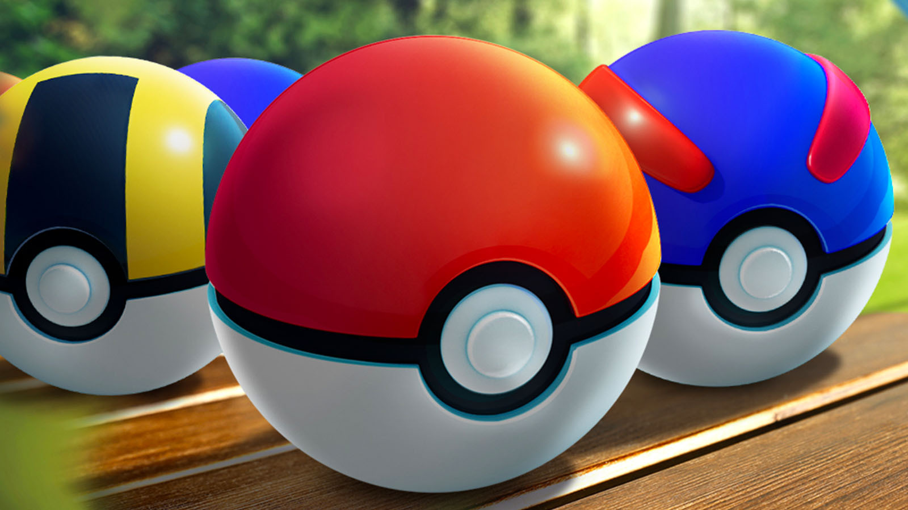

Catching is one of the most recognizable and important aspects of the Pok&#x00e9;mon franchise. In most Pok&#x00e9;mon games, players aim to weaken wild Pok&#x00e9;mon in battle to then throw a Pok&#x00e9 Ball. In Pok&#x00e9;mon Go and the Pok&#x00e9;mon: Let's Go! games, players catch Pok&#x00e9;mon without battling them, instead throwing Pok&#x00e9; Balls directly, sometimes aided by berries.

The Pok&#x00e9; Ball (&#x30e2;&#x30f3;&#x30b9;&#x30bf;&#x30fc;&#x30dc;&#x30fc;&#x30eb;, Monsut&#x0101;b&#x014d;ru, lit: Monster Ball) is a spherical device used by Pok&#x00e9;mon Trainers to catch wild Pok&#x00e9;mon. When a Pok&#x00e9; Ball is thrown at a Pok&#x00e9;mon, the Pok&#x00e9;mon shrink themselves to fit inside of it.

## The Pokédex

The Pok&#x00e9;dex (&#x30dd;&#x30b1;&#x30e2;&#x30f3;&#x56f3;&#x9451;, Pok&#x00e9;mon Zukan, lit.: Pok&#x00e9;mon Encyclopedia) is an electronic device designed to catalog and provide information regarding the various species of Pok&#x00e9;mon. The name Pok&#x00e9;dex is a portmanteau of Pok&#x00e9;mon and index. In the video games, whenever a Pok&#x00e9;mon is first caught, its height, weight, species type, and a short description will be added to a player's Pok&#x00e9;dex. Each region has its own Pok&#x00e9;dex, which differs in appearance, species of Pok&#x00e9;mon catalogued, and functions. In Pok&#x00e9;mon Legends: Arceus, which takes place long before any other Pok&#x00e9;mon games, players are tasked with assembling the first-ever Pok&#x00e9;dex.

Browse the markdown [Pokédex](Pokedex/pokemon.md).

View [Pokémon data](pokedex.md).

Jump directly to one of the Pokédex categories:

|    |    |    |    |    |
|----|----|----|----|----|
| **[Abilities](Pokedex/abilities/abilities_index.md)** | **[Berries](Pokedex/berries/berries_index.md)** | **[Characteristics](Pokedex/characteristics/characteristics_index.md)** | **[Colors](Pokedex/colors/colors_index.md)** | **[Conquest](Pokedex/conquest/conquest_index.md)** |
| **[Contest](Pokedex/contest/contest_index.md)** | **[Encounters](Pokedex/encounters/encounters_index.md)** | **[Evolution](Pokedex/evolution/evolution_index.md)** | **[Forms](Pokedex/forms/forms_index.md)** | **[Generations](Pokedex/generations/generations_index.md)** |
| **[Growth rates](Pokedex/growth_rates/growth_rates_index.md)** | **[Habitats](Pokedex/habitats/habitats_index.md)** | **[Items](Pokedex/items/items_index.md)** | **[Languages](Pokedex/languages/languages_index.md)** | **[Locations](Pokedex/locations/locations_index.md)** |
| **[Moves](Pokedex/moves/moves_index.md)** | **[Natures](Pokedex/natures/natures_index.md)** | **[Pokedexes](Pokedex/pokedexes/pokedexes_index.md)** | **[Regions](Pokedex/regions/regions_index.md)** | **[Shapes](Pokedex/shapes/shapes_index.md)** |
| **[Species](Pokedex/species/species_index.md)** | **[Stats](Pokedex/stats/stats_index.md)** | **[Translations](Pokedex/translations/translations.md)** | **[Types](Pokedex/types/types_index.md)** | **[Versions](Pokedex/versions/versions_index.md)** |

### The National Pokédex

The National Pok&#x00e9;dex allows Pok&#x00e9;mon from all regions to be catalogued. After its removal from Pok&#x00e9;mon Sword and Shield, many fans were upset, due to the lack of a National Pok&#x00e9;dex meaning that not every Pok&#x00e9;mon would be transferrable to Sword and Shield. Although the National Pok&#x00e9;dex returned in Brilliant Diamond and Shining Pearl, albeit only allowing Pok&#x00e9;mon transferrable to the original Diamond and Pearl games, it has remained absent in original titles.

Browse the [National Pokédex](national_pokedex.md).

## Pokémon Types

### Types Legend

| **Bug** | **Dark** | **Dragon** | **Electric** | **Fairy** | **Fighting** | **Fire** | **Flying** | **Ghost** |
|---|---|---|---|---|---|---|---|---|
|  |  |  |  |  |  |  |  |  |
| **Grass** | **Ground** | **Ice** | **Normal** | **Poison** | **Psychic** | **Rock** | **Steel** | **Water** |
|  |  |  |  |  |  |  |  |  |

### List of Pokémon

| **Number** | **Name** | **Type** | **Image** |
| --- |---| --- | --- |
| 000 | [MissingNo](Pokemon/MissingNo.md) | Bird / | 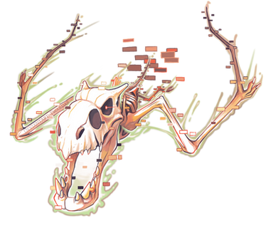|
| 001 | [Bulbasaur](Pokemon/Bulbasaur.md) | / | |
| 002 | [Ivysaur](Pokemon/Ivysaur.md) |  | |
| 003 | [Venusaur](Pokemon/Venusaur.md) |  | |
|004|[Charmander](Pokemon/Charmander.md)|||
| 005 |[Charmeleon](Pokemon/Charmeleon.md)|||
| 006 | [Charizard](Pokemon/Charizard.md) | / | |
| 007 | [Squirtle](Pokemon/Squirtle.md) |  | 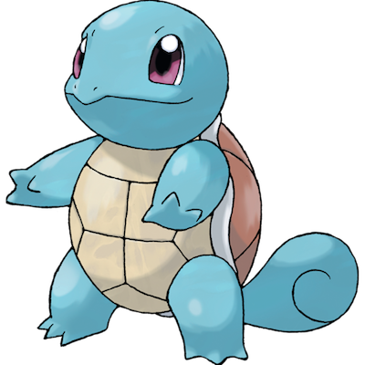|
| 008 | [Wartortle](Pokemon/Wartortle.md) |||
| 009 | [Blastoise](Pokemon/Blastoise.md) ||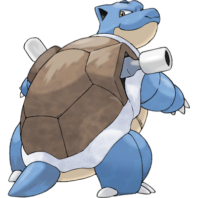|
| 010 | [Caterpie](Pokemon/Caterpie.md) |  | |
| 011 | [Metapod](Pokemon/Metapod.md) |  | 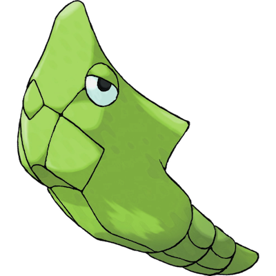|
| 012 | [Butterfree](Pokemon/Butterfree.md) |  | 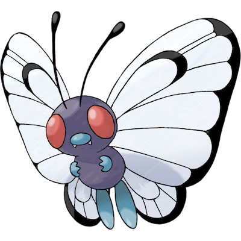|
| 013 |[Weedle](Pokemon/Weedle.md)|/|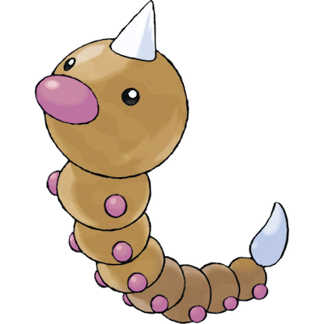|
| 014 |[Kakuna](Pokemon/Kakuna.md)|/|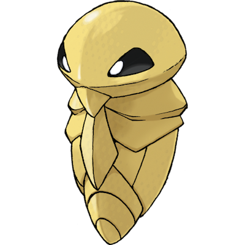|
| 015 | [Beedrill](Pokemon/Beedrill.md)  | | |
| 016 | [Pidgey](Pokemon/Pidgey.md) |  | 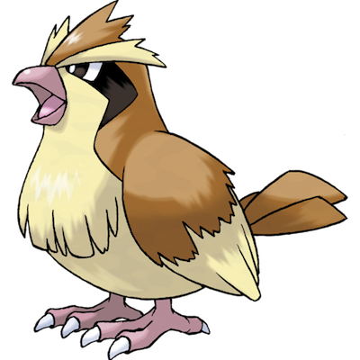|
| 017 |[Pidgeotto](Pokemon/Pidgeotto.md)| |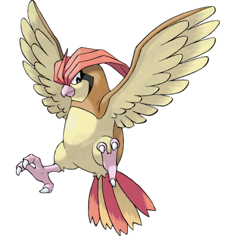|
| 018 |[Pidgeot](Pokemon/Pidgeot.md)|||
| 019 | [Rattata](Pokemon/Rattata.md) | | 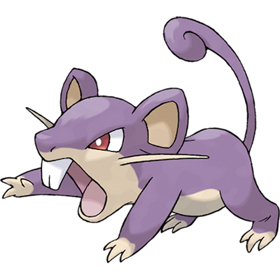|
| 020 | [Raticate](Pokemon/Raticate.md) |  | 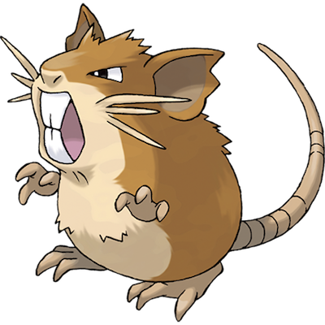|
| 021 | [Spearow](Pokemon/Spearow.md) |  | 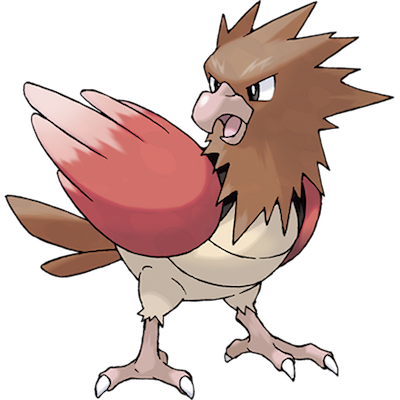|
| 022 | [Fearow](Pokemon/Fearow.md) |  | 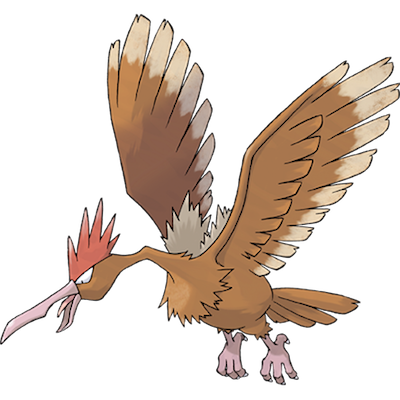|
| 023  | [Ekans](Pokemon/Ekans.md) | | 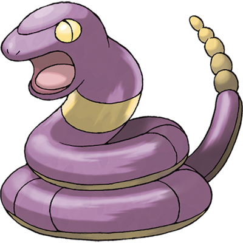|
| 024 |[Arbok](Pokemon/Arbok.md)   ||  |
| 025 | [Pikachu](Pokemon/Pikachu.md) | | |
| 026 | [Raichu](Pokemon/Raichu.md) | | |
| 027 | [Sandshrew](Pokemon/Sandshrew.md) | | 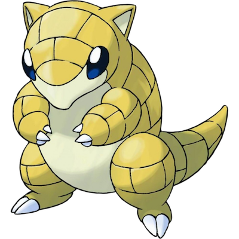|
| 028 | [Sandslash](Pokemon/Sandslash.md) | | 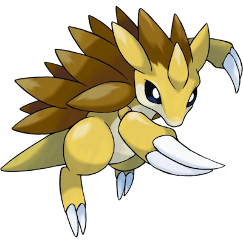|
| 029 | Nidoran |  | |
| 030 | [Nidorina](Pokemon/Nidorina.md) |  | 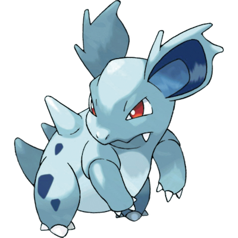|
| 031 | [Nidoqueen](Pokemon/Nidoqueen.md) | / | 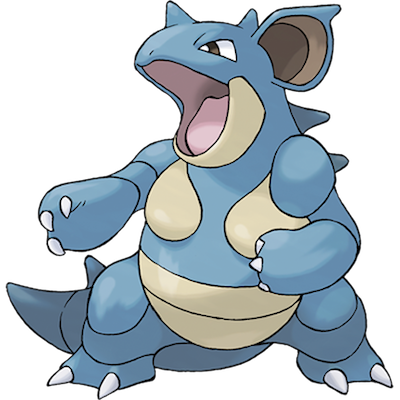 |
| 032 | Nidoran |  |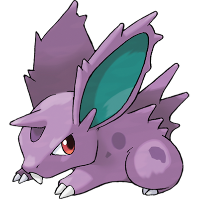 |
| 033 | [Nidorino](Pokemon/Nidorino.md) |  |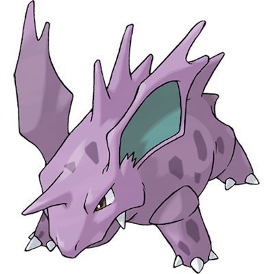 |
| 034 | [Nidoking](Pokemon/Nidoking.md) | / |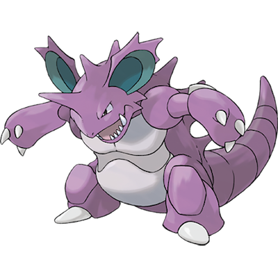 |
| 035 | [Clefairy](Pokemon/Clefairy.md) |  |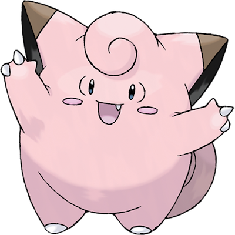 |
| 036 | [Clefable](Pokemon/Clefable.md) |  |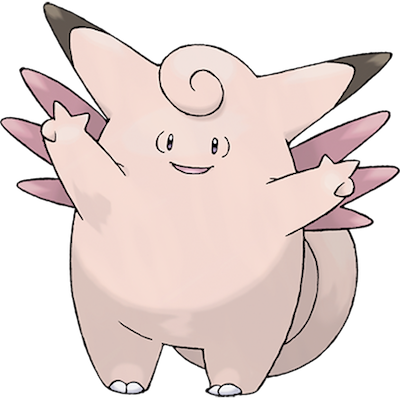 |
| 037 | [Vulpix](Pokemon/Vulpix.md) |  | |
| 038 | [Ninetales](Pokemon/Ninetales.md) |  | |
| 039 | [Jigglypuff](Pokemon/Jigglypuff.md) | / | |
| 040 | [Wigglytuff](Pokemon/Wigglytuff.md) |/ |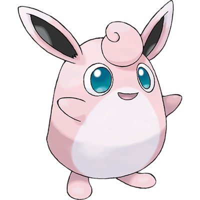 |
| 041 | [Zubat](Pokemon/Zubat.md) |/ |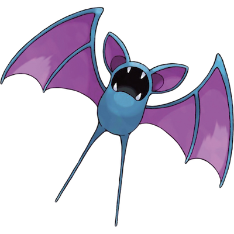 |
| 042 | [Golbat](Pokemon/Golbat.md) |/ |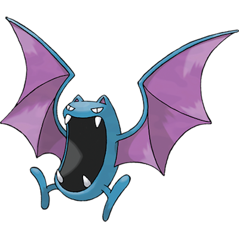 |
| 043 | [Oddish](Pokemon/Oddish.md) |/ |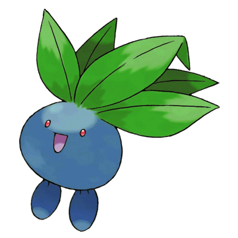 |
| 044 | [Gloom](Pokemon/Gloom.md) |/ |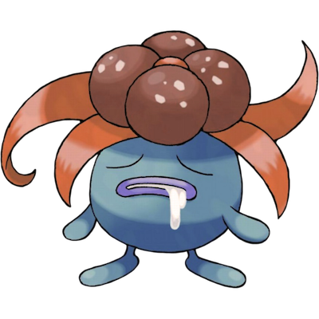 |
| 045 ||| 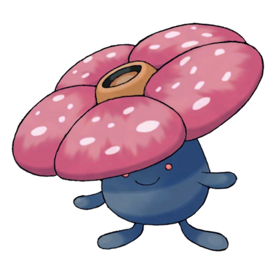 |
| 046 ||| 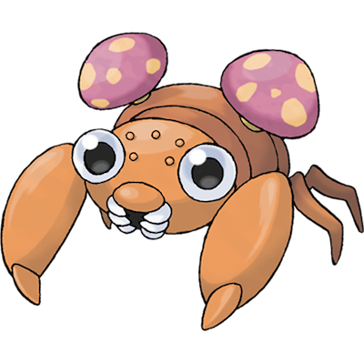 |
| 047 ||| 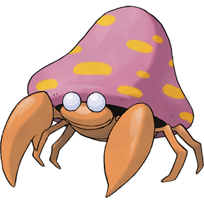 |
| 048 |||  |
| 049 ||| 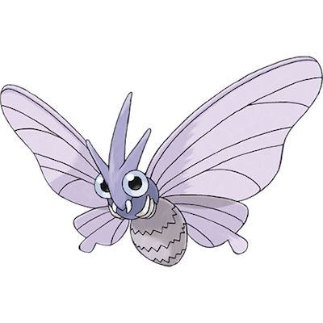 |
| 050 ||| 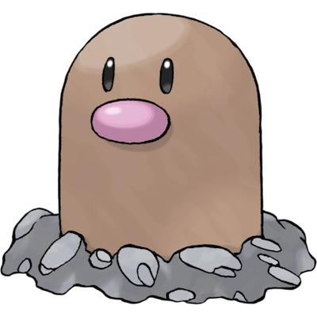 |
| 051 | [Dugtrio](Pokemon/Dugtrio.md)| | 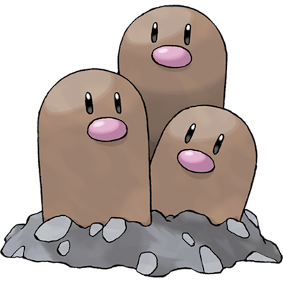|
| 052 | [Meowth](Pokemon/Meowth.md)| | 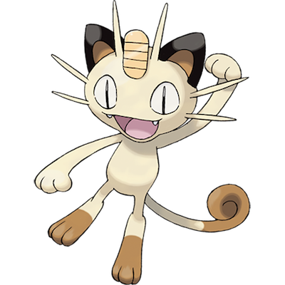|
| 053 | [Persian](Pokemon/Persian.md)| | 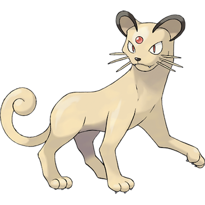|
| 054 |||  |
| 055 |||  |
| 056 ||| 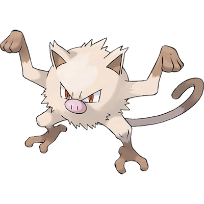 |
| 057 |||  |
| 058 ||| 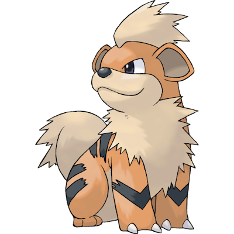 |
| 059 ||| 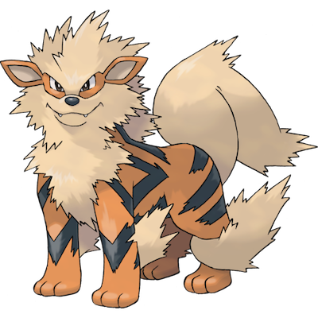 |
| 060 |||  |
| 061 | [Poliwhirl](Pokemon/Poliwhirl.md)|  | 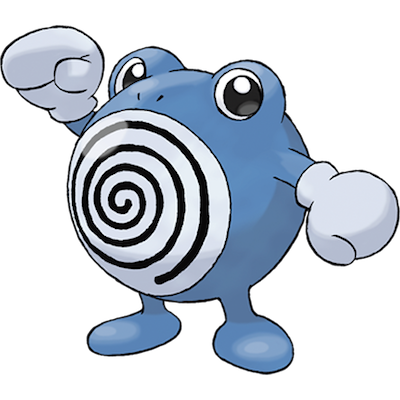|
| 062 ||| 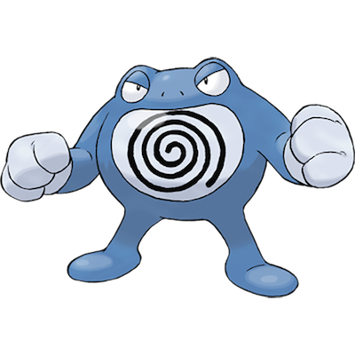 |
| 063 ||| 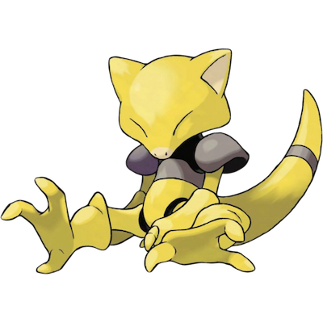 |
| 064 ||| 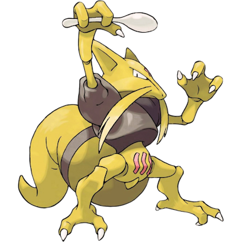 |
| 065 ||| 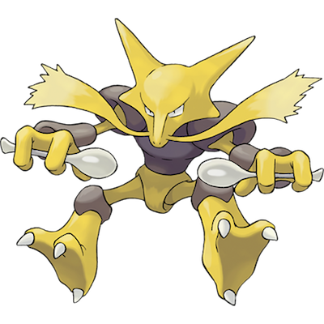 |
| 066 |||  |
| 067 ||| 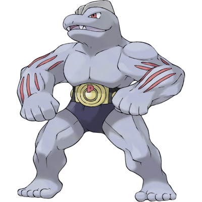 |
| 068 ||| 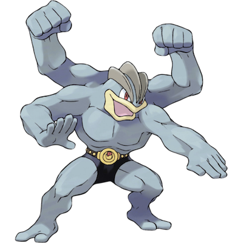 |
| 069 | [Bellsprout](Pokemon/Bellsprout.md) |  | 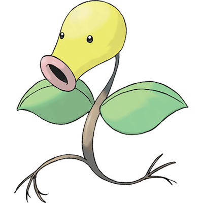|
| 070 | [Weepinbell](Pokemon/Weepinbell.md) | / | 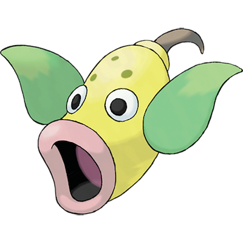|
| 071 ||| 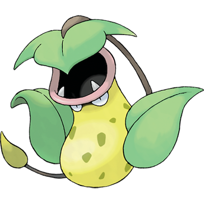 |
| 072 |||  |
| 073 |||  |
| 074 |||  |
| 075 |||  |
| 076 |||  |
| 077 |||  |
| 078 | [Rapidash](Pokemon/Rapidash.md) |  | |
| 079 | [Slowpoke](Pokemon/Slowpoke.md) |  /  | |
| 080 |||  |
| 081 |||  |
| 082 |||  |
| 083 |||  |
| 084 |||  |
| 085 |||  |
| 086 |||  |
| 087 |||  |
| 088 |||  |
| 089 |||  |
| 090 |||  |
| 091 |||  |
| 092 |||  |
| 093 |||  |
| 094 |||  |
| 095 | [Onix](Pokemon/Onix.md) |  | |
| 096 |||  |
| 097 |||  |
| 098 |||  |
| 099 |||  |
| 100 |||  |
| 101 |||  |
| 102 |||  |
| 103 |||  |
| 104 |||  |
| 105 |||  |
| 106 | [Hitmonlee](Pokemon/Hitmonlee.md) |  ||
|107||||
|108||||
|109||||
|110||||
|111||||
|112||||
|113||||
|114||||
|115||||
|116||||
|117||||
|118||||
|119||||
|120||||
|121||||
|122| [Mr. Mime](Pokemon/Mr-Mime.md) |||
|123||||
|124||||
|125||||
|126||||
|127||||
|128||||
|129||||
|130||||
|131||||
|132||||
|133| [Eevee](Pokemon/Eevee.md)|||
|134||||
|135||||
|136||||
|137||||
|138||||
|139||||
|140||||
|141||||
|142||||
|143||||
|144||||
| 145 | [Zapdos](Pokemon/Zapdos.md) | / | |
| 146 | [Moltres](Pokemon/Moltres.md) | / | |
| 147 | [Dratini](Pokemon/Dratini.md) |  | |
| 148 | [Dragonair](Pokemon/Dragonair.md) |  | |
| 149 | [Dragonite](Pokemon/Dragonite.md) | / | |
| 150 | MewTwo |  | |
| 151 | [Mew](Pokemon/Mew.md) |  | |
| 152 | [Chikorita](Pokemon/Chikorita.md) |  | |
| 153 | [Bayleef](Pokemon/Bayleef.md) |  | |
|154||||
|155||||
|156||||
|157||||
|158||||
|159||||
|160||||
|161||||
|162||||
|163||||
|164||||
|165||||
|166||||
|167||||
|168||||
|169||||
|170||||
|171||||
|172||||
|173||||
|174||||
|175||||
|176||||
|177||||
|178||||
|179||||
|180||||
|181||||
|182||||
|183||||
|184||||
|185||||
|186||||
|187||||
|188||||
|189||||
|190||||
|191||||
|192||||
|193||||
|194||||
|195||||
|196||||
|197||||
|198||||
|199||||
|200||||
|201||||
|202||||
|203||||
|204||||
|205||||
|206||||
|207||||
|208||||
|209||||
|210||||
|211||||
|212||||
|213||||
|214||||
|215||||
|216||||
|217||||
|218||||
|219||||
|220||||
|221||||
|222||||
|223||||
|224||||
|225||||
|226||||
|227||||
|228||||
|229||||
|230||||
|231||||
|232||||
|233||||
|234||||
|235||||
|236||||
|237||||
|238||||
|239||||
|240||||
|241||||
|242||||
|243||||
|244||||
|245||||
|246||||
|247||||
|248||||
|249||||
|250||||
|251||||
|252||||
|253||||
|254||||
|255||||
|256||||
|257||||
|258||||
|259||||
|260||||
|261||||
|262||||
|263||||
|264||||
|265||||
|266||||
|267||||
|268||||
|269||||
|270||||
|271||||
|272||||
|273||||
|274||||
|275||||
|276||||
|277||||
|278||||
|279||||
|280||||
|281||||
|282||||
|283||||
|284||||
|285||||
|286||||
|287||||
|288||||
|289||||
|290||||
|291||||
|292||||
|293||||
|294||||
|295||||
|296||||
|297||||
|298||||
|299||||
|300||||
|301||||
|302||||
|303||||
|304||||
|305||||
|306||||
|307||||
|308||||
|309||||
|310||||
|311||||
|312||||
|313||||
|314||||
|315||||
|316||||
|317||||
|318||||
|319||||
|320||||
|321||||
|322||||
|323||||
|324||||
|325||||
|326||||
|327||||
|328||||
|329||||
|330||||
|331||||
|332||||
|333||||
|334||||
|335||||
|336||||
|337||||
|338||||
|339||||
|340||||
|341||||
|342||||
|343||||
|344||||
|345||||
|346||||
|347||||
|348||||
|349||||
|350||||
|351||||
|352||||
|353||||
|354||||
|355||||
|356||||
|357||||
|358||||
|359||||
|360||||
|361||||
|362||||
|363||||
|364||||
|365||||
|366||||
|367||||
|368||||
|369||||
|370||||
|371||||
|372||||
|373||||
|374||||
|375||||
|376||||
|377||||
|378||||
|379||||
|380||||
|381||||
|382||||
|383||||
|384||||
|385||||
|386||||
|387||||
|388||||
|389||||
|390||||
|391||||
|392||||
|393||||
|394||||
|395||||
|396||||
|397||||
|398||||
|399||||
|400||||
|401||||
|402||||
|403||||
|404||||
|405||||
|406||||
|407||||
|408||||
|409||||
|410||||
|411||||
|412||||
|413||||
|414||||
|415||||
|416||||
| 417 | [Pachirisu](Pokemon/Pachirisu.md) |  | |
|418||||
|419||||
|420||||
|421||||
|422||||
|423||||
|424||||
|425||||
|426||||
|427||||
|428||||
|429||||
|430||||
|431||||
|432||||
|433||||
|435||||
|435||||
|436||||
|437||||
|438||||
|439||||
|440||||
|441||||
|442||||
|443||||
|445||||
|445||||
|446||||
|447||||
|448||||
|449||||
|450||||
|451||||
|452||||
|453||||
|455||||
|455||||
|456||||
|457||||
|458||||
|459||||
|460||||
|461||||
|462||||
|463||||
|465||||
|465||||
|466||||
|467||||
|468||||
|469||||
|470||||
|471||||
|472||||
|473||||
|475||||
|475||||
|476||||
|477||||
|478||||
|479||||
|480||||
|481||||
|482||||
| 483 |[Dialga](Pokemon/Dialga.md)|/| |
| 484 |[Palkia](Pokemon/Palkia.md)|/||
|485||||
|486||||
| 487 |[Giratina](Pokemon/Giratina.md)|/||
|488||||
|489||||
|490||||
| 491 | [Darkrai](Pokemon/Darkrai.md) |  | |
|492||||
| 493 | [Arceus](Pokemon/Arceus.md) |  | |
|500||||
|501||||
|502||||
|503||||
|504||||
|505||||
|506||||
|507||||
|508||||
|509||||
|510||||
|511||||
|512||||
|513||||
|514||||
|515||||
|516||||
|517||||
|518||||
|519||||
|520||||
|521||||
|522||||
|523||||
|524||||
|525||||
|526||||
|527||||
|528||||
|529||||
|530||||
|531||||
|532||||
|533||||
|534||||
|535||||
|536||||
|537||||
|538||||
|539||||
|540||||
|541||||
|542||||
|543||||
|544||||
|545||||
|546||||
|547||||
|548||||
|549||||
|550||||
|551||||
|552||||
|553||||
|554||||
|555||||
|556||||
|557||||
|558||||
|559||||
|560||||
|561||||
|562||||
|563||||
|564||||
|565||||
|566||||
|567||||
|568||||
|569||||
|570||||
|571||||
|572||||
|573||||
|574||||
|575||||
|576||||
|577||||
|578||||
|579||||
|580||||
|581||||
|582||||
|583||||
|584||||
|585||||
|586||||
|587||||
|588||||
|589||||
|590||||
|591||||
|592||||
|593||||
|594||||
|595||||
|596||||
|597||||
|598||||
|599||||
|600||||
|601||||
|602||||
|603||||
|604||||
|605||||
|606||||
|607||||
|608||||
|609||||
|610||||
|611||||
|612||||
|613||||
|614||||
|615||||
|616||||
|617||||
|618||||
|619||||
|620||||
|621||||
|622||||
|623||||
|624||||
|625||||
|626||||
|627||||
|628||||
|629||||
|630||||
|631||||
|632||||
|633||||
|634||||
|635||||
|636||||
|637||||
|638||||
|639||||
|640||||
|641||||
|642||||
|643||||
|644||||
|645||||
|646||||
|647||||
|648||||
|649||||
|650||||
|651||||
|652||||
|653||||
|654||||
|655||||
|656||||
|657||||
|658||||
|659||||
|660||||
|661||||
|662||||
|663||||
|664||||
|665||||
|666||||
|667||||
|668||||
|669||||
|670||||
|671||||
|672||||
|673||||
|674||||
|675||||
|676||||
|677||||
|678||||
|679||||
|680||||
|681||||
|682||||
|683||||
|684||||
|685||||
|686||||
|687||||
|688||||
|689||||
|690||||
|691||||
|692||||
|693||||
|694||||
|695||||
|696||||
|697||||
|698||||
|699||||
|700||||
|701||||
|702||||
|703||||
|704||||
|705||||
|706||||
|707||||
|708||||
|709||||
|710||||
|711||||
|712||||
|713||||
|714||||
|715||||
|716||||
|717||||
|718||||
|719||||
|720||||
|721||||
| 722 | [Rowlet](Pokemon/Rowlet.md) | / | |
| 723 | [Dartrix](Pokemon/Dartrix.md) | / | |
| 724 | [Decidueye](Pokemon/Decidueye.md) | / | |
| 725 | [Litten](Pokemon/Litten.md) |  | |
| 726 | [Torracat](Pokemon/Torracat.md) |  | |
| 727 | [Incineroar](Pokemon/Incineroar.md) | / | |
|728||||
|729||||
|730||||
|731||||
|732||||
|733||||
|734||||
|735||||
|736||||
|737||||
|738||||
|739||||
|740||||
|741||||
|742||||
|743||||
|744||||
|745||||
|746||||
|747||||
|748||||
|749||||
|750||||
|751||||
|752||||
|753||||
|754||||
|755||||
|756||||
|757||||
|758||||
|759||||
|760||||
|761||||
|762||||
|763||||
|764||||
|765||||
|766||||
|767||||
|768||||
|769||||
|770||||
|771||||
|772||||
|773||||
|774||||
|775||||
|776||||
|777||||
|778||||
|779||||
|780||||
|781||||
|782||||
|783||||
|784||||
|785||||
|786||||
|787||||
|788||||
|789||||
|790||||
| 791 |[Solgaleo](Pokemon/Solgaleo.md)|/||
|792||||
|793||||
|794||||
|795||||
|796||||
|797||||
|798||||
|799||||
|800||||
|801||||
|802||||
|803||||
|804||||
|805||||
|806||||
| 807 |[Zeraora](Pokemon/Zeraora.md)|||

## See Also

- [National Pokédex](national_pokedex.md)
- [Pokédex Pokémon](Pokedex/pokemon.md)
- [Pokédex](pokedex.md)
- [Pokémon Generations](generations.md)
- [README](README.md)
